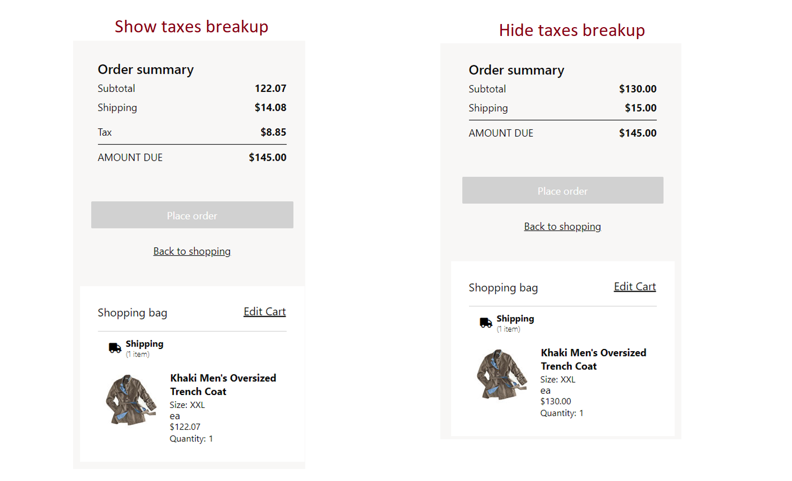

---
# required metadata

title: Hide taxes breakup information in order summaries
description: This topic describes how to hide taxes breakup information in order summaries on cart, checkout, order confirmation, and order details pages in Microsoft Dynamics 365 Commerce.
author: gvrmohanreddy
ms.date: 04/07/2022
ms.topic: article
audience: Application User, Developer, IT Pro
ms.reviewer: v-chgriffin
ms.search.region: Global
ms.author: gmohanv
ms.search.validFrom: 2022-03-28
---

[!include [banner](includes/banner.md)]
[!include [banner](includes/preview-banner.md)]

# Hide taxes breakup information in order summaries

This topic describes how to hide taxes breakup information in order summaries on cart, checkout, order confirmation, and order details pages in Microsoft Dynamics 365 Commerce.

Dynamics 365 Commerce shows tax breakup information by default for order summaries on cart, checkout, order confirmation, and order details pages. As of the Commerce version 10.0.27, in Commerce site builder you can opt to instead hide the tax breakup for order summaries.

The following example illustration shows two order summaries, the first showing tax breakup information and the second hiding tax breakup information.

> [!NOTE]
> - The ability to hide taxes breakup information in order summaries is only available when the e-commerce channel has the **Prices include sales tax** option set to **Yes** in Commerce headquarters at **Retail and Commerce \> Channels \> Stores \> All stores**. 
> - The **Show taxes breakup in order summary** option in site builder is enabled by default.

## Hide taxes breakup information in order summaries

To hide taxes breakup information in order summaries, follow these steps.

1. In Commerce site builder, navigate to the site that you want to update.
1. Go to **Site settings /> Extensions**.
1. Select the **Show taxes breakup in order summary** checkbox.

To show taxes breakup information in order summaries, clear the **Show taxes breakup in order summary** check box.  

The following example illustration shows the **Show taxes breakup in order summary** option highlighted and enabled in site builder.

## Additional resources

[Sales tax overview](/finance/general-ledger/indirect-taxes-overview)

[Configure sales tax for online orders](sales-tax-config.md)

[Troubleshoot: Taxes on online orders are incorrectly calculated](troubleshoot/tax-miscalculated-online-order.md)
