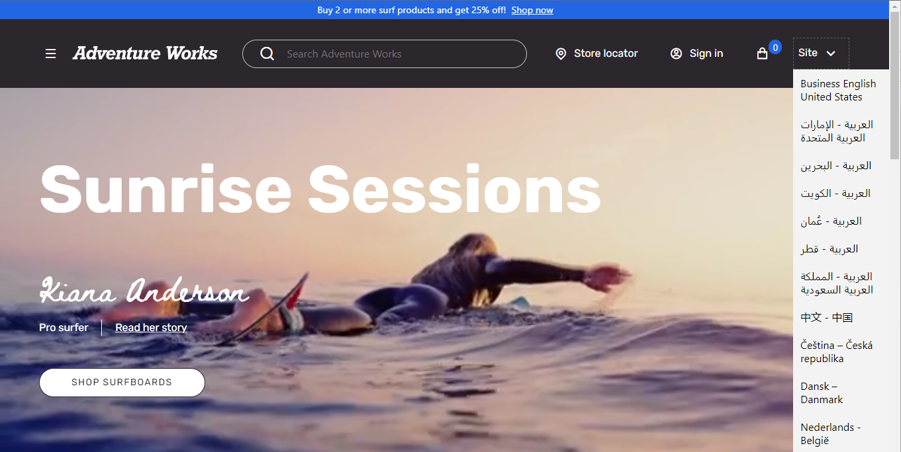
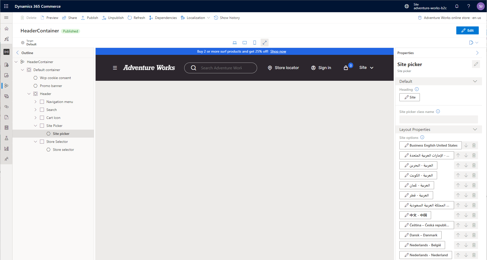

# Site picker module

[!include [banner](includes/banner.md)]

This article covers the site picker module and describes how to add it to site pages in Microsoft Dynamics 365 Commerce.

When a business has different sites across markets, regions, and locales, site users need an easy way to switch between sites and select their preferred shopping site. To accommodate this scenario, the site picker module lets users browse across multiple sites. A site picker is also recommended when [geo detection and redirection](dev-itpro/geo-detection-redirection.md) have been implemented for your e-commerce site, so that customers have a way to override the site preference that they indicate by using the [country/region picker](country-region-picker-module.md) module. 

The site picker module must be configured with the list of sites (markets, regions, or locales) that site users can browse. The following illustration shows an example of a site picker module that is featured in the header of a site page.

## Site picker module properties

| Property name | Value                 | Description |
|---------------|-----------------------|-------------|
| Heading       | Text                  | The heading for the module. |
| Site options  | Name, Image, URL      | This property specifies a name, a link to the site's home page, and an optional image to show for each site that is included in the module. The image can be a flag, or some representation of a market, region, or locale. |

## Add a site picker module to a page

The site picker module can be added to the **Site picker** slot of the [header module](author-header-module.md). After a site picker module is added, you can define the module heading and site options. Generally, a header module is contained in a header fragment that can be shared across e-commerce pages for a site. 

To add the site picker module to a header module, follow these steps.

1. In the **Site picker** slot of the header fragment's header module, select the ellipsis (**...**), and then select **Add Module**.
1. In the **Select modules** dialog box, add a **Site picker** module, and then select **OK**.
1. In the **Site picker** properties pane, select **Add site options list**. An editable **Site options list** option appears.
1. Select **Site options list**. The **Site options list** dialog box appears.
1. Under **Site name**, enter the site name text that will be shown in the site picker drop-down list.
1. Under **Site redirect URL**, select **Add a link**. The **Add a link** flyout pane appears.
1. In the **Add a link** flyout pane, select **Custom page**, and then select **Next**.
1. From the site URL list, select the URL with the path you created when adding the channel to the site (for example, `www.adventure-works.com/fr-ca`), and then select **Apply**.
1. Select **OK**.
1. Select **Save**, and then select **Finish editing**.
1. Select **Publish** to publish the page.

In the following example, the site picker module has been added to the **Site picker** slot of a header module that is contained in a header fragment that is named **HeaderContainer**.

## Additional resources

[Module library overview](starter-kit-overview.md)

[Header module](author-header-module.md)

[Breadcrumb module](add-breadcrumb.md)

[Navigation menu module](nav-menu-module.md)

[!INCLUDE[footer-include](../includes/footer-banner.md)]
