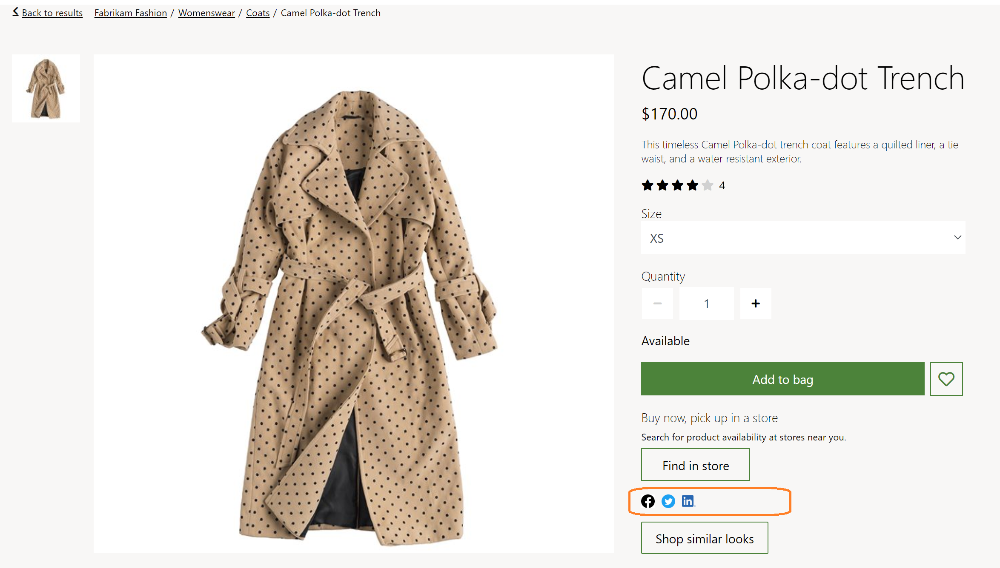

---
# required metadata

title: Social share module 
description: This topic covers social share modules and describes how to add them to site pages in Microsoft Dynamics 365 Commerce.
author:  anupamar-ms
ms.date: 09/15/2020
ms.topic: article
ms.prod: 
ms.technology: 

# optional metadata

# ms.search.form: 
# ROBOTS: 
audience: Application User
# ms.devlang: 
ms.reviewer: v-chgri
# ms.tgt_pltfrm: 
ms.custom: 
ms.assetid: 
ms.search.region: Global
ms.search.industry: 
ms.author: anupamar
ms.search.validFrom: 2019-10-31
ms.dyn365.ops.version: Release 10.0.14

---

# Social share module

[!include [banner](includes/banner.md)]

This topic covers social share modules and describes how to add them to site pages in Microsoft Dynamics 365 Commerce.

Social share modules allow users to share e-Commerce site page URLs on social media such as Facebook, Twitter, Pinterest, and LinkedIn. Site page URLs can also be shared via email. Social share modules are commonly used on product details pages (PDPs) to help users share product information.

Each social share module is a container for social share item modules. Each social share item module can be configured to point to a specific social media site. Integration with Facebook, Twitter, Pinterest, LinkedIn, and email is supported out of the box. When a site user selects a social media symbol, an HTML iframe is launched for the respective social media site. Within the iframe, the user can sign in and post the page content that they were viewing.

Each social media platform may track cookies, so this module requires site users to accept the cookie consent notification message. When cookie consent is not accepted, the module will be hidden on the page. For more information, see [Cookie compliance](cookie-compliance.md).

The following illustration highlights an example of a social share module used on a product details page.

## Social share module properties

| Property name             | Value                 | Description |
|---------------------------|-----------------------|-------------|
| Caption                  | Text | This property specifies a caption for the module. |
| Orientation | **Horizontal** or **Vertical**  | This property defines the layout orientation for the social media items. |

## Social share item module properties
| Property name             | Value                 | Description |
|---------------------------|-----------------------|-------------|
| Social media              | **Facebook**, **Twitter**, **Pinterest**, **LinkedIn**, **Mail** | A drop-down menu with a list of social media platforms. |
| Icon |Image    | This will be the image that will be shown for the respective social media. As a best practice, refer to the social media platform's SDK for the recommended image to use for each platform. |

## Add a social share module to a buy box module

To add a social share module to a buy box module, follow these steps.

1. In the Fabrikam site, select **Pages**, and then select the **DefaultPDP** page to open the product details page. 
1. In the **Buybox (required)** slot, select the ellipsis (**...**), and then select **Add Module**.
1. In the **Add Module** dialog box, select the **Social Share** module, and then select **OK**.
1. In the **Social Share** slot, select the ellipsis (**...**), and then select **Add Module**.
1. In the **Add Module** dialog box, select the **SocialShare** module, and then select **OK**.
1. In the properties pane of the **SocialShare** module, under **Orientation**, select **Horizontal**. Add a caption as needed.
1. In the **SocialShare** slot, select the ellipsis (**...**), and then select **Add Module**.
1. In the **Add Module** dialog box, select the **SocialShareItem** module, and then select **OK**.
1. In the properties pane of the **SocialShareItem** module, under **Social Media**, select **Facebook**.
1. In the properties pane of the **SocialShareItem** module, under **Icon**, select **+ Add an image**.
1. In the **Media Picker** dialog box, select the Facebook logo image, and then select **OK**. If no Facebook logo image is present, select **Upload new media item** to upload one.
1. Add and configure additional **SocialShareItem** modules as needed.
1. Select **Save**, and then select **Preview** to preview the page. The page will show the social share module.
1. Select **Finish editing** to check in the page, and then select **Publish** to publish it.

## Additional resources

[Module library overview](starter-kit-overview.md)

[Buy box module](add-buy-box.md)

[Cookie compliance](cookie-compliance.md)

[!INCLUDE[footer-include](../includes/footer-banner.md)]