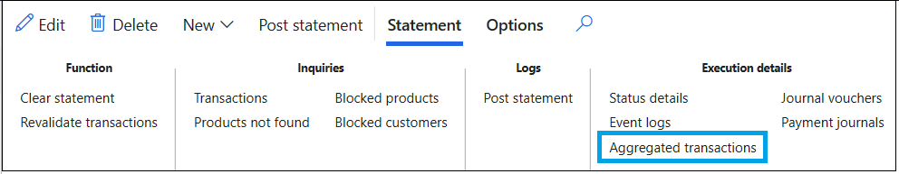
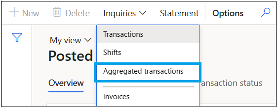
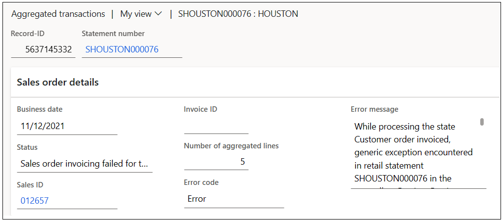
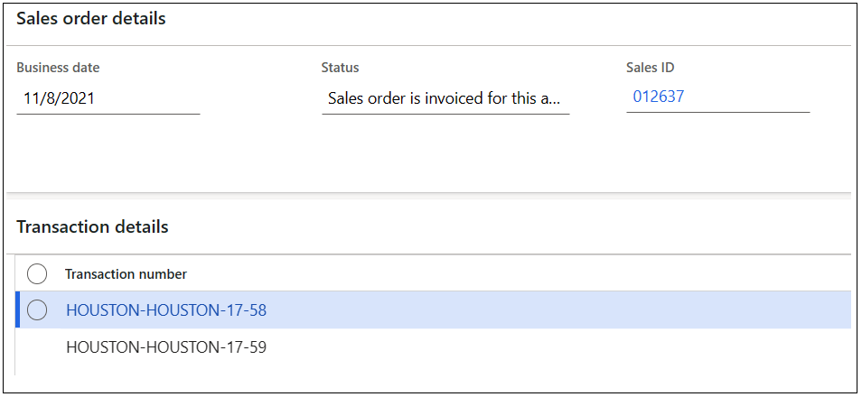
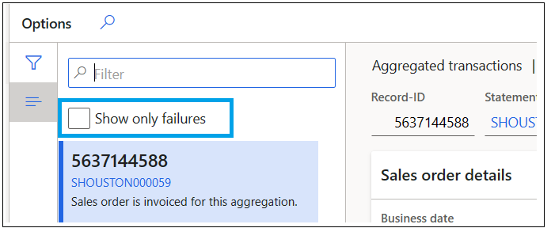
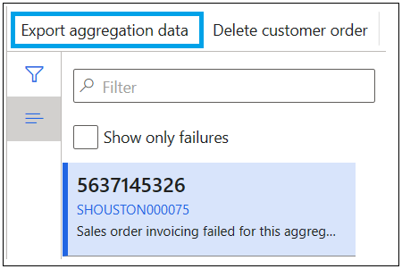
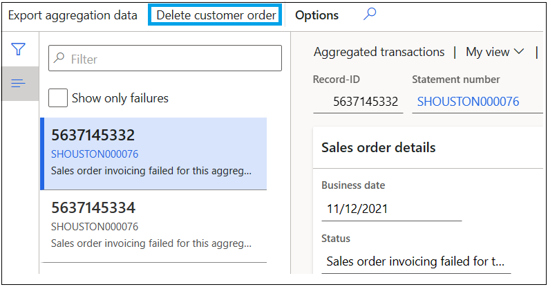

# Improvements to statement posting functionality

[!include [banner](includes/banner.md)]

This article describes the first set of improvements that have been made to the statement posting feature. These improvements are available in Microsoft Dynamics 365 Finance 7.3.2.

## Activation

By default, during deployment of finance and operations 7.3.2, the program is set up to use the legacy feature for statement postings. To enable the improved statement posting feature, you must turn on the configuration key for it.

- Go to **System administration** \> **Setup** \> **License configuration**, and then, under the **Retail and Commerce** node, clear the **Statements (legacy)** check box, and select the **Statements** check box.

When the new **Statements** configuration key is turned on, a new menu item that is named **Statements** is available. This menu item lets you manually create, calculate, and post statements. Any statement that causes an error when the batch posting process is used will also be available through this menu item. (When the **Statements (legacy)** configuration key is turned on, the menu item is named **Open statements**.)

Commerce includes the following validations that are related to these configuration keys:

- Both configuration keys can't be turned on at the same time.
- The same configuration keys must be used for all the operations that are performed on a given statement during its lifecycle (Create, Calculate, Clear, Post, and so on). For example, you can't create and calculate a statement while the **Statement (legacy)** configuration key is turned on, and then try to post the same statement while the **Statement** configuration key is turned on.

> [!NOTE]
> We recommend that you use the **Statements** configuration key for the improved statement posting feature, unless you have compelling reasons to use the **Statements (legacy)** configuration key instead. Microsoft will continue to invest in the new and improved statement posting feature, and it's important that you switch to it at the earliest opportunity to benefit from it. The legacy statement posting feature is deprecated starting in 8.0 release.

## Setup

As part of the improvements to the statement posting feature, three new parameters have been introduced on the **Statement** FastTab on the **Posting** tab of the **Commerce parameters** page:

- **Disable clear statement** – This option is applicable only for the legacy statement posting feature. We recommend that you set this option to **No** to prevent users from clearing statements that are in a semi-posted state. If statements that are in a semi-posted state are cleared, data becomes corrupted. You should set this option to **Yes** only in exceptional circumstances.
- **Reserve inventory during calculation** – We recommend that you use the **Post inventory** batch job for inventory reservation, and that you set this option to **No**. When this option is set to **No**, the improved statement posting feature doesn't try to create inventory reservation entries at the time of calculation (if entries weren't already created through the **Post inventory** batch job). Instead, the feature creates inventory reservation entries only at the time of posting. This implementation was a design choice and was based on the fact that the time window between the calculation process and the posting process is typically small. However, if you want to reserve inventory at the time of calculation, you can set this option to **Yes**.

    The legacy statement posting feature always reserves inventory during the statement calculation process (if reservation wasn't already done through the **Post inventory** batch job), regardless of the setting of this option.

- **Disable counting required** – When this option is set to **Yes**, the posting process for a statement continues, even if the difference between the counted amount and the transaction amount on the statement is outside the threshold that is defined on the **Statement** FastTab for stores.

> [!NOTE]
> As of the Commerce version 10.0.14 release, when the **Retail statements - Trickle feed** feature is enabled, the **Post inventory** batch job is no longer applicable and can't be run.

## Processing

Statements can be calculated and posted in batch using the menu items **Calculate statements in batch** and **Post statements in batch**. Alternatively, statements can be manually calculated and posted by using the **Statements** menu item that the improved statement posting feature provides.

The process and steps for calculating and posting statements in a batch are the same as they were in the legacy statement posting feature. However, significant improvements have been made in the core back-end processing of the statements. These improvements make the process more resilient, and provide for better visibility into the states and error information. Therefore, users can address the root cause of errors and then continue the posting process without causing data corruption and without causing data fixes to be required.

The following sections describe some of the major improvements for the statement posting feature that appear in the user interface for statements and posted statements.

### Status details

A new state model has been introduced in the statement posting routine across the calculation and posting processes.

The following table describes the various states and their order during the calculation process.

| State order | State      | Description |
|-------------|------------|-------------|
| 1           | Started    | The statement was created and is ready to be calculated. |
| 2           | Marked     | The transactions that are in scope for the statement are identified based on the statement parameters, and they are marked with the statement ID. |
| 3           | Calculated | The statement lines are computed and shown. |

The following table describes the various states and their order during the posting process.

| State order | State                   | Description |
|-------------|-------------------------|-------------|
| 1           | Checked                 | Multiple validations are done that are related to parameters (for example, the disposition charge), and to the statement and statement lines (for example, the difference between the counted amount and the transaction amount). |
| 2           | Aggregated              | Sales transactions for named and unnamed customers are aggregated based on the configuration. Every aggregated transaction is eventually converted to a sales order. |
| 3           | Customer order created  | Based on the aggregated transaction, sales orders are created in the system. |
| 4           | Customer order invoiced | Sales orders are invoiced. |
| 5           | Discounts posted        | Periodic discount journals are posted based on the configuration. |
| 6           | Income/expense posted   | Income/expense transactions are posted as vouchers. |
| 7           | Vouchers linked         | Payment journals are created and linked to the corresponding invoice. |
| 8           | Payments posted         | Payment journals are posted. |
| 9           | Gift cards posted       | Gift card transactions are posted as vouchers. |
| 10          | Posted                  | The statement is marked as posted. |

Every state in the preceding tables is independent in nature, and a hierarchical dependency is built between the states. This dependency flows from top to bottom. If the system encounters any errors while it's processing a state, the status of the statement is reverted to the previous state. Any subsequent reattempt of the process resumes from the state that failed and continues to move forward. This approach has the following benefits:

- The user has complete visibility into the state where the error occurred.
- Data corruption is avoided. For example, in the legacy statement posting feature, there were instances where some sales orders were invoiced but others were left open. There were also instances where some payment journals didn't have a corresponding invoice to settle, because the invoice posting had an error.
- Users can see the current state of a statement by using the **Status details** button in the **Execution details** group of the statement. The status details page has three sections:

    - The first section shows the current status of the statement, together with the error code and a detailed error message, if an error occurred.
    - The second section shows the various states of the calculation process. Visual cues indicate states that have been successfully run, states that could not be run because of errors, and states that haven't yet been run.
    - The third section shows the various states of the posting process. Visual cues indicate states that have been successfully run, states that could not be run because of errors, and states that haven't yet been run.

Additionally, the header of the second and third sections shows the overall status of the relevant process.

### Event logs

A statement goes through various operations (for example, Create, Calculate, Clear, and Post), and multiple instances of the same operation might be called during the statement's lifecycle. For example, after a statement is created and calculated, a user can clear the statement and calculate it again. The **Event logs** button in the **Execution details** group of the statement provides a complete audit trail of the various operations that were called on a statement, together with information about when those operations were called.

### Aggregated transactions

During the posting process, cash-and-carry transactions are aggregated by customer and product. Therefore, the number of sales orders and lines that are created is reduced. The aggregated transactions are stored in the system and used to create sales orders. Every aggregated transaction creates one corresponding sales order in the system. 

If a statement isn't fully posted, you can view aggregated transactions in the statement. On the Action Pane, on the **Statement** tab, in the **Execution details** group, select **Aggregated transactions**.

For posted statements, you can view aggregated transactions on the **Posted statements** page. On the Action Pane, select **Inquiries**, and then select **Aggregated transactions**.

The **Sales order details** FastTab of an aggregated transaction shows the following information:

- **Record ID** – The ID of the aggregated transaction.
- **Statement number** – The statement that the aggregated transaction belongs to.
- **Date** – The date when the aggregated transaction was created.
- **Sales ID** – When a sales order is created from the aggregated transaction, the sales order ID. If this field is blank, the corresponding sales order hasn't been created.
- **Number of aggregated lines** – The total number of lines for the aggregated transaction and sales order.
- **Status** – The last status of the aggregated transaction.
- **Invoice ID** – When the sales order for the aggregated transaction is invoiced, the sales invoice ID. If this field is blank, the invoice for the sales order hasn't been posted.
- **Error code** – This field is set if the aggregation is in an error state.
- **Error message** – This field is set if the aggregation is in an error state. It shows details about what caused the process to fail. You can use the information in the error code to fix the issue, and then manually restart the process. Depending on the type of resolution, aggregated sales might have to be deleted and processed on a new statement.

The **Transaction details** FastTab of an aggregated transaction shows all the transactions that have been pulled into the aggregated transaction. The aggregated lines on the aggregated transaction show all the aggregated records from the transactions. The aggregated lines also show details such as the item, variant, quantity, price, net amount, unit, and warehouse. Basically, each aggregated line corresponds to one sales order line.

In some situations, aggregated transactions might fail to post their consolidated sales order. In these situations, an error code will be associated with the statement status. To view only aggregated transactions that have errors, you can enable the **Show only failures** filter in the aggregated transactions view by selecting the checkbox. By enabling this filter, you limit the results to aggregated transactions that have errors that require resolution. For information about how to fix these errors, see [Edit and audit online order and asynchronous customer order transactions](edit-order-trans.md).

On the **Aggregated transactions** page, you can download the XML for a specific aggregated transaction by selecting **Export aggregation data**. You can review the XML in any XML formatter to see the actual data details that involve sales order creation and posting. The functionality for downloading the XML for aggregated transactions isn't available for statements that have been posted.

In the event that you can't fix the error by correcting data on the sales order or data that supports the sales order, a **Delete customer order** button is available. To delete an order, select the aggregated transaction that failed, and then select **Delete customer order**. Both the aggregated transaction and the corresponding sales order will be deleted. You can now review the transactions by using the edit and audit functionality. Alternatively, they can be reprocessed through a new statement. After all failures are fixed, you can resume statement posting by running the post statement function for the relevant statement.

The aggregated transactions view provides the following benefits:

- The user has visibility into the aggregated transactions that failed during sales order creation and the sales orders that failed during invoicing.
- The user has visibility into how transactions are aggregated.
- The user has a complete audit trail, from transactions, to sales orders, to sales invoices. This audit trail wasn't available in the legacy statement posting feature.
- Aggregated XML file makes it easier to identify issues during sales order creation and invoicing.

> [!NOTE]
> When transactions are aggregated, the staff member assigned to the transaction is no longer available to the **Top Staff Sales Report**, meaning that the **Top Staff Sales Report** won't show all transactions. We recommend that you don't use the **Top Staff Sales Report** with aggregated transactions.

### Journal vouchers

The **Journal vouchers** button in the **Execution details** group of the statement shows all the various voucher transactions that are created for a statement, and that are related to discounts, income/expense accounts, gift cards, and so on.

Currently, the program shows this data only for posted statements.

### Payment journals

The **Payment journals** button in the **Execution details** group of the statement shows all the various payment journals that are created for a statement.

Currently, the program shows this data only for posted statements.

## Other improvements

Other, back-end improvements that users can see have been made to the statement posting feature. Here are some examples:

- The aggregation doesn't consider the staff, terminal, and shift entities. Because there are fewer aggregation parameters, fewer sales order lines must be processed.
- The occurrence of deadlock on transaction tables is reduced by introducing additional extension tables and by doing insert operations instead of update operations on the transaction tables.
- The number of running batch tasks has been parameterized and limited. Therefore, this number can be fine-tuned specifically to a customer's environment. In the legacy statement posting feature, an unlimited number of batch tasks was created at the same time. The results were unmanageable loads, overhead, and bottlenecks on the batch server.
- Statements are efficiently queued for processing by prioritizing the statements that have the maximum number of transactions.
- Batch processes such as **Calculate statements in batch** and **Post statements in batch** are run only in batch mode. In the legacy statement posting feature, users could choose to run these batch processes in an interactive mode which is s single threaded operation unlike batch processes which are multi-threaded.
- In the legacy statement posting feature, any failure of a batch task put the whole batch job in an error state. In the improved feature, batch task failures don't put the batch job in an error state if other batch tasks are successfully completed. You should assess the posting status for a batch execution run by using the **Statements** page, where you can see any statements that weren't posted because of errors.
- In the legacy statement posting feature, the first occurrence of a statement failure causes the whole batch to fail. The remaining statements aren't processed. In the improved feature, the batch process continues to process all statements, even if some of the statements fail. One benefit is that users gain visibility into the exact number of statements that have errors. Therefore, users don't have to be stuck in a continuous loop of fixing the errors and running the post statement process till all statements are posted.

## General guidance about the statement posting process

- We recommend that you run the statement posting process in a batch, because batch runs take advantage of the power of the batch framework in terms of multithreading. Multithreading is required in order to handle the huge volumes of transactions that are normally seen in statement postings.
- We recommend that you turn on negative physical inventory on the item model group, so that you have a seamless posting experience. In some scenarios, negative statements might not be able to be posted unless there is negative physical inventory. For example, in theory, if there is only one unit of an item in inventory, and there have been a sales transaction and a return transaction for the item, the transaction should be able to be posted even if negative inventory isn't turned on. However, because the statement posting process pulls both the sales transaction and the return transaction in a single customer order, there is no guarantee that the sales line will be posted first, followed by the return line. Therefore, errors can occur. If negative inventory is turned on in this scenario, the transaction posting isn't negatively affected, and the system will correctly reflect the inventory.
- We recommend that you use aggregation while you calculate and post statements. Therefore, the following settings are recommended for some of the aggregation parameters:

    - Go to **Retail and Commerce** \> **Headquarters setup** \> **Parameters** \> **Commerce parameters**. Then, on the **Posting** tab, on the **Inventory update** FastTab, in the **Detail level** field, select **Summary**.
    - Go to **Retail and Commerce** \> **Headquarters setup** \> **Parameters** \> **Commerce parameters**. Then, on the **Posting** tab, on the **Aggregation** FastTab, set the **Voucher transactions** option to **Yes**.

[!INCLUDE[footer-include](../includes/footer-banner.md)]

