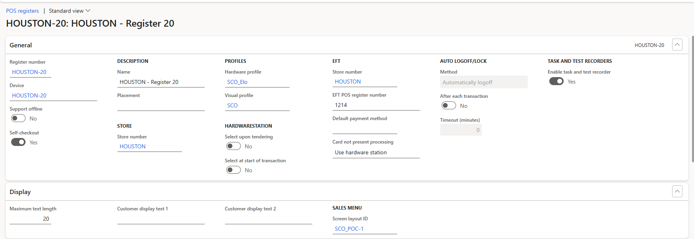
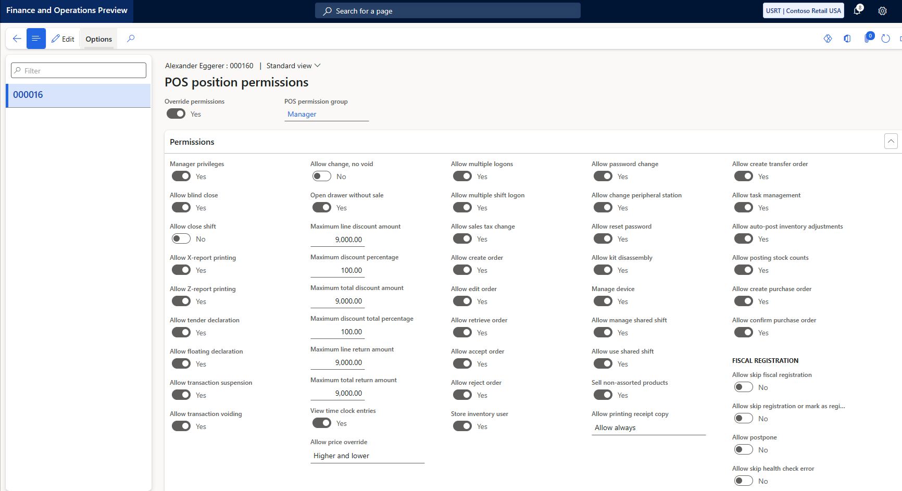
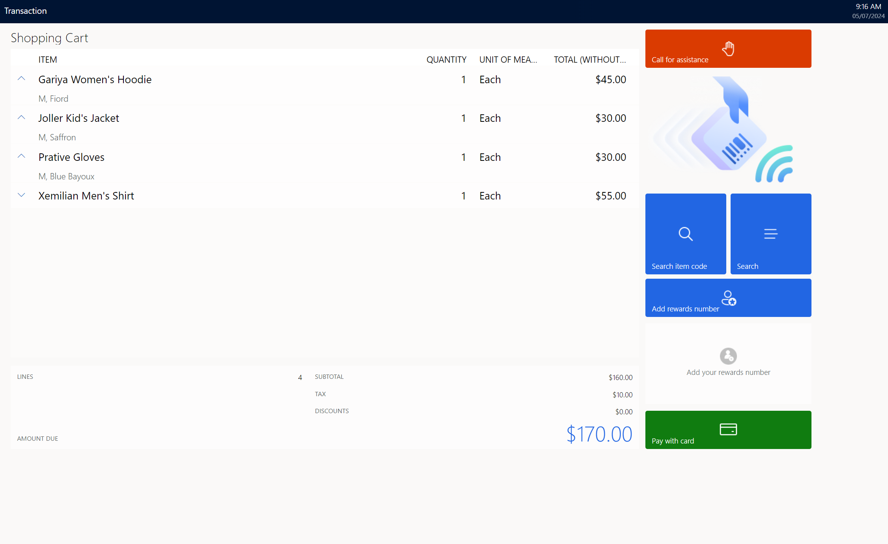

# Enable self-checkout in the Store Commerce app

[!include [banner](includes/banner.md)]

This article describes how to enable self-checkout (SCO) and related features in the Microsoft Dynamics 365 Commerce Store Commerce app.

> [!IMPORTANT]
> To enable the self-checkout and related features in the Store Commerce app, you must be running Commerce version 10.0.40, Store Commerce version 10.0.40, and Commerce Scale Unit (CSU) version 9.50.

Point of sale (POS) customers can reuse existing workflows to turn on kiosk-based SCO in an existing Store Commerce app. Customers can then use SCO terminals to scan or search for items, add items to a shopping cart, and pay for items by using a credit card or debit card.

## Enable the SCO feature

To enable the SCO feature, follow these steps.

1. In Commerce headquarters, go to **Feature management** (**System administration \> Workspaces \> Feature management)**.
1. Check for new updates.
1. Search for and select the **Configure POS self-checkout register** feature.
1. Select **Enable now**.

## Configure SCO

To configure SCO for a register, in headquarters go to the register setup under **POS Registers** and set the **Self-checkout** option to **Yes**.

The enabling of the **Self-checkout** feature results in the following behavior:

- **TASK AND TASK RECORDERS** option **Enable task and test recorder** is set to **No**.
- **HARDWARESTATION** options **Select upon tendering** and **Select at start of transaction** are set to **No**.
- **AUTO LOGOFF/LOCK** option **After each transaction** is set to **No**.

When the **Self-checkout** option at the register is set to **Yes**, the following changes are made in POS for consumer operations:

- Header and side navigation bars are hidden.
- Navigation to payment methods from totals is disabled.

> [!NOTE]
> If **Manage device** is set to **Yes** on the **POS position permissions** form in headquarters, the header and side navigation bars are still visible on the self-checkout register, which allows store associates to perform setup or administrator tasks without having to switch to a cashier register.

To restrict specific products from being offered at SCO, in headquarters go to **Released products** and set the **Blocked at self-checkout** option to **Yes**.

## Configure and activate a SCO kiosk

To enable only operations that are applicable to consumers on an SCO kiosk, follow these steps.

1. As an administrator, create a new, generic user with limited permissions to be used to sign in to the kiosk.
1. Assign the **SCO kiosk** permission group to the new user. The **SCO kiosk** permission group has limited permissions, so the new user can only perform consumer operations such as scan and pay.
1. Activate SCO on the kiosk.
1. Turn on shifts for the generic SCO user.
1. Use the generic SCO user ID to sign in to the kiosk so that consumers can use SCO throughout the day.
1. To allow shifts for SCO kiosks to be turned on or off from cashier registers, set the **Allow manage shared shift** option to **Yes** for cashier user permissions.

To set up the kiosk and the hardware peripherals during initial setup, an administrator can use their user credentials to sign in to the kiosk. Administrators must ensure that their screen layout is assigned to their user ID in headquarters.

## Configure the out-of-box customer-facing SCO layout

The out-of-box customer-facing SCO layout available in the demo environment for export and import is configured with limited operations, as shown in the following example image. 

To use the out-of-box customer-facing SCO layout, go to **Retail and Commerce \> Screen layouts** and assign the SCO screen layout to the **Registers** setup.

> [!NOTE]
> - In demo data, **Houston - Register 49** is set up as an SCO register, and the SCO layout (**SCO\_POC1**) is assigned to it. If you update an existing demo environment, for any register of your choice you can  set the **Self-checkout** option to **Yes** and assign it the SCO layout.
> - In demo data, user **000815** is configured as an SCO customer, and user **000813** is configured as an SCO manager. If these users don't exist in your demo enviroment, you can assign the **SCO kiosk** permission group to the customer you want to use instead.
> - To download the SCO out-of-the-box layout along with the permission group, use the package [https://download.microsoft.com/download/1/8/2/182fcc7e-183a-48ff-b883-ee2f329e6581/SCO demo layout and perms.zip](https://download.microsoft.com/download/1/8/2/182fcc7e-183a-48ff-b883-ee2f329e6581/SCO%20demo%20layout%20and%20perms.zip).
> - For instructions on how to export POS screen layouts for import to a new environment, see [Export POS screen layouts for import to a new environment](export-pos-layouts.md).

## Supported customer operations

The following customer operations are supported.

| Operation | Action | Description |
|---|---|---|
| Scan and add item to cart | Product sale | Allows a customer to scan items and add them to a transaction. If an item is restricted from SCO, an error message instructs the customer to ask a cashier for help. |
| Add rewards number | Add loyalty card | Brings up a numeric keypad that a customer can use to enter their loyalty account number to associate themselves with the transaction. |
| Search item code | Product sale | Brings up a numeric keypad that a customer can use to enter the item code of a product. Customers can then add the product to the cart if the bar code is missing or can't be scanned. |
| Search | Search | Brings up a product browsing page where the customer can select products from product categories to add them to the cart. |
| Pay card | Pay card | Enables payment of a transaction using only a credit or debit card. |

After payment is processed, an option is presented to print a receipt.

## Assisted sale workflow

The **Call for assistance** operation provides support for cashier assistance during SCO, and the **Allow request for assistance** action is associated with this operation. When a customer selects **Call for assistance**, a manager or store associate must sign or swipe in to perform one of the following elevated operations:

- **Void** - This operation has two options:
    - **Void transaction** – Void the whole transaction.
    - **Void item** – Select a specific item to void. Only one item at a time can be selected for the operation.
- **Tax override** – This operation has two options:
    - **Override line tax** – Apply an exempt code and void the tax for a line.
    - **Override transaction** – Void the tax for the whole transaction.
- **Suspend transaction** – This operation allows the store associate suspend the transaction on the kiosk and resume it on a regular, non-SCO cashier register.
- **Price override** – This operation allows the store associate override the price of an item by selecting the item.
- **Add discount** – This operation has two options:
    - **Discount%** – Apply a discount percentage.
    - **Discount amount** – Apply a discount amount to the line item.
- **Logout** – This operation allows the store associate sign out of the kiosk.
- **Cancel** – This operation allows the store associate cancel out of the **Call for assistance** operation.

> [!NOTE]
> If you are updating your demo environment with a self-checkout configuration, in Commerce headquarters you must manually add the **718 - Allow request for assistance** operation. To add this operation, go to **POS operations** and select **+New**. In the new row, enter "718" for **Operation ID**, enter a name for **Operation name**, enter "1002" for **Permission ID**, select both the **Check user access** and **User operation** checkboxes, and then select **Save**. 
