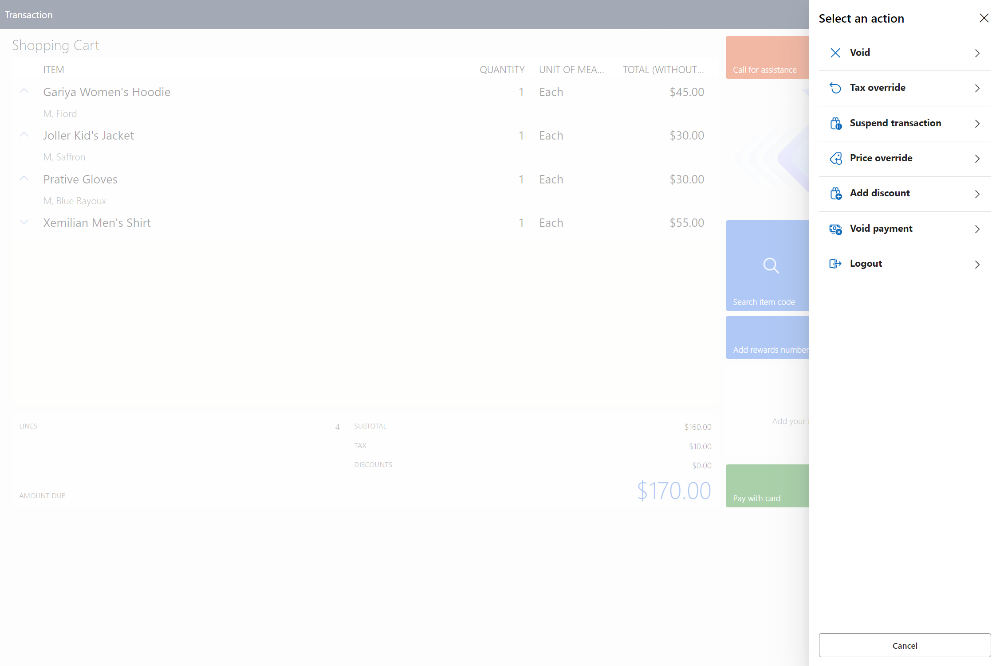

# Enable self-checkout in the Store Commerce app (preview)

[!INCLUDE [preview-banner](~/../shared-content/shared/preview-includes/preview-banner.md)]

This article describes how to enable self-checkout and related features in the Microsoft Dynamics 365 Commerce Store Commerce app.

> [!IMPORTANT]
> For the self-check out feature to function, you must be running Commerce version 10.0.40, Commerce Scale Unit (CSU) version 9.50 (10.0.40), and Store Commerce version 10.0.40.

Point of sale (POS) customers can reuse existing workflows to turn on kiosk-based self-checkout (SCO) in an existing Store Commerce app. Customers can then use SCO terminals to scan or search for items, add items to a shopping cart, and pay for the items by using a credit card or debit card.

To enable SCO, in Commerce headquarters administrators must go to **Feature Management**, check for new updates, select the **Configure POS self-checkout register** feature, and enable it.

## Configuration in Commerce headquarters

To enable SCO for a register, in headquarters go to the register setup under **POS Registers** and set **Self-checkout** to **Yes**.

The presence of the **Self-checkout** flag drives the following behavior:

- **Enable task and test recorder** is set to **No**.
- **HARDWARESTATION** options **Select upon tendering** and **Select at start of transaction** are set to **No**.
- **AUTO LOGOFF/LOCK** option **After each transaction** is set to **No**.

If the **Self-checkout** flag at the register is set to **Yes**, the following changes are made in POS to tailor consumer operations:

- Header and side navigation bars are hidden.
- Navigation to payment methods from totals is disabled.

> [!NOTE]
> If **Manage device** is set to **Yes** on the **POS position permissions** form in headquarters, the header and side navigation bars are still visible on the self-checkout register, which allows store associates to perform setup or administrator tasks without having to switch to a cashier register.

To restrict specific products from being offered at SCO, in headquarters go to **Released products** and set **Blocked at self-checkout** to **Yes**.

## SCO device activation and kiosk sign-in

To enable only operations that are applicable to consumers on an SCO kiosk, follow these steps.

1. Create a new, generic user with limited permissions that's used to sign in to the kiosk.
1. Assign the **SCO kiosk** permission group to the new user. The **SCO kiosk** permission group has limited permissions, so the new user can only perform consumer operations such as scan and pay.

### Sign-in process

Either the cashier or the store manager must use their permissions to activate SCO on the register. They must then turn on shifts for the SCO user. Finally, they must use the SCO user ID to sign in on the kiosk, so that consumers can use SCO throughout the day.

To enable shifts for SCO kiosks to be turned on or ended from cashier registers, be sure to set **Allow manage shared shift** to **Yes** for cashier user permissions.

To set up the kiosk and the hardware peripherals during initial setup, your administrator can use their user credentials to sign in on the kiosk. Ensure that their screen layout is assigned to their user ID in headquarters.

## Customer-facing out-of-box layout

The customer-facing layout is configured with limited operations and is available in the demo environment for export and import. Look for the SCO layout in **Screen layouts** under **Retail and Commerce**. Assign the screen layout to the **Registers** setup.

> [!NOTE]
> - In demo data, **Houston - Register 49** is set up as an SCO register, and the SCO layout (**SCO\_POC1**) is assigned to it.
> - in demo data, user 000815 is configured as an SCO customer, and user 000813 is configured as an SCO manager.

## Support for operations

The following customer operations are supported.

| Operation | Action | Description |
|---|---|---|
| Scan and add item to cart | Product sale | Allows a customer to scan items and add them to a transaction. If an item is restricted from SCO, an error message instructs the customer to ask a cashier for help. |
| Add rewards number | Add loyalty card | Brings up a numeric keypad that a customer can use to enter their loyalty account number to associate themselves with the transaction. |
| Search item code | Product sale | Brings up a numeric keypad that a customer can use to enter the item code of a product. Customers can then add the product to the cart if the bar code is missing or can't be scanned. |
| Search | Search | Brings up a product browsing page where the customer can select products from product categories to add them to the cart. |
| Pay card | Pay card | Enables payment of a transaction using only a credit or debit card. |

After payment is processed, an option is presented to print a receipt.

## Assisted sale workflow

The **Call for assistance** operation provides support for cashier assistance during SCO. The **Allow request for assistance** action was created and associated with this operation. When a consumer selects this operation, a manager or store associate must sign in or swipe in to perform one of the following elevated operations:

- **Void** – This operation has two options:

    - **Void transaction** – Void the whole transaction.
    - **Void item** – Select a specific item to void. Only one item at a time can be selected for the operation.

- **Tax override** – This operation has two options:

    - **Override line tax** – Apply an exempt code and void the tax for a line.
    - **Override transaction** – Void the tax for the whole transaction.

- **Suspend transaction** – This operation lets the store associate suspend the transaction on the kiosk and resume it on a regular, non-SCO cashier register.
- **Price override** – This operation lets the store associate override the price of an item by selecting the item.
- **Add discount** – This operation has two options:

    - **Discount%** – Apply a discount percentage.
    - **Discount amount** – Apply a discount amount to the line item.

- **Logout** – This operation lets the store associate sign out of the kiosk.
- **Cancel** – This operation lets the store associate cancel out of the **Call for assistance** operation.

