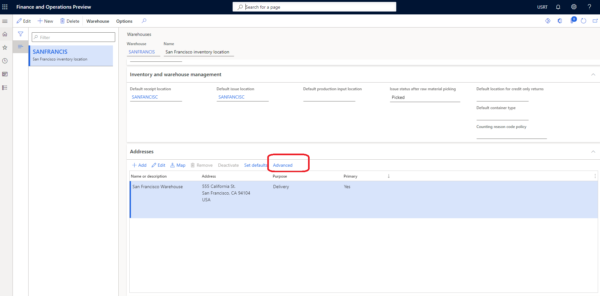
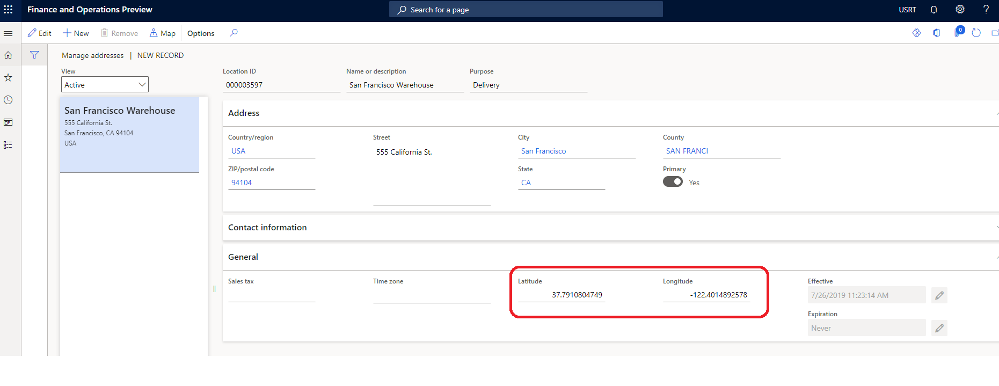

# Store selector module

[!include [banner](includes/banner.md)]

This article covers the store selector module and describes how to add it to site pages in Microsoft Dynamics 365 Commerce.

Customers can use the store selector module to pick up a product in a selected store after an online purchase. In Commerce version 10.0.13, the store selector module also includes additional capabilities that can showcase a **Find a Store** page that shows nearby stores.

The store selector module lets users enter a location (city, state, address, and so on) to search for stores within a search radius. When the module is first opened, it uses the customer's browser location to find stores (if consent is provided).

## Store selector module usage

- A store selector module can be used on a product details page (PDP) to select a store for pickup.
- A store selector module can be used on a cart page to select a store for pickup.
- A store selector module can be used on a standalone page that shows all available stores.

## Fulfillment group setup in Commerce headquarters

For the store selector to display available stores, the fulfillment group must be set up in Commerce headquarters. For more information, see [Set up fulfillment groups](customer-orders-overview.md#set-up-fulfillment-groups).

In addition, for each store in the fulfillment group, the latitude and longitude of the store location must be defined in headquarters.

To enter the latitude and longitude values for a store location in Commerce headquarters, follow these steps.

1. Go to **Inventory management \> Setup \> Inventory breakdown**.
1. Select the warehouse location in the left pane.
1. On the **Addresses** FastTab, select **Advanced**.

    

1. On the Action Pane, select **Edit**.
1. On the **General** FastTab, enter values for **Latitude** and **Longitude**.

    

1. On the Action Pane, select **Save**. 

### Hide a store from the store selector module

Some stores in a fulfillment group might not be valid pickup locations. To ensure that only valid pickup locations appear as options in the store selector module, follow these steps in Commerce headquarters.

1. Go to **Retail and Commerce \> Commerce setup \> Fulfillment groups \> All stores**.
1. On the Action Pane, select **Edit**.
1. Under **Setup**, for every store that isn't a valid pickup location, clear the **Is Pickup Location** checkbox.
1. On the Action Pane, select **Save**.
1. Run the 1070 **Channel configuration** distribution schedule job.

## Bing Maps integration

The store selector module is integrated with the [Bing Maps REST application programming interfaces (APIs)](/bingmaps/rest-services/) to use Bing's Geocoding and Autosuggest features. A Bing Maps API key is required and must be added to the shared parameters page in Commerce headquarters. The Geocoding API is used to convert a location to latitude and longitude values. The integration with the Autosuggest API is used to show search suggestions when users enter locations in the search field.

For the Autosuggest REST API, you must ensure that the following URLs are allowed per your site's content security policy (CSP). This setup is done in Commerce site builder, by adding allowed URLs to various CSP directives for the site (for example, **img-src**). For more information, see [Content security policy](manage-csp.md). 

- To the **connect-src** directive, add **&#42;.bing.com**.
- To the **img-src** directive, add **&#42;.virtualearth.net**.
- To the **script-src** directive, **add &#42;.bing.com, &#42;.virtualearth.net**.
- To the **script style-src** directive, add **&#42;.bing.com**.

## Pickup in store mode

The store selector module supports a **Pick up in store** mode that shows a list of stores where a product is available for pickup. It also shows store hours and product inventory for each store in the list. The store selector module requires the context of a product to render product availability and to let the user add the product to the cart, if the product's delivery mode is set to **pickup** at the selected store. For more information, see [Inventory settings](inventory-settings.md). 

The store selector module can be added to a buy box module on a PDP to show stores where a product is available for pickup. It can also be added to a cart module. In this case, the store selector module shows pickup options for each line item in the cart. The store selector module can also be added to other pages or modules via extensions and customizations.

For this scenario to work, products should be configured so that the **pickup** delivery mode is used. Otherwise, the module won't be shown on the product pages. For more information about how to configure the delivery mode, see [Set up modes of delivery](/dynamicsax-2012/appuser-itpro/set-up-modes-of-delivery).

The following image shows an example of a store selector module used on a PDP.

> [!NOTE]
> In version 10.0.16 and later, a new feature can be enabled which allows an organization to define multiple pick up modes of delivery options for customers.  If this feature is enabled, the store selector and other modules of e-Commerce will be enhanced to allow the shopper to choose from potentially multiple pick up delivery options if configured.  To learn more about this feature, refer to [this documentation](./multiple-pickup-modes.md). 

## Find stores mode

The store selector module also supports a **Find stores** mode. This mode can be used to create a store locations page that shows available stores and their information. In this mode, the store selector module works without product context and can be used as a standalone module on any site page. In addition, if the relevant settings are turned on for the module, users can select a store as their preferred store. When a store is selected as a user's preferred store, the store ID is maintained in the browser cookie. Therefore, the user must accept a cookie consent message.

The following illustration shows an example of a store selector module that is used together with a map module on a store locations page.

## Render a map

The store selector module can be used together with the map module to show the store locations on a map. For more information about the map module, see [Map module](map-module.md)

## Store selector module properties

| Property name | Value | Description |
|---------------|-------|-------------|
| Heading | Text | The heading for the module. |
| Mode | **Find stores** or **Pick up in store** | **Find stores** mode shows available stores. **Pick up in store** mode lets users select a store for pickup. |
| Style | **Dialog** or **Inline** | The module can be rendered either inline or in a dialog box. |
| Set as preferred store | **True** or **False** | When this property is set to **True**, users can set a preferred store. This feature requires that users accept a cookie consent message. |
| Show all stores | **True** or **False** | When this property is set to **True**, users can bypass the **Search radius** property and view all stores. |
| Autosuggest options: Max results | Number | This property defines the maximum number of autosuggest results that can be shown via the Bing Autosuggest API. |
| Search radius | Number | This property defines the search radius for stores, in miles. If no value is specified, the default search radius of 50 miles is used. |
| Terms of service | URL |  This property specifies the terms of service URL that is required to use the Bing Maps service. |

## Site settings

The store selector module respects the [Add product to cart settings](add-cart-settings.md). After an item is added to the cart from the store selector module, site users will see the appropriate configured workflows.

## Add a store selector module to a page

For **Pickup in store** mode, the module can be used only on PDPs and cart pages. You must set the mode to **Pickup in store** in the module's property pane.

- For information on how to add a store selector module to a buy box module, see [Buy box module](add-buy-box.md). 
- For information on how to add a store selector module to a cart module, see [Cart module](add-cart-module.md)

To configure the store selector module to show available stores for a store locations page, as in the illustration that appears earlier in this article, follow these steps.

1. Go to **Templates**, and select **New** to create a new template.
1. In the **New template** dialog box, under **Template name**, enter **Marketing template**, and then select **OK**.
1. Select **Save**, select **Finish editing** to check in the template, and then select **Publish** to publish it.
1. Go to **Pages**, and select **New** to create a new page.
1. In the **Create a new page** dialog box, under **Page name**, enter **Store locations**, and then select **Next**.
1. Under **Choose a template**, select the **Marketing template** that you created, and then select **Next**.
1. Under **Choose a layout**, select a page layout (for example, **Flexible layout**), and then select **Next**.
1. Under **Review and finish**, review the page configuration. If you need to edit the page information, select **Back**. If the page information is correct, select **Create page**. 
1. In the **Main** slot of the new page, select the ellipsis (**...**), and then select **Add module**.
1. In the **Select modules** dialog box, select the **Container** module, and then select **OK**.
1. In the **Container** slot, select the ellipsis (**...**), and then select **Add module**.
1. In the **Select modules** dialog box, select the **Container with 2 columns** module, and then select **OK**.
1. In the module's properties pane, set the **Width** value to **Fill Container**.
1. Set the **X-Small view port column configuration** value to **100%**.
1. Set the **Small view port column configuration** value to **100%**.
1. Set the **Medium view port column configuration** value to **33% 67%**.
1. Set the **Large view port column configuration** value to **33% 67%**.
1. In the **Container with 2 columns** slot, select the ellipsis (**...**), and then select **Add module**.
1. In the **Select modules** dialog box, select the **Store selector** module, and then select **OK**.
1. In the module's properties pane, set the **Mode** value to **Find stores**.
1. Set the **Search radius** value in miles.
1. Set other properties, such as **Set as preferred store**, **Show all stores**, and **Enable auto suggestion**, as you require.
1. In the **Container with 2 columns** slot, select the ellipsis (**...**), and then select **Add module**.
1. In the **Select modules** dialog box, select the **Map** module, and then select **OK**.
1. In the module's properties pane, set any additional properties as you require.
1. Select **Save**, select **Finish editing** to check in the page, and then select **Publish** to publish it.
 
## Additional resources

[Module library overview](starter-kit-overview.md)

[Buy box module](add-buy-box.md)

[Cart module](add-cart-module.md)

[Quick tour of PDP](quick-tour-pdp.md)

[Quick tour of cart and checkout](quick-tour-cart-checkout.md)

[Set up modes of delivery](/dynamicsax-2012/appuser-itpro/set-up-modes-of-delivery)

[Manage Bing Maps for your organization](dev-itpro/manage-bing-maps.md)

[Bing Maps REST APIs](/bingmaps/rest-services/)

[Maps module](map-module.md)

[!INCLUDE[footer-include](../includes/footer-banner.md)]
