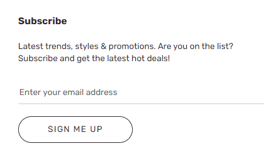

---
# required metadata

title: Subscribe module
description: This topic covers subscribe modules and describes how to add them to site pages in Microsoft Dynamics 365 Commerce.
author: anupamar-ms
ms.date: 07/08/2021
ms.topic: article
ms.prod: 
ms.technology: 

# optional metadata

ms.search.form: 
audience: Application User
# ms.devlang: 
ms.reviewer: v-chgri
# ms.tgt_pltfrm: 
# ms.custom: 
ms.search.region: Global
ms.search.industry: 
ms.author: anupamar
ms.search.validFrom: 2019-10-31
ms.dyn365.ops.version: Release 10.0.8

---
# Subscribe module

[!include [banner](includes/banner.md)]

This topic covers subscribe modules and describes how to add them to site pages in Microsoft Dynamics 365 Commerce.

Subscribe modules can be used on site pages to capture customer information for newsletters or promotions.

The following illustration shows an example of a subscribe module in the footer of an Adventure Works site page.

> [!IMPORTANT]
> - The subscribe module is available in the Commerce module library as of the Dynamics 365 Commerce version 10.0.20 release.
> - The subscribe module is showcased in the Adventure Works theme.
> - The subscribe module requires a data action extension to work with some marketing email providers, so that newsletter or promotional emails can be sent after customer information is captured.

## Subscribe module properties

| Property name | Values | Description |
|---------------|--------|-------------|
| Heading       | Heading text and heading tag (**H1**, **H2**, **H3**, **H4**, **H5**, or **H6**) | A text heading for the subscribe module, such as **Subscribe to the newsletter** or **Sign up for 10% off**. |
| Paragraph     | Paragraph text | The subscribe module supports paragraph text in rich text format, to provide additional details for the call to action in the heading. |

## Add a subscribe module to a new page

To add a subscribe list module to a new page and set the required properties in Commerce site builder, follow these steps.

1. Go to **Templates**, and open the marketing template for your site's home page (or create a new marketing template).
1. In the **Main** slot of the default page, select the ellipsis (**...**), and then select **Add Module**.
1. In the **Add Module** dialog box, select the **Subscribe** module, and then select **OK**.
1. Select **Save**, select **Finish editing** to check in the template, and then select **Publish** to publish it.
1. Go to **Pages**, and open the site's home page (or create a new home page by using the marketing template).
1. In the **Main** slot of the default page, select the ellipsis button (**...**), and then select **Add Module**.
1. In the **Add Module** dialog box, select the **Subscribe** module, and then select **OK**.
1. In the property pane of the subscribe module, add a heading, such as **Subscribe**.
1. Add paragraph text, such as **Latest trends, styles, & promotions. Are you on the list? Subscribe and get the latest hot deals!**
1. Select **Save**, and then select **Preview** to preview the page.
1. Select **Finish editing** to check in the template, and then select **Publish** to publish it.

## Additional resources

[Module library overview](starter-kit-overview.md)

[Adventure Works theme](adventure-works-theme.md)

[!INCLUDE[footer-include](../includes/footer-banner.md)]
