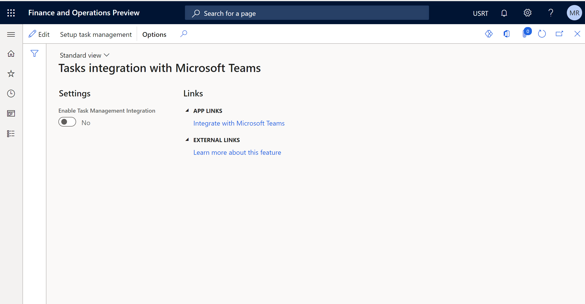

---
# required metadata
title: Synchronize task management between Microsoft Teams and Dynamics 365 Commerce POS
description: This topic describes how to synchronize task management between Microsoft Teams and Dynamics 365 Commerce point of sale (POS).
author: gvrmohanreddy
manager: annbe
ms.date: 03/12/2021
ms.topic: article
ms.prod: 
ms.service: dynamics-365-commerce
ms.technology: 
# optional metadata
# ms.search.form:  
#ROBOTS: 
audience: Application User
# ms.devlang: 
ms.reviewer: v-chgri
ms.search.scope: Retail, Core, Operations
# ms.tgt_pltfrm: 
# ms.custom: 
ms.search.region: Global
# ms.search.industry: 
ms.author: gmohanv
ms.search.validFrom: 2021-01-15
ms.dyn365.ops.version: 10.0.18
---

# Synchronize task management between Microsoft Teams and Dynamics 365 Commerce POS

[!include [banner](includes/banner.md)]
[!include [banner](includes/preview-banner.md)]

This topic describes how to synchronize task management between Microsoft Teams and Microsoft Dynamics 365 Commerce point of sale (POS).

One of the key objectives of Microsoft Teams integration is synchronizing task management between the POS application and Microsoft Teams, so that store employees can use either of the applications to manage tasks without needing to switch applications. 

Since Planner in Microsoft Teams is used as repository for tasks, there must be a link between Microsoft Teams and Dynamics 365 Commerce. This link is made by using a specific plan ID for a given store team. 

The following procedures provide the steps needed to set up task management synchronization between the POS and Teams applications.

## Publish a test task list in Teams

The following procedure assumes that your store teams are using Teams task management integration with Dynamics 365 Commerce for the first time.

To publish a test task list in Teams, follow these steps.

1. Sign in to Microsoft Teams as a communication manager. This is typically a user with the "regional manager" role in Dynamics 365 Commerce. 
1. In the left navigation pane, select **Tasks by Planner**. 
1. At the bottom left of the **Published lists** tab, select **New list** and name the list "Test task list."
1. Select **Create**. The new list appears under **Drafts**.
1. Under **Task title**, give the first task the title "Testing Teams integration" and then select **Enter**.
1. In the **Drafts** list, select the task list, then select **Publish** in the top right corner.
1. In the **Select who to publish to** dialog box, select the teams that should receive the test task list.
1. Select **Next** to review your publication plan. To make changes, select **Back**. 
1. Select **Confirm to proceed**, and then select **Publish**. 
1. Once publishing is done, a message at the top of the **Published lists** tab will indicate if your task list was successfully delivered.

For more information, see [Publish task lists to create and track work in your organization](https://support.microsoft.com/office/publish-task-lists-to-create-and-track-work-in-your-organization-095409b3-f5af-40aa-9f9e-339b54e705df).

## Link POS and Teams for task management

To link POS and Teams applications for task management in Commerce headquarters, follow these steps.

1. Go to **Retail and Commerce \> Task management \> Tasks integration with Microsoft Teams**. 
1. Select **Edit** on the Action Bar.
1. Set the **Enable Task Management Integration** option to **Yes**.
1. Select **Save** on the Action Bar.
1. Select **Setup task management** on the Action Bar. You should see a notification indicating that a batch job called "Teams provision" is being created. 
1. Go to **System administration \> Inquiries \> Batch jobs** and find the most recent job that has the description "Teams provision." Wait until the execution of this job is completed.
1. Run the **CDX job 1070** to publish the plan ID & store references to Retail Server. 

## Additional resources

[Manage the Tasks app for your organization in Microsoft Teams](https://docs.microsoft.com/microsoftteams/manage-tasks-app)

[Dynamics 365 Commerce and Microsoft Teams integration ](commerce-teams-integration.md)

[Provision Microsoft Teams from Dynamics 365 Commerce](provision-teams-from-commerce.md)

[Enable Microsoft Teams integration](enable-teams-integration.md)

[Manage user roles in Microsoft Teams](manage-user-roles-teams.md)
