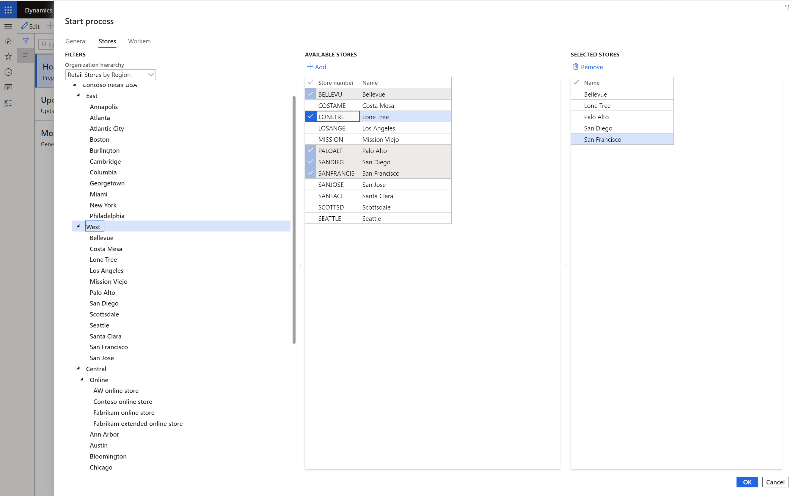
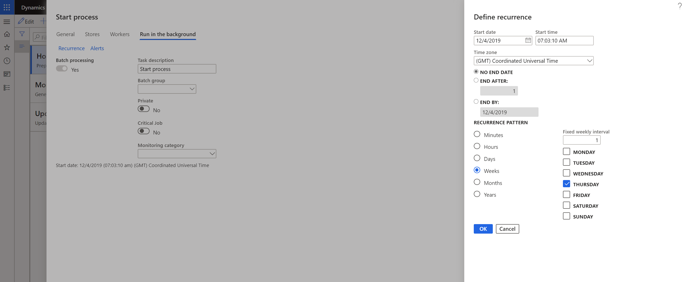

---
# required metadata

title: Assign task lists to stores or employees
description: This topic describes how to assign task lists to stores or employees in Microsoft Dynamics 365 Commerce.
author: gvrmohanreddy
ms.date: 02/10/2020
ms.topic: article
ms.prod: 
ms.technology: 

# optional metadata

# ms.search.form:  
# ROBOTS: 
audience: Application User
# ms.devlang: 
ms.reviewer: v-chgri
# ms.tgt_pltfrm: 
# ms.custom: 
ms.search.region: Global
ms.search.industry: 
ms.author: gmohanv
ms.search.validFrom: 2020-02-03
ms.dyn365.ops.version: Release 10.0.9
---

# Assign task lists to stores or employees

[!include [banner](includes/banner.md)]

This topic describes how to assign task lists to stores or employees in Microsoft Dynamics 365 Commerce.

Task management in Dynamics 365 Commerce lets you assign a task list to multiple stores or employees, or to a combination of stores and employees. For example, a regional manager for 20 stores might want to assign the **Holiday season preparation** task list to all 20 stores.

## Start the task list assignment process

To start the process of assigning a task list, follow these steps.

1. Go to **Retail and Commerce \> Task management \> Task management administration**.
1. Select the task list to assign.
1. Select **Start process**.
1. In the **Start process** dialog box, on the **General** tab, in the **Process name** field, enter a name (for example, **East region stores**).
1. In the **Target date** field, specify a date.
1. To assign the task list to stores, on the **Stores** tab, use the **Organization hierarchy** filter to find and select the stores.

    To assign the task list to employees, on the **Workers** tab, find and select the employees.

1. Select **OK** to start the process. The tasks list is assigned to the selected stores or employees.

The following illustration shows an example of how to find and select stores in the **Start process** dialog box.

## Assign task lists on a recurring basis

Retailer sometimes have recurrent tasks, such as "Thursday closure checklist" or "First day of the month checklist." Therefore, they might want to assign the task list on a recurring basis.

1. Go to **Retail and Commerce \> Task management \> Task management administration**.
1. Select the task list to assign.
1. Select **Start process**.
1. In the **Start process** dialog box, on the **General** tab, in the **Process name** field, enter a name.
1. Set the **Recurrence** option to **Yes**.
1. In the **Recurrence target date offset in days** field, enter a number of days. For example, if you enter **4**, the target date is the recurrence date plus four days.
1. On the **Run in the background** tab, select **Recurrence**.
1. In the **Define recurrence** dialog box, enter the frequency criteria, and then select **OK**.

The following illustration shows an example of how to enter frequency criteria in the **Define recurrence** dialog box.

## Track task list status

If you're a regional manager or store manager, you might want to track the status of task lists that have been assigned to multiple stores or employees. You can then follow up with stores or workers that didn't complete their assigned tasks on time. Commerce back office lets you view the status of task lists, reassign tasks, or change the status of a task.

To track the task list status for all tasks, follow these steps.

1. Go to **Retail and Commerce \> Task management \> Task management processes**.
1. Select the **All task lists** tab to view the status of all task lists that are assigned to various stores.

To track the task list status for all tasks that are assigned to you, follow these steps.

1. Go to **Retail and Commerce \> Task management \> Task management processes**.
1. Select the **My tasks** or **All tasks** tab to view or update the status of tasks that are assigned to you.

## Additional resources

[Task management overview](task-mgmt-overview.md)

[Configure task management](task-mgmt-configure.md)

[Create task lists and add tasks](task-mgmt-create-lists.md)

[Task management in POS](task-mgmt-POS.md)

[!INCLUDE[footer-include](../includes/footer-banner.md)]
