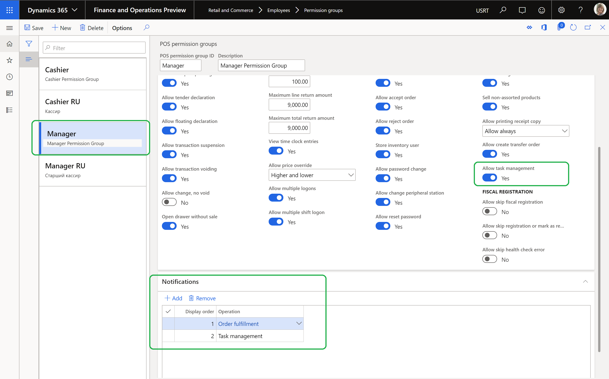

---
# required metadata

title: Configure task management
description: Dynamics 365 Commerce's Task Management is a productivity feature, for Firstline manager (Regional/Store) and Firstline workers, that gives an ability to create tasks lists , manage assignment criteria, and track status, in an integrated way between Backoffice and POS applications.
author: [gvrmohanreddy]
manager: annbe
ms.date: 02/10/2020
ms.topic: article
ms.prod: 
ms.service: dynamics-365-commerce
ms.technology: 

# optional metadata

# ms.search.form:  
# ROBOTS: 
audience: Application User
# ms.devlang: 
ms.reviewer: v-chgri
ms.search.scope: Retail, Core, Operations
# ms.tgt_pltfrm: 
# ms.custom: 
ms.search.region: Global
ms.search.industry: 
ms.author: gmohanv
ms.search.validFrom: 2020-02-03
ms.dyn365.ops.version: Release 10.0.9
---

# Configure task management

[!include [banner](includes/banner.md)]

## Overview

Task management features in Dynamics 365 Commerce needs permissions for Backoffice persona and Store persona. This document illustrates how to configure permissions for different personas to manage tasks lists and tasks. It also covers configuring POS notifications for tasks and adding a tile for Tasks on the POS home page screen layout.

## Configuring permissions for Backoffice persona
Backoffice user needs to be assigned with Retail task manager role to allow creation of tasks lists, manage assignment criteria at stores level and ability to configure recurrence for any tasks lists. 

To grant permissions to an employee, follow below steps. 

1. Go to **Retail and Commerce > Employees > Users** 
1. Click on specific user 
1. In User's role fast tab, click on **+ Assign roles**
1. On **Assign roles to user** flyout fine **Retail task manager** role and click Ok.

## Configure POS notifications for tasks

POS operation Task management needs to be enabled for allowing notifications in POS. 

To configure POS notification for tasks, follow these steps.

1. Go to **Retail and Commerce > Channel setup > POS setup > POS > Operations**.
1. Search for the Task management (1400) operation, and select the Enable notifications check box for it to specify that the notification framework should listen to the handler for this operation. 

The following image shows

## Configure permissions for store managers

Every worker in the store can **view** all tasks assigned to the given store, and update status for tasks those are assigned to themselves. However personas like store managers need **task management permissions** for all the tasks assigned to the store and even an ability to create ad-hoc tasks. 

To configure POS permissions for store managers, follow these steps.

1. Go to **Retail and Commerce > Employees > Permissions Groups**.
1. Click on specific permission group, e.g. **Manager**, and click **Edit**. 
1. On **Permissions** fast tab, set **Allow task management** switch to **Yes**.
1. On **Notifications** fast tab, add the **Task management** operation, and set the Display order field value, e.g. 2 in your already have Order fulfillment notifications. 
1. For more details on configurating POS notification and what jobs to be run refer to [Show order notifications in the point of sale (POS)](https://docs.microsoft.com/en-us/dynamics365/retail/notifications-pos?toc=/dynamics365/commerce/toc.json) .
	
!Note: In a scenario where a non-manager persona needs task management permissions in POS, either grant permission to the individual, or create a new permission group with **allow task management** enabled for non-managers. 

The following image shows

### Distribute permission to POS

To distribute permission to POS, follow these steps.

1. Go to **Retail and Commerce > Retail and Commerce IT > Distribution schedule**.
1. Select **1060 staff** and click on **Run now**.
1. Select **1070 channel configuration** and click on **Run now**. 
  
## Configure the tasks tile on POS Homepage

To configure the tasks tile on POS application, follow these steps.

1. Go through  [**Screen layouts for POS**](https://docs.microsoft.com/en-us/dynamics365/retail/pos-screen-layouts?toc=/dynamics365/commerce/toc.json) to learn on how to configure screen layout and use designer, to add new buttons to POS screen layouts.
1. Then go to **Retail and Commerce > Channel setup > POS setup > POS > Screen layouts**.
1. Select **Screen layout**, and **Layout size**, and then select **Button grid**.
1. Click **Designer** link to edit the appropriate  button grid 
1. Add **Tasks** tile in appropriate section on the Home Screen. An example is showed below.

The following image shows

## Additional resources

