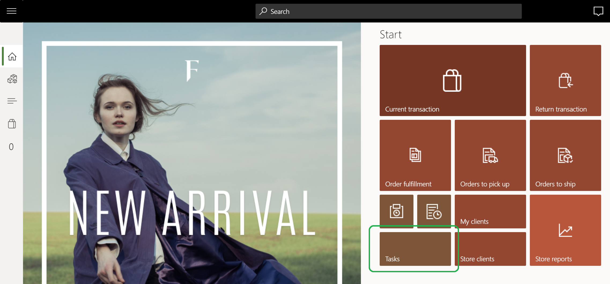

---
# required metadata

title: Configure task management
description: This topic describes how to configure task management features in Microsoft Dynamics 365 Commerce.
author: gvrmohanreddy
manager: annbe
ms.date: 02/10/2020
ms.topic: article
ms.prod: 
ms.service: dynamics-365-commerce
ms.technology: 

# optional metadata

# ms.search.form:  
# ROBOTS: 
audience: Application User
# ms.devlang: 
ms.reviewer: v-chgri
ms.search.scope: Retail, Core, Operations
# ms.tgt_pltfrm: 
# ms.custom: 
ms.search.region: Global
ms.search.industry: 
ms.author: gmohanv
ms.search.validFrom: 2020-02-03
ms.dyn365.ops.version: Release 10.0.9
---

# Configure task management

[!include [banner](includes/banner.md)]

This topic describes how to configure task management features in Microsoft Dynamics 365 Commerce.

## Overview

For Commerce managers and employees to be able to use Dynamics 365 Commerce task management features, task management must first be configured. Configuration steps include granting permissions to managers and employees, distributing permissions to point of sale (POS) clients, setting up POS notifications, and configuring the tasks tile on a POS application home page. 

## Configure permissions for store managers

Every worker in the store can view all tasks assigned to the given store, and update status for tasks that are assigned to them. However, personas like store managers need task management permissions to manage tasks assigned to the store and even create ad-hoc tasks. 

To configure task management permissions for store managers, follow these steps.

1. Go to **Retail and Commerce \> Employees \> Permissions Groups**.
1. Select a specific permission group (for example, **Manager**), and then select **Edit**. 
1. On the **Permissions** tab, select **Yes** for **Allow task management**.

1. On the **Notifications** tab, add the **Task management** operation, and then enter a value for **Display order**, e.g. 2 in your already have Order fulfillment notifications.  
1. For more details on configurating POS notification and what jobs to be run refer to [Show order notifications in the point of sale (POS)](https://docs.microsoft.com/en-us/dynamics365/retail/notifications-pos?toc=/dynamics365/commerce/toc.json) .
	
> [!NOTE]
> In a scenario where a non-manager persona needs task management permissions in POS, you can either grant permission to the individual, or create a new permission group with **allow task management** enabled for non-managers. 

The following image shows

## Configure permissions for employees

Employees need to have permissions configured to create tasks lists, manage assignment criteria, and configure recurrence for any task lists. This is done by assigning the employee the retail task manager role.

To configure permissions for an employee, follow these steps. 

1. Go to **Retail and Commerce \> Employees \> Users** 
1. Find and select a specific employee. 
1. On the employee's role tab, select **+ Assign roles**.
1. On the **Assign roles to user** flyout menu, find the **Retail task manager** role and then select **OK**.

### Distribute permissions to POS clients

For employees to be able to use POS clients, permissions must first be distributed and synced to those clients.

To distribute permissions to POS clients, follow these steps.

1. Go to **Retail and Commerce \> Retail and Commerce IT \> Distribution schedule**.
1. Select **1060 staff**, and then select **Run now**.
1. Select **1070 channel configuration**, and then select **Run now**. 

## Configure POS notifications for tasks

POS operation Task management needs to be enabled for allowing notifications in POS. 

To configure POS notification for tasks, follow these steps.

1. Go to **Retail and Commerce \> Channel setup \> POS setup \> POS \> Operations**.
1. Search for the **Task management (1400)** operation, and then select the **Enable notifications** check box. 

The following image shows

  
## Configure the tasks tile on a POS application home screen

Before configuring the task tile on a POS application home page, see [**Screen layouts for the point of sale (POS)**](pos-screen-layouts.md) to learn on how to configure and add new buttons to a POS screen layout.

To configure the tasks tile on a POS application home page, follow these steps.

1. Go to **Retail and Commerce \> Channel setup \> POS setup \> POS \> Screen layouts**.
1. Select **Screen layout**, select **Layout size**, and then select **Button grid**.
1. Select **Designer** to edit the appropriate button grid.
1. Add a **Tasks** tile to the appropriate section of the home screen. An example is showed below.

The following image shows an example of a tasks tile on a POS home screen.

## Additional resources

