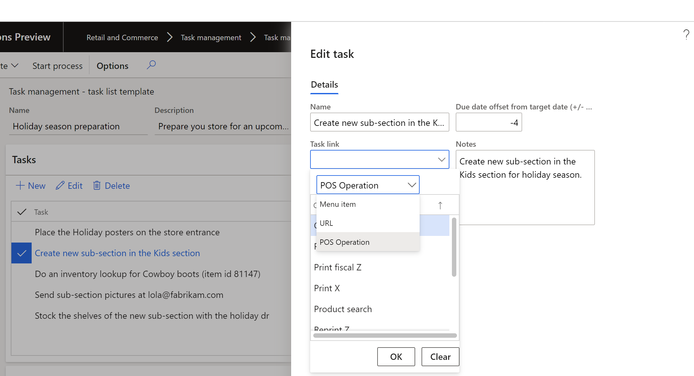

---
# required metadata

title: Create task lists and add tasks
description: This topic describes how to create task lists and add tasks to task lists in Dynamics 365 Commerce.
author: [gvrmohanreddy]
manager: jeffbl
ms.date: 02/10/2020
ms.topic: article
ms.prod: 
ms.service: dynamics-365-commerce
ms.technology: 

# optional metadata

ms.search.form:  
#ROBOTS: 
audience: Application User
# ms.devlang: 
ms.reviewer: v-chgri
ms.search.scope: Retail, Core, Operations
# ms.tgt_pltfrm: 
# ms.custom: 
ms.search.region: Global
ms.search.industry: 
ms.author: gmohanv
ms.search.validFrom: 2020-02-03
ms.dyn365.ops.version: Release 10.0.9
---

# Create task lists and add tasks

[!include [banner](includes/banner.md)]

This topic describes how to create task lists and add tasks to task lists in Dynamics 365 Commerce.

## Overview

A task list is a collection of tasks that must be completed as part of a business process. For example, there might be a task list that a new worker must complete while onboarding, a task list for an evening shift cashier to complete, and a task list to prepare the store for an upcoming holiday season etc. In Dynamics 365 Commerce a task list can be assigned to number of store and/or number of employees with a target date, and even recurrently. 

A task defines a specific piece of work or an action that someone must complete on or before the specified due date. In Dynamics 365 Commerce, a task will have ability to provide detailed instructions, contact person, and ability to link a task with Backoffice operation, POS operation, or a URL so that Task owner can jump start with context and improve the productivity.   

HQ persona or Store Manager can creates task lists e.g. Holiday season preparation, Thursday night closing checklist etc. in Dynamics 365 Commerce's Backoffice and assign them to the set of stores. 

Dynamics 365 Commerce's Task Management is a productivity feature, for Firstline manager (Regional/Store) and Firstline workers, that gives an ability to create tasks lists , manage assignment criteria, and track status, in an integrated way between Backoffice and POS applications.

## Create a task list

1. Go to **Retail and Commerce > Task management > Task management administration**  
1. Click on **+ New** and provide **Name, Description**, and select an **Owner** for the task list.
1. Click on **Save**.

## Add tasks to a task list
 
1. After saving task list, under **Tasks** fast tab, click on **+ New** to add a task.
1. On the **Create a new task** flyout, fill in task details.
1. **Name** of the task as a title for task owner. 
1. Give a +/- integer value for **Due data offset from target date**, e.g. give **-2** if you want the task to be completed two days before the tasks list due date.    
1. Provide detailed instructions under **Notes** field. 
1. Provide **Contact person** if the task needs subject matter help.
1. Provide a **Task link** based on the nature of the task. Read below for more information on Task link feature. 
   
> [!TIP] 
> Though it's technically feasible to assign a task to someone while creating the task, try to avoid assigning task while creating task list.  You can assign the tasks once the list is instantiated for individual stores. 

Using Task link to improve workers productivity
 
Dynamics 365 Commerce offers a way to link a task to a specific POS operation e.g. Run sales report, or online training video for new employee orientation task, or Backoffice operation e.g. product kits. This feature helps task owners to jump start with the task as clicking on task link navigate them to appropriate operation.

Linking tasks while creating a task

1. Click on **Task link** dropdown
1. Choose  **Menu item** for configuring a Backoffice operation, e.g. Product kits
1. Choose **POS operation** for configuring a POS operation, e.g. Sales reports.
1. Choose **URL** for configuring absolute URL. e.g. [http://mydomain.com/training/orientation(http://mydomain.com/training/orientation) 

The following diagram shows

**Enable a POS operation to be linkable to a task**

To enable a POS operation to be linked with a task, follow below steps:

	1. Go to **Retail and Commerce > Channel setup > POS setup > POS > Operations**.
	2. Click **Edit**,  and identify the preferred POS operation, and then select **Enable Task Management** check box. 

## Additional resources

