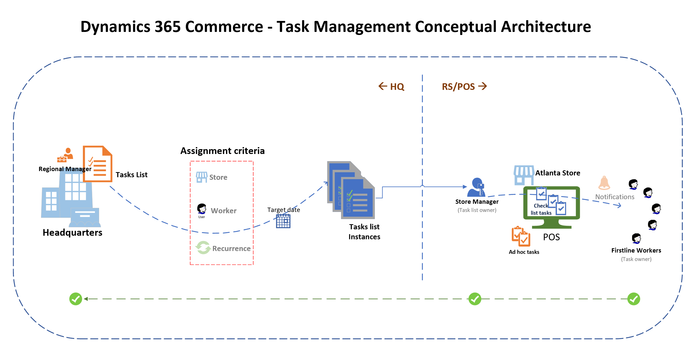

---
# required metadata

title: Task management overview
description: This topic provides an overview of task management for managers and workers in Microsoft Dynamics 365 Commerce.
author: gvrmohanreddy
ms.date: 02/10/2020
ms.topic: overview
ms.prod: 
ms.technology: 

# optional metadata

ms.search.form:  
audience: Application User
# ms.devlang: 
ms.reviewer: v-chgri
# ms.tgt_pltfrm: 

ms.search.region: Global
ms.search.industry: 
ms.author: gmohanv
ms.search.validFrom: 2020-02-03
ms.dyn365.ops.version: Release 10.0.9
---

# Task management overview

[!include [banner](includes/banner.md)]

This topic provides an overview of task management for managers and workers in Microsoft Dynamics 365 Commerce.

In a retail environment, it's always difficult to make sure that tasks are performed by the right person at the right time. Retailers must be able to notify workers about upcoming tasks and provide related business context, so that the tasks can be completed correctly and on time.

Task management is a productivity feature in Dynamics 365 Commerce that lets managers and workers create task lists, manage assignment criteria, track task status, and integrate these operations between Commerce back office and point of sale (POS) applications.

Headquarters personas can use task management to create task lists for retail stores, and to track status by store or worker. They can also create recurrent tasks (for example, "Thursday night closing checklist").

Store managers can use task management to assign tasks to individual workers, send notifications about upcoming tasks or tasks that are past due, update task status, and create single-purpose tasks in the POS application. Workers can then see notifications, view task details, and update task status at the POS.

The following illustration shows the conceptual architecture of task management in Commerce.

## Additional resources

[Configure task management](task-mgmt-configure.md)

[Create task lists and add tasks](task-mgmt-create-lists.md)

[Assign task lists to stores or employees](task-mgmt-assign-lists.md)

[Task management in POS](task-mgmt-POS.md)

[!INCLUDE[footer-include](../includes/footer-banner.md)]
