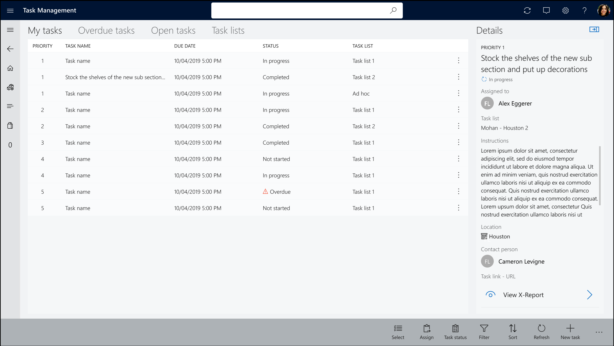
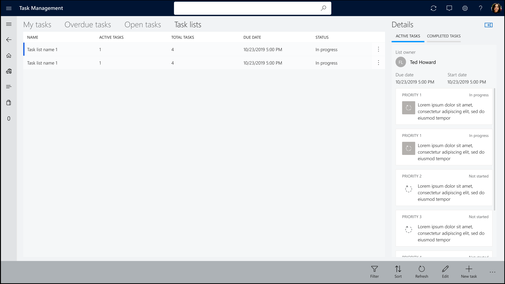

---
# required metadata

title: Task management in POS
description: This topic describes task management in the Microsoft Dynamics 365 Commerce point of sale (POS) application.
author: gvrmohanreddy
ms.date: 02/10/2020
ms.topic: article
ms.prod: 
ms.technology: 

# optional metadata

# ms.search.form:  
# ROBOTS: 
audience: Application User
# ms.devlang: 
ms.reviewer: v-chgri
# ms.tgt_pltfrm: 
# ms.custom: 
ms.search.region: Global
ms.search.industry: 
ms.author: gmohanv
ms.search.validFrom: 2020-02-03
ms.dyn365.ops.version: Release 10.0.9
---

# Task management in POS

[!include [banner](includes/banner.md)]

This topic describes task management in the Microsoft Dynamics 365 Commerce point of sale (POS) application.

The Dynamics 365 Commerce POS application has task management features that let store managers and workers manage tasks and update task status. Store workers can access tasks either by selecting the **Tasks** tile on the POS home page or by selecting task notifications. By default, store workers are taken to the **My tasks** tab, where they can view the tasks that are assigned to them. However, they can easily switch to the **Overdue tasks**, **Open tasks**, and **Task lists** tabs.

## Task operations for store managers

Store managers can perform the following task operations in the POS application by using the buttons on the command bar:

- **Assign** – Assign selected tasks to a store worker.
- **Task status** – Change the status of selected tasks.
- **Filter** – By default, only active tasks are shown. However, by applying filters, managers can view all tasks, even tasks that have been completed or canceled.
- **New task** – Create a task under an existing task list, or create an single-purpose task.

Store workers can perform the following task operations in the POS application by using the buttons on the command bar:

- **Task status** – Change the status of selected tasks.
- **Filter** – By default, only active tasks are shown. However, by applying filters, workers can view all tasks, even tasks that have been completed or canceled.

The following illustration shows the **My tasks** tab in the Commerce POS application.

The following illustration shows the **Task lists** tab.

## Additional resources

[Task management overview](task-mgmt-overview.md)

[Configure task management](task-mgmt-configure.md)

[Create task lists and add tasks](task-mgmt-create-lists.md)

[Assign task lists to stores or employees](task-mgmt-assign-lists.md)

[!INCLUDE[footer-include](../includes/footer-banner.md)]
