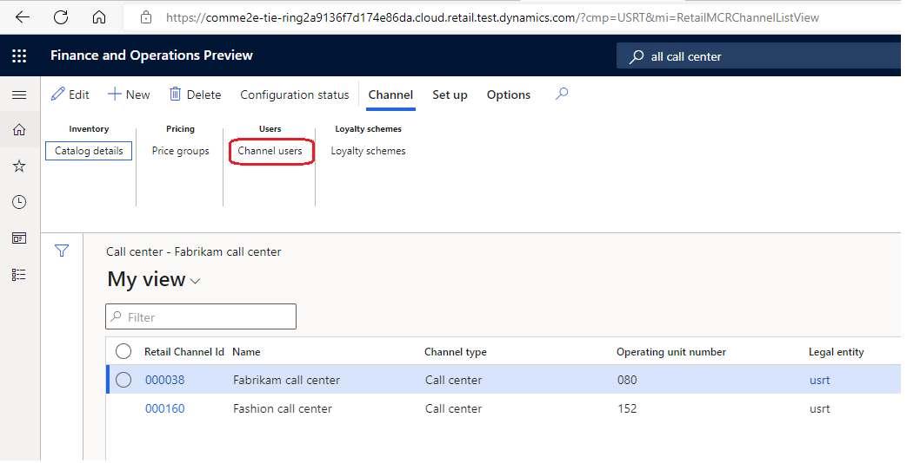
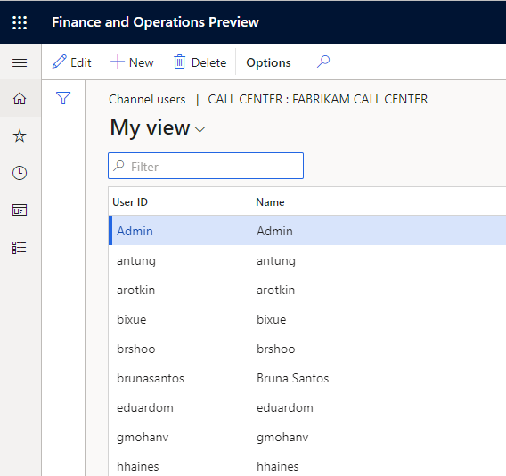
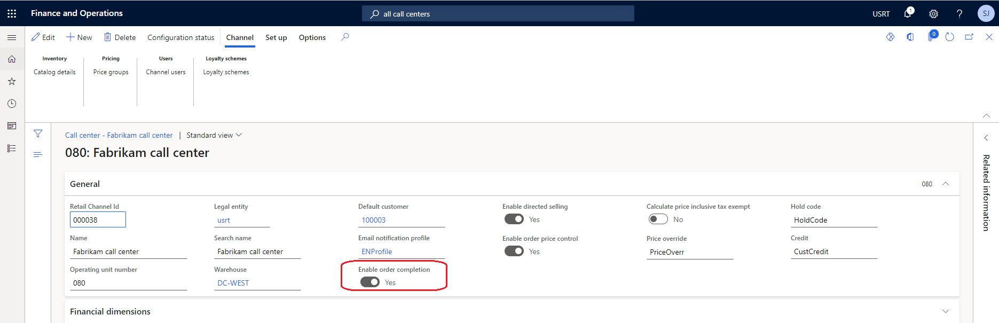

--- 
# required metadata 
 
title: Create call center orders
description: This article describes how call center users can look up a customer, create a new order, search for a product, and collect payment from a customer in Microsoft Dynamics 365 Commerce. 
author: josaw1
ms.date: 07/27/2022
ms.topic: business-process 
ms.prod:  
ms.technology:  
 
# optional metadata 
 
ms.search.form: MCRCustomerService, SalesTable, MCRSourceIdTargetLookup, MCRSalesQuickQuote, MCRSalesOrderRecap, MCRCustPaymDialog, MCRCustPaymLookup   
audience: Application User 
# ms.devlang:  
ms.reviewer: josaw
# ms.tgt_pltfrm:  
# ms.custom:  
ms.search.region: Global
ms.search.industry: Retail
ms.author: josaw
ms.search.validFrom: 2016-06-30 
ms.dyn365.ops.version: Version 7.0.0 
---
# Create call center orders

[!include [banner](../includes/banner.md)]

This article describes how call center users can look up a customer, create a new order, search for a product, and collect payment from a customer in Microsoft Dynamics 365 Commerce. The procedure below uses demo data company USRT and is intended for the sales order clerk. 

## Prerequisites

The user who completes the procedure is set up as a Call center user and optionally, Fabrikam Semi-Annual Catalog is published with at least one Source code on it. 

To add yourself as a call center user, in Commerce headquarters navigate to the **All call centers** form and add yourself as a user. Refer the images below:

Additionally, open the call center form where you are added as a user and ensure that the **Enable order completion** option is set to **Yes**. If this option is not visible, you can skip this step. Refer the image below.

## Steps
 
1. Go to **Retail and Commerce \> Customers \> Customer service**.
2. For **SearchText**, enter the search criteria to look up the customer. For this example procedure, enter "Karen" and select **Tab**.  
3. Select **Search**. Since there is only one customer named "Karen" in the demo data, the result will be automatically selected. If not selected, then press the "Select" button.  
4. Select **New sales order**.
5. Expand or collapse the **Sales order** header section and choose "Mode of delivery" as 99 - Standard shipping.

  
6. Additionally, select the source code for the catalog. If there are no active source codes you can skip this step.   
7. Select the **Lines** tab to exit the **Header** tab, and then select **Add line**.
8. For **Item number**, enter the item search term. For this sample procedure, enter a item number of '813' and press tab. This action will bring up the item search window.  
9. Select the product to add to the sales order. For this task, select the item 81327
10. Enter the sales quantity.
11. Select **Complete** to capture the customer payment. Refer the image below:

    

12. Clicking the Complete buttons opens the sales order summary which displays the total amount due. The Complete button also triggers the calculation for any charges such as shipping, handling etc. and they are displayed on the order summary form.

    
    
13. Under the **Payments** section, select **Add** to capture the payments. Expand the Payments tab if it is collapsed.   
14. Select the payment method. For this example procedure, select the cash payment method.  
15. Close the page.
16. Enter the amount. For this procedure, enter an amount equal to the order balance that can be seen in the Sales order summary page to the left of the amount field. This action will allow you to complete the order as fully paid.  
17. Select **OK**.
18. Select **Submit**.
    
## Additional resources

[Customize transactional emails by mode of delivery](../customize-email-delivery-mode.md)

[Change mode of delivery in POS](../pos-change-delivery-mode.md)

[!INCLUDE[footer-include](../../includes/footer-banner.md)]
