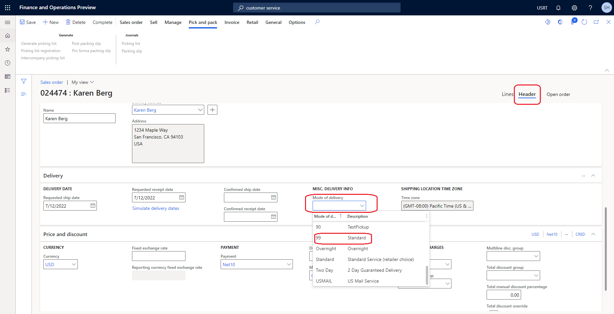
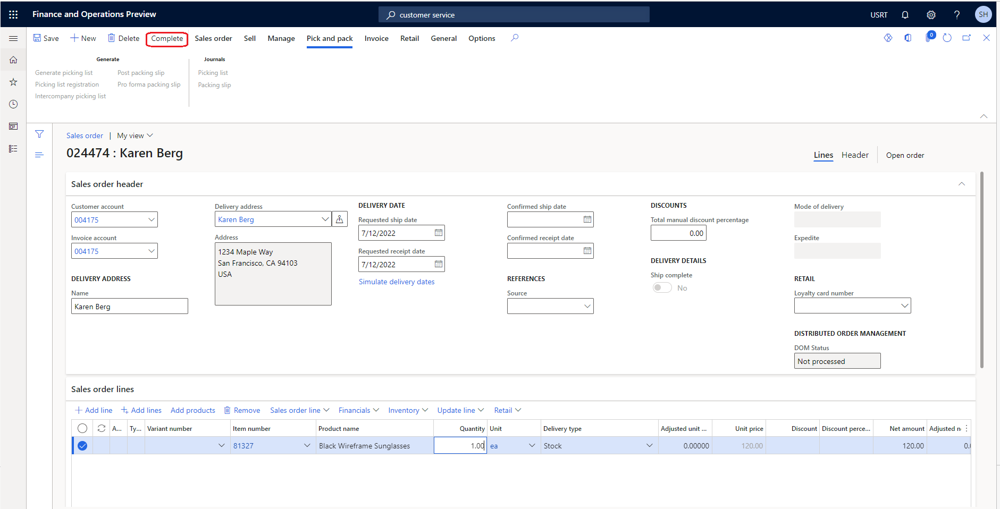
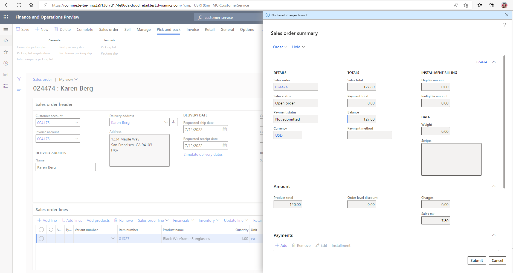

--- 
# required metadata 
 
title: Create call center orders
description: This article walks through an example procedure where a call center user looks up a customer, creates a new order, searches for a product, and collects payment from the customer in Microsoft Dynamics 365 Commerce. 
author: josaw1
ms.date: 08/05/2022
ms.topic: how-to 
ms.prod:  
ms.technology:  
 
# optional metadata 
 
ms.search.form: MCRCustomerService, SalesTable, MCRSourceIdTargetLookup, MCRSalesQuickQuote, MCRSalesOrderRecap, MCRCustPaymDialog, MCRCustPaymLookup   
audience: Application User 
# ms.devlang:  
ms.reviewer: josaw
# ms.tgt_pltfrm:  
# ms.custom:  
ms.search.region: Global
ms.search.industry: Retail
ms.author: josaw
ms.search.validFrom: 2016-06-30 
ms.dyn365.ops.version: Version 7.0.0 
---
# Create call center orders

[!include [banner](../includes/banner.md)]

This article walks through an example procedure where a call center user looks up a customer, creates a new order, searches for a product, and collects payment from the customer in Microsoft Dynamics 365 Commerce. The procedure uses the USRT demo data company and is intended for sales order clerks. 

## Prerequisites

The user who completes the procedure must be set up as a call center user. Optionally, the Fabrikam semi-annual catalog can be published with at least one source code on it.

### Add yourself as a call center user

To add yourself as a call center user, follow these steps.

1. In Commerce headquarters, go to **Retail and Commerce \> Channels \> Call centers \> All call centers**.
1. In the **Users** field, select **Channel users**.
1. On the Action Pane, select **New**.
1. In the **User ID** field, enter your user ID.
1. In the **Name** field, enter your user name. The user name can be the same as the user ID.
1. On the Action Pane, select **Save**.
1. Go back to **Retail and Commerce \> Channels \> Call centers \> All call centers**.
1. Select the retail channel ID of the call center.
1. Confirm that the **Enable order completion** option is set to **Yes**. If the option isn't visible, you can skip this step.

## Complete the example call center procedure

To complete the example call center procedure, follow these steps.

1. Go to **Retail and Commerce \> Customers \> Customer service**.
1. On the **Customer search** tab, enter search criteria to look up the customer. For this example procedure, enter **Karen**.
1. Select **Search**. The **Customer search** dialog box appears and lists the search results.
1. Select the customer record for **Karen Berg** that has customer account number **2001**, and then select **Select**.
1. On the Action Pane, select **New sales order**.
1. On the right, select the **Header** tab.
1. On the **Delivery** FastTab, in the **Mode of delivery** field, select **99 Standard**.

    

1. On the right, select the **Lines** tab.
1. In the **Sales order lines** section, on the new row for the new sales line, in the **Item number** field, enter the item number to search for. For this example procedure, enter **81327**, and then select the product in the drop-down list to add it to the sales order.
1. In the **Quantity** field, enter the sales quantity.
1. In the **Source code** field, select the source code for the catalog. If there are no active source codes, you can skip this step.
1. On the Action Pane, select **Complete** to capture the customer payment. This action opens the **Sales order summary** dialog box, which shows the total amount that is due. The action also triggers the calculation of any charges, such as shipping and handling, and shows them in the **Sales order summary** dialog box.

    

1. In the **Sales order summary** dialog box, on the **Payments** FastTab, select **Add** to capture the payments.

    

1. In the **Enter customer payment information** dialog box, in the **Payment method** field, select the payment method. For this example procedure, select **Cash**.
1. In the **Payment amount** field, enter the payment amount. For this example, enter **120.00**, which equals to the order balance that is shown in the **Sales order summary** dialog box. By entering this amount, you can complete the order as fully paid.
1. Select **OK**.
1. Select **Submit**.

## Additional resources

[Customize transactional emails by mode of delivery](../customize-email-delivery-mode.md)

[Change mode of delivery in POS](../pos-change-delivery-mode.md)

[!INCLUDE[footer-include](../../includes/footer-banner.md)]
