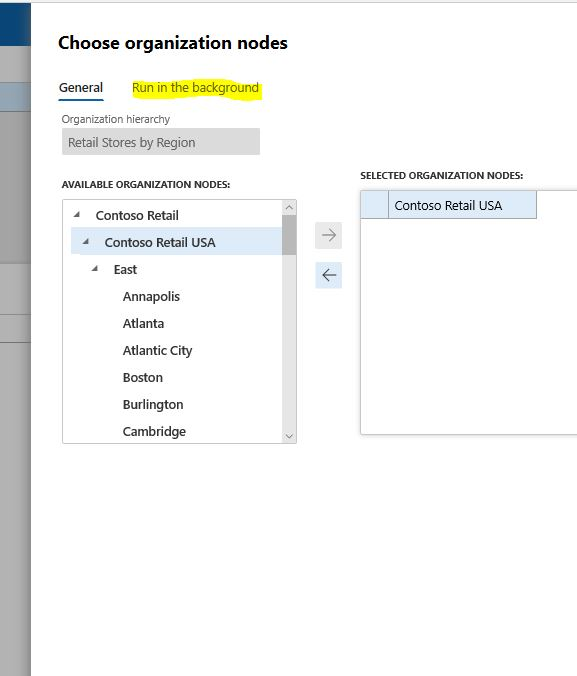
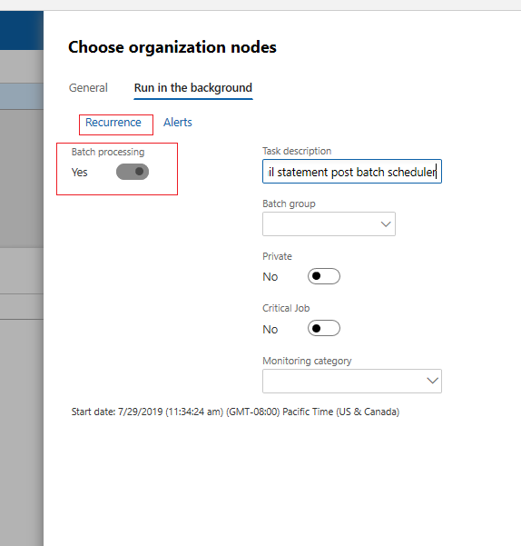

--- 
# required metadata 
 
title: Configure and run job to post statements
description: This procedure walks through configuring and running a recurrent batch job to post statements for a selected store or group of stores. 
author: josaw1
ms.date: 07/29/2019
ms.topic: how-to 
ms.prod:  
ms.technology:  
 
# optional metadata 
 
ms.search.form: RetailChannelOperationsWorkspace, RetailOperatingUnitPicker, SysRecurrence   
audience: Application User 
# ms.devlang:  
ms.reviewer: josaw
# ms.tgt_pltfrm:  
# ms.custom:  
ms.search.region: Global
ms.search.industry: Retail
ms.author: josaw
ms.search.validFrom: 2016-06-30 
ms.dyn365.ops.version: Version 7.0.0 
---
# Configure and run job to post statements

[!include [banner](../includes/banner.md)]

This procedure walks through configuring and running a recurrent batch job to post statements for a selected store or group of stores. This procedure uses the USRT company in demo data.

1. Go to All workspaces > .. > Store financials.
2. Click Post statements in batch.
    * Select an organizational hierarchy and then in the organization nodes tree, select either an individual store or a node. Select a node if you want to create the batch job for a group of stores.  
    * Click the arrow to add your selection.  
3. Click the Run in the background tab.
 
4. Check or uncheck the Batch processing checkbox.
 
5. Click Recurrence.
6. In the Start date field, enter a date.
7. In the Start time field, enter a time.
    * Choose whether you want to end the recurrence after a specific number of runs, at a specific date, or never. Then choose the various options to define how frequently you want the job to run.  
8. Click OK.
9. Click OK.

[!INCLUDE[footer-include](../../includes/footer-banner.md)]