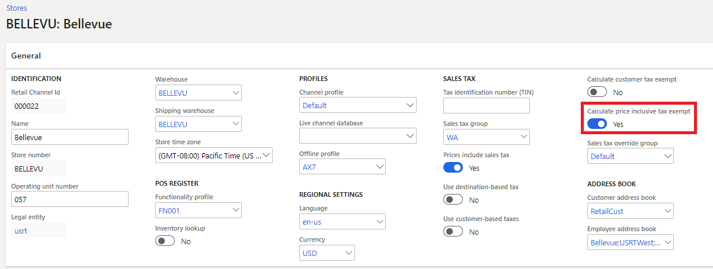

---
# required metadata

title: Calculation of tax exemption
description: This topic describes functionality for tax exemption calculations in the point of sale (POS) and call center. 
author: BrianShook
ms.date: 09/01/2020
ms.topic: article
ms.prod: 
ms.technology: 

# optional metadata

# ms.search.form: 
# ROBOTS: 
audience: IT Pro
# ms.devlang: 
ms.reviewer: josaw
# ms.tgt_pltfrm: 
ms.custom: 141393
ms.assetid: e23e944c-15de-459d-bcc5-ea03615ebf4c
ms.search.region: Global
ms.search.industry: Retail
ms.author: brshoo
ms.search.validFrom: 2019-01-01
ms.dyn365.ops.version: AX 7.0.1

---

# Calculation of tax exemption

[!include [banner](../includes/banner.md)]

This topic describes functionality for tax exemption calculations in the point of sale (POS) and call center.

## Key terms

| Term | Description |
|---|---|
| B2B | An abbreviation for "business to business." It's used to indicate sales between businesses, as opposed to sales between a retailer and an individual. |
| VAT | Value-added tax that is included in the price of a product. |

## Adjust prices for tax exemptions when the price includes tax

Microsoft Dynamics 365 Commerce version 10.0.13 and later includes a feature called **Enable tax exemption for the 'price includes sales tax' scenario**. When this feature is enabled, an option called **Calculate price inclusive tax exempt** appears on the **General** FastTab for store and call center settings. If this option is set to **Yes**, prices in tax-inclusive scenarios are adjusted when the transaction or specific taxes in the transaction should be exempted. When store-based taxes are used, you can apply these exemptions by using tax overrides. When customer-based taxes are used at the store, the exemptions are automatically applied based on the customer's tax settings.

This setting is also supported for orders that are created in the call center and stores.

## Set up price reductions for tax exemptions

The following steps show how to test this capability in demo data scenarios. The setup steps for other data sets are similar.

1. Go to **Retail and Commerce** \> **Channels** \> **Stores** \> **All stores**.
2. Select the **San Francisco** store. To open the store details, select the **Retail Channel Id** value for the store.
3. Select **Edit**.
4. On the **General** FastTab, set the **Calculate price inclusive tax exempt** option to **Yes**.
5. Set the **Price includes tax** option to **Yes**.
6. Select **Save**.
7. Enter **Sales tax groups** in the search field to open the **Sales tax groups** page.
8. Select **New**, and enter a name for the sales tax group.
9. On the **Setup** FastTab, select **Add**.
10. On the drop-down list in the **Sales tax code** column, select **RP\_CAST**, and then select the **Exempt** check box.
11. Select **Save**.
12. Enter **Sales tax overrides** in the search field to open the **Sales tax overrides** page.
13. Select **New**, and enter a name for the sales tax override.
14. Set the status to **Enable**.
15. In the **Override type** field, select **Sales tax group**.
16. In the **From** field, select **Any tax group**.
17. In the **To** field, select **Specified tax group**.
18. In the **From tax group** field, select **CA**.
19. In the **To tax group** field, select the sales tax group that created earlier.
20. Select **Save**.
21. Enter **Sales tax override groups** in the search field to open the **Sales tax override groups** page.
22. Select the **Default** group, and then select **Edit**.
23. Select **Add**, and then select the sales tax override that you created earlier.
24. Select **Save**.
25. Enter **Distribution schedules** in the search box to open the **Distribution schedules** page.
26. Select schedule job **9999**, and then select **Run now**.
27. When the jobs have completed synchronization, open the POS.

    > [!NOTE]
    > Tax details for the channel might be cached. Then close the point of sale application and relaunch it to to observe the changes after they have synchronized to the channel database.

28. Add item **91050** to a transaction.
29. Select **Tax overrides**, and then select **Override transaction tax**.
30. Select the sales tax override that you created earlier. The tax is reduced to 0 (zero), and the price for the line items is reduced to reflect the tax exemption.

Alternatively, you can set the **Use customer based tax** option for the store to **Yes** and then assign the sales tax group that you create directly to the customer. Then, when the customer is added to a transaction, the prices are reduced to reflect that customer's tax-exempt status.

### Check customers for exemptions when tax is exclusive of price

Some retail verticals, such as liquor stores, sell goods to individuals and other businesses in cash-and-carry transactions. However, in many cases, transactions that involve different customer segments have different requirements for taxation purposes. For example, when a liquor store sells goods to some businesses, sales taxes that are usually associated with the items that are sold might be exempt for those specific businesses. However, in all other cases, regular sales tax should apply.

To support this scenario, set the **Calculate customer tax exempt** option for the store to **Yes**. Then, when a customer is added to a transaction, the POS checks the taxes that are applicable to that customer. If the customer's tax settings have a tax code that is marked as **Exempt**, but tax is applicable to the transaction, the tax is treated as exempt for the transaction and isn't added to the transaction.

The **Calculate customer tax exempt** option applies to stores where the price doesn't include tax. The exemption calculation is also supported if the **Use destination based tax** option for the store is set to **Yes**.

### Set up tax exemption calculations for customers

The following steps show how to test this capability in demo data scenarios. The setup steps for other data sets are similar.

1. Go to **Retail and Commerce** \> **Channels** \> **Stores** \> **All stores**.
2. Select the **San Francisco** store. To open the store details, select the **Retail Channel Id** value for the store.
3. Select **Edit**.
4. On the **General** FastTab, set the **Calculate customer tax exempt** option to **Yes**.
5. Select **Save**.
6. Enter **Sales tax groups** in the search field to open the **Sales tax groups** page.
7. Select **New**, and enter a name for the sales tax group.
8. On the **Setup** FastTab, select **Add**.
9. On the drop-down list in the **Sales tax code** column, select **RP\_CAST**, and then select the **Exempt** check box.
10. Select **Save**.
11. Go to **Retail and Commerce** \> **All customers**.
12. Select account ID **004009** for **Matthew Tolley**.
13. Select **Edit**.
14. On the **Invoice and delivery** FastTab, in the **Sales tax group** field, select the sales tax group that you created earlier.
15. Select **Save**.
16. Enter **Distribution schedules** in the search field to open the **Distribution schedules** page.
17. Select schedule job **9999**, and then select **Run now**.
18. When the jobs have completed synchronization, open the POS.
19. Add item **91050** to a transaction. The total that is due is **$75.06**.
20. Add **Matthew Tolley** to the transaction. Taxes are recalculated to reflect this customer's exemption.

[!INCLUDE[footer-include](../includes/footer-banner.md)]