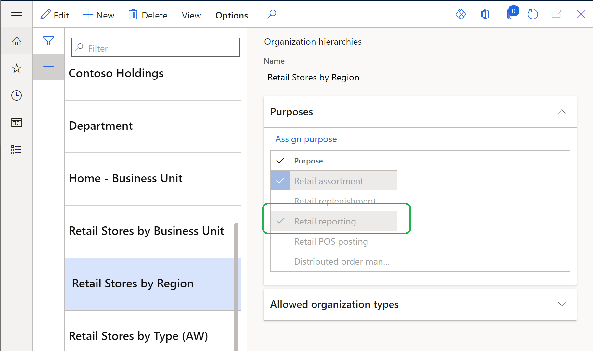

---
# required metadata
title: Dynamics 365 Commerce and Microsoft Teams integration FAQ
description: This topic provides answers to frequently asked questions regarding Microsoft Dynamics 365 Commerce and Microsoft Teams integration.
author: gvrmohanreddy
ms.date: 03/31/2021
ms.topic: article
ms.prod: 
ms.technology: 
# optional metadata
# ms.search.form:  
#ROBOTS: 
audience: Application User
# ms.devlang: 
ms.reviewer: v-chgri
ms.search.scope: Retail, Core, Operations
# ms.tgt_pltfrm: 
# ms.custom: 
ms.search.region: Global
# ms.search.industry: 
ms.author: gmohanv
ms.search.validFrom: 2021-01-15
ms.dyn365.ops.version: 10.0.18
---

# Dynamics 365 Commerce and Microsoft Teams integration FAQ

[!include [banner](includes/banner.md)]

This topic provides answers to frequently asked questions regarding Microsoft Dynamics 365 Commerce and Microsoft Teams integration.

### Who in the store becomes an owner of a team while provisioning Teams from Commerce? 

All store managers are automatically added as owners to the corresponding team group so that they can perform operations such as adding a private channel and adding or deleting members. 

### How do I assign the "communications manager" role to an employee in Commerce headquarters? 

Communication managers in Microsoft Teams have the ability to create and publish task lists. Organization employees who need to become communication managers must have the "retail task manager" role assigned to them in Commerce headquarters.

To assign the retail task manager role to an employee in Commerce headquarters, follow these steps.

1. Go to **Retail and Commerce \> Employees \> Users**.
1. Select an employee.
1. On the **User's roles** FastTab, select **Assign roles**.
1. In the **Assign roles to user** dialog box, select the **Retail task manager** role, and then select **OK**.

### How do I make a specific organization hierarchy available to upload into Microsoft Teams?

In Commerce headquarters, every organization's hierarchy is associated with one or more purposes. Make sure the hierarchy that you want to provision into Microsoft Teams has the **Retail reporting** purpose associated with it, as shown in the following example image. 

### How do I enable retail store workers to sign in to Commerce point of sale (POS) using Azure Active Directory (Azure AD)?

For information about how to configure the Commerce POS sign-in experience to use Azure AD authentication, see [Enable Azure Active Directory authentication for POS sign-in](aad-pos-logon.md).

### How do I map stores and corresponding teams in Commerce headquarters if my organization has already created teams in Microsoft Teams?

For information on how to map stores and teams if there are pre-existing teams, see [Map stores and corresponding teams if your organization has pre-existing teams in Microsoft Teams](map-stores-existing-teams.md).

### How do I clear the Microsoft Graph API token stored in the session storage?

A user who has signed in to the point of sale (POS) with an Azure Active Directory (Azure AD) account should sign out from the POS or close the application to clear the session storage. 

> [!TIP]
> A recommended best practice is to always have store workers lock the POS terminal or sign out from a session when not using the terminal. 

### What happens if a store doesn't have store managers?

If a store doesn't have managers, a team group will not be created for the store or in Teams. 

### What happens if a store manager leaves the company?

Anyone with the owner role can add a new store manager in Commerce headquarters and reprovision Teams so that the new manager will have the necessary privileges in Teams for the group. 

## Additional resources

[Dynamics 365 Commerce and Microsoft Teams integration overview](commerce-teams-integration.md)

[Enable Dynamics 365 Commerce and Microsoft Teams integration](enable-teams-integration.md)

[Provision Microsoft Teams from Dynamics 365 Commerce](provision-teams-from-commerce.md)

[Synchronize task management between Microsoft Teams and Dynamics 365 Commerce POS](synchronize-tasks-teams-pos.md)

[Manage user roles in Microsoft Teams](manage-user-roles-teams.md)

[Map stores and teams if there are pre-existing teams in Microsoft Teams](map-stores-existing-teams.md)
