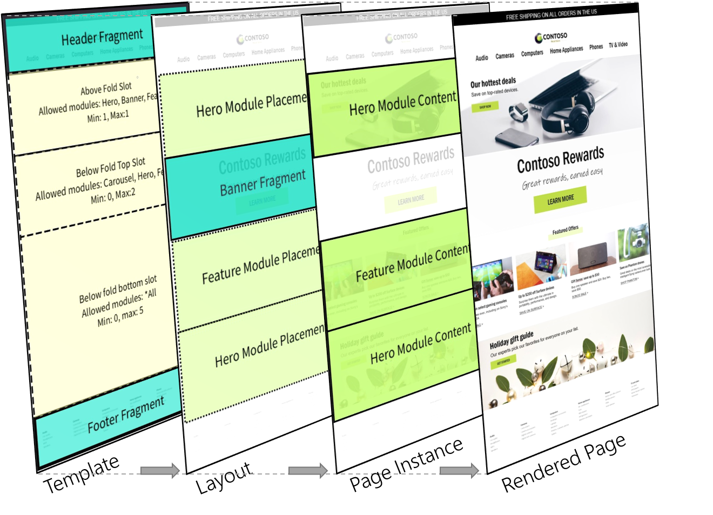
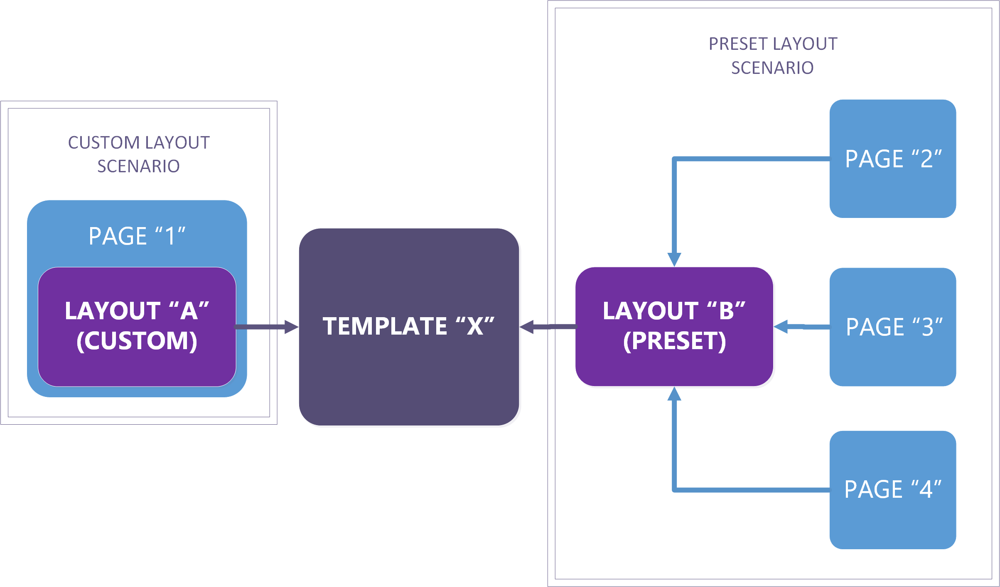

---
 # required metadata

title: Templates and layouts
description: This topic describes how and when to use templates and layouts within the e-commerce authoring toolset.
author: Nick Holman
manager: Brendan Sullivan
ms.date: 07/08/2019
ms.topic: article
ms.prod: 
ms.service: dynamics-365-commerce
ms.technology: 

# optional metadata

ms.search.form:  
audience: Application User
# ms.devlang: 
ms.reviewer: josaw
ms.search.scope: 
# ms.tgt_pltfrm: 
# ms.custom: 
ms.search.region: Global
ms.search.industry: retail
ms.author: phinneyridge
ms.search.validFrom: 
ms.dyn365.ops.version: 

---

# Templates and layouts

Templates are a foundational element of the D365 for Commerce page model. Learning to leverage templates within your website is a critical initial step to maximize efficiency and consistency for site authoring workflows. Early decisions around template structure are important and can significantly affect cost and agility for daily, seasonal, and sitewide brand updates that must occur in the future. Well-structured templates have other benefits such as improved sitewide SEO scores and minimizing bug counts. A good place to start with templates is to understand the functional benefits, differences, and hierarchy between 1) **templates** and 2) **layouts**, described in more detail below.

The following diagram shows the page model hierarchy behind a rendered webpage:

| Entity        | Basic Function                                               |
| ------------- | ------------------------------------------------------------ |
| Template      | Defines the **module options and basic scaffolding** for a set of layouts and page instances. |
| Layout        | Defines the final **module selection and arrangement** for a page or set of pages. |
| Page Instance | Defines the **data and content** for a specific page.        |

## Templates

**Templates** sit at the top of the Dynamics e-Commerce page model and
represent a key early step for site configuration. Conceptually,
templates control consistency across a family of
child **layouts** and **pages** by defining the base structure and authoring
options for down-stream layout and page creation workflows. Templates can simplify the content authoring process with pre-determined centrally managed elements (headers, footers, etc.), and guided authoring flows that ensure on-brand module configuration choices.  

### Controlling Consistency
The biggest business decision to make when designing a template is how much control to exert over the page creation process. A Template that leaves everything open for a downstream author is the simplest template to create, but may have long-term maintenance consequences for pages created from it. A well-written template will provide guidance and a stream-lined authoring experience for an author while allowing them enough flexibility to complete their task. All of that is based on the level of control enforced by the template.

Templates can help content authors be more efficient and stay on-brand in the following ways:

- Narrow down which modules should be used in a page
- Suggest default module choices and configuration
- Explicitly make some module and configuration choices that are controlled at the template level, also known as 'locking' a setting.

A basic template example
could be configured and described like this:

- All child layouts of template "X" must have a header, body,
  and a footer container
  - The header configuration is locked within 
    template "X" and can't be changed anywhere except within the
    template itself.  All child layouts and pages will always get this header.
  - The body container requires at least one, and up to a maximum of
    ten, modules that are defined by a down-stream layout and page
    authors
    - The available module choices for the body container are:
      Hero, Feature, Carousel, and Banner
  - The footer container is configured within template "X",
    but can be overridden by down-stream pages and layouts

The example above describes a simple structure and set of options for
down-stream content authors. Notice that certain page parts (the header)
are fully defined and locked within the template and can't be
changed by down-stream authors. Other parts (the body) are left for
down-stream authors to define within chosen guidelines (ie. minimum one
configured module with a maximum ten from the set of allowed modules).
And other parts (the footer) are defaulted in the template but
allowed to be overridden by down-stream authors. The level of constraint
vs. flexibility for child page and layout authors is 100% configurable
using templates. Determining this balance is an important upfront
step for site and brand administrators and will affect how page elements
are centrally updated (locked within the template) or left to
individual child levels down the page hierarchy.

## Layouts

Where a Template defines all of the possible combinations of modules allowed for a page, a layout is an explicit selection of one of those combinations. Pages then sit below a layout in the hierarchy and define
the localized content for the modules selected
within the layout. Building upon our template example in the section above, a basic layout could be configured and described like this:

*Example layout configuration:*

- A layout whose parent template requires that the body
  contain between one and ten modules from the options of Hero,
  Feature, Carousel, and Banner:
  - can define a Banner to reside as the first module in the body
    container, followed by a Hero, and two Feature modules
  - can define that the first Feature module is left aligned and the
    second Feature module is right aligned
- Even though a default footer is inherited from the template,
  the layout can override this with a different footer fragment
  since the template author chose to leave this unlocked

The layout example above describes the final module arrangement for
any of its child pages. A layout, like a template, can also
define default or locked module properties (example: left vs right
alignment of the Feature module) that will be inherited by child pages.
The actual content (or data) for each module within the layout is then defined
further down the hierarchy within each child page instance. An important
distinction here is that layouts do *not* directly contain localizable
content, whereas their child pages do. The layout's primary function
is to define the final module arrangement and default configuration of
modules for its child pages.

This architecture is powerful for a couple of reasons. First, layouts
that share the same parent template are treated as compatible for
layout switching scenarios. This means any page can switch to a
different layout from within the same template hierarchy
without reauthoring page-level content. This can be used for seasonal design 
updates, experimentation, or permanent site redesign scenarios.
Secondly, layouts provide another way to centrally modify common
elements for a group of pages without the need to update individual
ones. For example, if there are 1,000 Pages in a product category that
all share the same layout, re-ordering the modules in the layout
will immediately be reflected in all 1,000 child pages. Understanding
this hierarchy can go a long way towards delivering an agile and
efficient site structure that saves cost, scales, and produces better
results as your site evolves over time.

### Preset and custom layouts

Layouts can have one of two forms within your site: **preset** or **custom**.  

- **Preset layouts** enable a page creation workflow where *all* modules are already chosen and arranged, and only data entry is required. This can be a big time saver when authoring many pages with the same layout requirements. Another important distinction for preset layouts is that they have a 1:many relationship with their child pages, meaning that you can have a single preset layout to centrally control the module arrangement for 100's or 1,000's of child pages.
- **Custom layouts** are essentially one-offs that are
embedded within a single page and are not exposed as an option when
  creating another new page or layout swapping scenarios. The benefit of
  this approach is that authors can experiment by authoring a page using a
  custom layout, and if they decide they want to re-use the layout
  for other pages, they can easily convert it to a preset
  layout. Once the new preset layout is saved, it becomes an available option
  for both: a) new page creation workflows, and b) layout swapping for
  pages that share a common template hierarchy. Conversely, preset layouts
  can be branched into a custom layout, which allows a page to break away
  from a preset and create a custom one-off layout (still bound by any
  constraints in the parent template).

Editing preset vs custom layouts occur in different
surface areas within the authoring toolset. Custom layouts are edited
directly within the Page Editor UX since they have no dependencies on
other pages. In this scenario, the existence of a layout is mostly
transparent to the user and is only exposed in page level properties and
through layout option actions. Preset layouts, because changes to them
may affect many pages, must be edited in the Layout Editor UX where
publish actions consider the full downstream impact to, what could be many, child pages.

# Working with templates:

As discussed in the templates overview section, **templates define the set of options available to down-stream authors**.  There are multiple reasons why this is helpful to an enterprise web authoring team, and well structured templates can help with all of the goals below:

1. Simplify the authoring experience for day-to-day content editor roles.  

   * Filter module options to only show relevant choices for a specific page section.
     * *example*: *A marketing section of a template can be configured to filter out irrelevant module choices that should never be used within that context and would only add noise to content authoring tasks.*
   * Configure module setting defaults to improve authoring efficiency.
   * Define page fragments defaults to improve authoring efficiency.
     * *example*: *Header and footer fragments in a template will automatically appear in every downstream page*.

2. Ensure that enterprise sites stay on-brand by defining an approved set of module arrangement and configuration options.  

   > [!TIP] 
   > e-Commerce sites thrive on providing customers with familiar, repeatable, and on-brand UX design patterns.  Templates can control these measures of consistency across your site.  

3. Improve SEO scores by ensuring repeatable and programmatically defined page definitions and metadata.

> [!NOTE]
> While templates are designed to control consistency across a site, they can theoretically be configured to not enforce any consistency.  Brand and site administrators are empowered to set any level of variability for pages in their site.  For example: a template could be left entirely open, which would allow content authors to create any page design they choose.  In this example, all of the benefits above are not applicable.

## Modify a template
Templates are modified using the template editor UI.  There are multiple navigation paths into the template editor:
- Navigate to the template inspector list view (**[Your Site] > Templates**) and click on a template's name to enter into the template editor UI.

  or,

- If you are in the page editor for an existing page, you can navigate to the page's template directly from the property panel.  In the outline, make sure the top node is selected and then click on the **Edit Template** link from the property panel.

To edit a template, follow these steps.

1. Open a template in the editor UI using either of the above navigation paths.

2. Notice the outline tree view on the left.  This outline shows the module options and structures that are available to child layouts and pages.  

3. Notice the property panel on the right.  Select a module in the outline to view the template properties for the selected module.  You will notice some unique properties that are specific to template editing, such as:

  | Property Name | Description |
  | ---- | --- |
  | Min Occurs | Sets the minimum number of occurrence of the the selected module.  For example, setting "Min Occurs" = 1 makes the module required, whereas setting it = 0 makes the module optional for downstream authors. |
  | Max Occurs | Sets the maximum number of occurrence for the selected module.  For example, setting "Max Occurs" = 1 means that module can only be added once. |
  | Min Modules (Containers) | Modules that contain other modules (containers), can set the minimum number of total modules that should be added as children.  For example, a carousel module might define that the minimum number of child modules is greater than 1. |
  | Max Modules (Containers) | Modules that contain other modules (containers), can set the maximum number of total modules that should be added as children.  For example, a carousel module might define that the maximum number of child modules is less than 10. |
  | Locked | You will notice a boolean control titled "locked" next to all core module properties.  This allows the template author to lock a module setting in the template that can't be overridden by any child layouts or pages.  A locked module setting becomes a centrally editable property value for all layouts and pages that use the template. |
   
   

## Create a new template
To create a new template, follow these steps.

1. Navigate to the **Templates** tab in the left navigation bar of your site within the Dynamics e-Commerce authoring interface.  This will bring you to the template inspector view.
2. Click the "**New Template**" button in the action bar at the top of the inspector view.  This will launch the template creation modal window.
3. Enter a name and description for your template.  This will be shown to authors during new page creation workflows, so enter metadata that would be useful to page authors (example: "Use this template to create general marketing pages").  This can always be edited later.
4. Click "**OK**" to create the new template and navigate into the template editor.
5. The template editor will show an outline on the left, and a property panel on the right.  Expand the nodes in the outline and select the "**HTML Head**" slot.  If there are no modules yet in this slot, click the ellipse menu ("**...**") and select "**Add Module**".
6. In the module picker modal that appears, choose "**Default page summary**" from the options and then "**OK**".
7. With the newly added module selected in the outline, enter any default settings in the property panel that you want to automatically populate for all child pages of the template.  If you don't want any defaults then just leave the values blank.
8. Now select the "**Body**" slot and, if it is empty, click the ellipse menu ("**...**") and select "**Add Module**".
9. Select a page container module (depending on your site, there may only be one option) and click "**OK**".
10. Under this new page container module you will see a new set of slots (Header, Main, etc.).  This is where you can add and configure module options that are available to authors when creating pages from this template.  If you add no modules to a slot, then the default behavior is to allow all available modules types for that slot.
11. The template is now technically valid, and can be saved, checked-in, and used for creating new pages.  But as you will see below, there are some other defaults you will likely want to configure first.

## Add headers and footers

If your site already has a header fragment and you've completed the "Create a new template" steps above, follow these steps to add a header and footer to your new template.

1. Expand the "**Body**" slot and its child page module in the outline.
2. Select the "**Header Slot**" in the outline.
3. In the Header Slot's action menu ("**...**"), select "**Add Fragment**".
4. Search for and select your site's header fragment, and press "**OK**".
5. All pages that use this template will now automatically inherit this header fragment.

If your site does not yet have a header fragment, please do the following.

1. Read and follow the steps in the **Fragments > Create a fragment** section of this documentation and choose "**Header**" as the module type for the fragment.
2. Continue with the steps in the section above.

## Change template theme
To set the default theme for all pages that use this template, follow these steps.

1. Expand the "**Body**" slot in the outline.
2. Select the page container module within it (example: "Default Page").
3. In the property panel on the right, locate the property settings dropdown selector titled, "**Theme**".
4. From the selector control choose a theme (example: "default").
5. All new pages will now default to this theme.  If you would like to restrict pages from overriding this setting at a layout or page level, set the "**Locked**" Boolean control to true.

## Add script to a template
HTML script tags containing JavaScript can be added to your template to provide default script behaviors to the HTML head, body begin, and body end of your pages.  To add a script to your template, follow these steps.

1. In the outline, select the slot where you would like your script tag to be added (HTML head, body begin, body end).
2. In the slot's action menu ("**...**"), choose "**Add Module**".
3. From the module picker modal, choose your desired script module (examples: External Script, Inline Script).
4. In the property panel on the right, enter your script into the script property control (examples: "Inline Script" or "Script tags").
5. Enter any other optional settings in the property panel that you wish to configure.

> [!TIP]
> Script modules that you want to re-use for other templates can be converted intto fragments for more efficient authoring and central updates.  To convert your script module into a fragment, follow the steps in the **Fragments > Save an existing module configuration as a fragment** article within this documentation.

## Save, check in, preview, and publish a template
To save your template, click the "**Save**" button in the action bar at the top of the template editor.  Saved changes will not affect downstream pages until they are "**Checked In**".  To check in your changes and make them discoverable for downstream workflows, click the "**Check In**" button in the action bar.

To preview your changes, either open an existing page that uses this template or create a new page from the template.  

Once you have previewed your template changes within a page preview context, there are multiple ways to publish the template to your live site.

* Publishing a page that references an unpublished template will automatically publish the template.
* Select the template in the templates list view (**Left navigation control > Templates > Selected template**) and click the "**Publish**" button in the top action bar.
* Go back to the template editor view and select "**Publish**" from the top action bar.

> [!WARNING]
>
> By definition, **publishing** a template (or any other CMS item) means that it is discoverable on the internet.  No not publish documents or assets until you wish to make them public.  Saved, and Checked In document versions are only discoverable to authenticated system users.

---

# Working with preset layouts:

Please be sure to read the **[Preset vs. custom layouts](#preset-and-custom-layouts)** section before continuing with the steps below.

## Create a new preset layout

There are two methods to create a preset layout.  The first is to save an existing custom layout as a preset, and the second is to create a new preset layout from scratch.

To create a preset layout from an existing custom layout, follow these steps.

1. Open an existing page that does not currently use a preset layout and has a module structure you would like to re-use for other pages within your site.

   > [!TIP]
   >
   > To quickly see if a specific page is currently bound to a preset layout, select the page in the pages list view and read the layout metadata in the property panel on the right.  
   
2. Check out the page by clicking the "**Check out**" button in the page editor's action bar.

3. Once the page is checked out to you, there will be a new action bar button to "**Save as new layout**".  Click this button to launch the save as layout modal.

4. Enter a name and description for your layout.  The name and description are shown to other authors when they create a new page from, or switch to, your layout.  Enter something helpful to a page author.

5. Click "**OK**" after you have filled out the layout metadata fields.

6. Your preset layout is now available when you create new pages, or choose another layout for a page within the same template hierarchy.

To create a preset layout from scratch, follow these steps.

1. From the left navigation bar select "**Layouts**" 

   > [!NOTE] 
   > Subsequent tool versions will group layouts under the templates list view.
   
2. From the action bar at the top of the list view, click the "**New Layout**" button.  This will launch the new layout modal window.

3. Choose the **template** that you would like to use for your preset layout.

4. Enter a name and description for your preset layout.  The name and description are shown to other authors when they create a new page from or switch to your new layout.  Enter something helpful to a page author.

5. Click "**OK**" to create the new layout and enter the layout editor.

6. In the layout editor, add and configure modules using the outline and property panel just as you would in the template editor.  Your module arrangement and locked defaults will be the centralized module configuration for any pages that use this layout.

## Modify a preset layout

To modify a preset layout, follow these steps.

1. Navigate to the layout editor for the preset layout you wish to modify.  This can be done through any of these navigation paths:
   * If you are editing a page that uses a preset layout, you can navigate to the layout editor by selecting the top node in the outline view and clicking the **Layout** link in the property panel.
   
   * If you are in the pages list view, select a page that uses a preset layout and click the **Layout** link in the property panel.
   
   * From the left navigation bar select "**Layouts**".  Click on the name of the layout you wish to modify from the list view.
   
     > [!NOTE] 
     > Subsequent tool versions will group layouts under the templates list view.
   
2. In the layout editor's outline view, select a module that you wish to modify and do any of the following:

   * To move a module up or down within its parent, choose the "**Move up**" or "**Move down**" options in the module's action menu ("**...**").
   * To change default module settings, use the property panel to enter default values and optionally lock them for all downstream pages.
   * For container modules, add new modules or fragments by selecting the "**Add module**" or "**Add fragment**" options in the module's action menu ("**...**").
   * To remove a module from the layout, select the "**Delete**" option in the module's action menu ("**...**").

## Change preset layout theme

A common practice is to set a default theme for all pages that use a preset layout.  To set or change a theme for all of your layout's child pages, follow these steps.

1. In the layout editor's outline view, select the page container module node (typically the second node titled "Default page").

2. Find the "**Theme**" picker control in the property panel on the right.

3. Select your desired theme from the dropdown selector.  

   > [!NOTE]
   >
   > To add new theme options to your site, read the help documentation for creating, editing, and adding new themes.

## Save, preview, and publish a preset layout

To save your layout, click the "**Save**" button in the action bar at the top of the layout editor.  Saved changes will not affect downstream pages until they are "**Checked In**".  To check in your changes and make them discoverable for downstream workflows, click the "**Check In**" button in the action bar.

To preview your changes, either open an existing page that uses this layout or create a new page from the layout.  

Once you have previewed your layout changes within a page preview context, there are multiple ways to publish the layout to your live site.

- Publishing a page that references an unpublished layout will automatically publish the layout.

- Select the layout in the layouts list view (**Left navigation control > Layouts > Selected layout**) and click the "**Publish**" button in the top action bar.

- Go back to the layout editor view and select "**Publish**" from the top action bar.

  > [!WARNING]
  >
  > Preset layouts can be referenced by multiple pages.  When you publish a preset layout, be aware that you may be affecting the layout for multiple pages with this action.  

