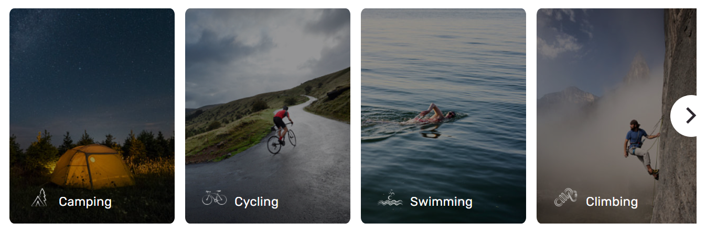

---
# required metadata

title: Tile and tile list modules 
description: This topic covers tile and tile list modules and describes how to add them to site pages in Microsoft Dynamics 365 Commerce.
author:  anupamar-ms
ms.date: 06/25/2021
ms.topic: article
ms.prod: 
ms.technology: 

# optional metadata

# ms.search.form: 
# ROBOTS: 
audience: Application User
# ms.devlang: 
ms.reviewer: v-chgri
# ms.tgt_pltfrm: 
ms.custom: 
ms.assetid: 
ms.search.region: Global
ms.search.industry: 
ms.author: anupamar
ms.search.validFrom: 2019-10-31
ms.dyn365.ops.version: 
---

# Tile and tile list modules 

[!include [banner](includes/banner.md)]
[!include [banner](includes/preview-banner.md)]

This topic covers tile and tile list modules and describes how to add them to site pages in Microsoft Dynamics 365 Commerce.

A tile list module is a collection of tiles in a carousel, and is used to market product categories or product brands with images and text. For example, a retailer can add a tile list module to the home page of an e-commerce site to promote all of the top-selling categories. 

The tile list module is driven by data from the content management system (CMS) and doesn't depend on any other modules or data from Commerce headquarters. The tile list module can be added to any site page where a retailer wants to market or promote something (for example products, categories, or brands).

The following example image shows a tile list and tile modules on the Adventure Works home page.

> [!IMPORTANT]
> The tile list module is available as of the Dynamics 365 Commerce version 10.0.20 release.
> The tile list module is showcased in the Adventure Works theme.

## Tile and tile list modules and themes

Tile list module can support various layouts and styles based on a theme. For example, the Adventure works theme, the Tiles have an animation effect when user hovers on it. In addition, each theme can expose additional properties for Tile List and Tile modules. A theme developer can also build more layouts on for the module

## Tile list module properties

| Property name  | Values | Description |
|----------------|--------|-------------|
|Heading| Heading text, Heading tag| This property is used to set a heading for the Tile List|

## Tile module properties

| Property name  | Values | Description |
|----------------|--------|-------------|
| Image          | Image file | An image can be used to showcase a product or a category. An image can be uploaded to the image gallery, or an existing image can be used. |
| Heading        | Heading text and heading tag (**H1**, **H2**, **H3**, **H4**, **H5**, or **H6**) | By default, the **H2** heading tag is used for the heading. However, the tag can be changed to meet accessibility requirements. |
| Paragraph      | Paragraph text | The module supports paragraph text in rich text format. Some basic rich text capabilities are supported, such as bold, underlined, and italic text, and hyperlinks. Some of these capabilities can be overridden by the page theme that is applied to the module. |
| Link           | Link text, link URL, Accessible Rich Internet Applications (ARIA) label, and **Open link in new tab** | Modules support one or more "call to action" links. If a link is added, link text, a URL, and an ARIA label are required. ARIA labels should be descriptive to meet accessibility requirements. Links can be configured so that they are opened on a new tab. |
|Tile Link | Link text, link URL, Accessible Rich Internet Applications (ARIA) label, and **Open link in new tab**| In addition, to providing Links, the Tile can have a re-directional link that takes it to a different page|
|Icon| image | In addition to a background image, an icon can also be added. Icon will appear above the image|

## Add a tile list module to a new page

To add a Tile List module to a new page and set the required properties, follow these steps.
1. Go to **Templates**, and open **Marketing template** which is used for the home page (or create a new one)
1. In the **Main** slot of the default page, add a tile list module.
1. Select **Save**, select **Finish editing** to check in the template, and then select **Publish** to publish it.
1. Open the site Home page (or create a new one)
1. In the **Main** slot of the default page, select the ellipsis button (**...**), and then select **Add Module**.
1. In the **Add Module** dialog box, under **Select Modules**, select the Tile list module, and then select **OK**.
1. In the module property panel of Tile List module, set a Heading
1. To the Tile List module, add Tile module from the module outline
1. In the property panel for Tile module, add an Image and a Heading
1. In the property panel for Tile module, add an Icon.
1. Repeat the above steps and continue adding more Tile modules to Tile List
1. Select **Save**, and then select **Preview** to preview the page.
1. Select **Finish editing** to check in the template, and then select **Publish** to publish it. 

## Additional resources

[Module library overview](starter-kit-overview.md)

[Adventure Works theme](adventure-works-theme.md)

[!INCLUDE[footer-include](../includes/footer-banner.md)]
