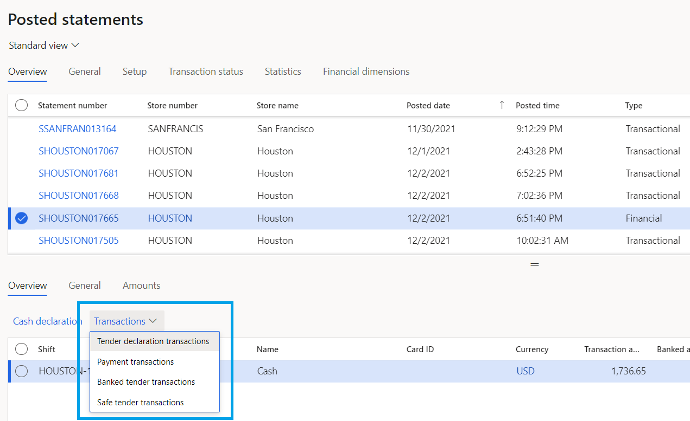

---
# required metadata

title: Trickle feed-based order creation for retail store transactions
description: This topic describes the trickle feed-based order creation for store transactions in Microsoft Dynamics 365 Commerce.
author: analpert
ms.date: 01/11/2021
ms.topic: index-page
ms.prod: 
ms.technology: 

# optional metadata

# ms.search.form: 
# ROBOTS: 
audience: Application User
# ms.devlang: 
ms.reviewer: josaw
# ms.tgt_pltfrm: 
ms.custom: 
ms.assetid: 
ms.search.region: global
ms.search.industry: Retail
ms.author: josaw
ms.search.validFrom: 2019-09-30
ms.dyn365.ops.version: 

---
# Trickle feed-based order creation for retail store transactions

[!include [banner](includes/banner.md)]

In Microsoft Dynamics 365 Commerce version 10.0.5 and later, we recommend that you transition all statement posting processes to the trickle feed–based statement posting processes. Significant performance and business benefits are associated with using the trickle feed functionality. Sales transactions are processed throughout the day. Tender and cash management transactions are processed on the financial statement at the end of the day. Trickle feed functionality enables the continuous processing of sales orders, invoices, and payments. Therefore, inventory, revenue, and payments are updated and recognized in near-real time.

## Use trickle feed-based posting

> [!IMPORTANT]
> Before you enable trickle feed–based posting, you must ensure that there are no calculated and unposted statements. Post all statements before you enable the feature. You can check for open statements in the **Store financials** workspace.

To enable trickle feed–based posting of retail transactions, enable the **Retail statements - Trickle feed** feature in the **Feature management** workspace. Statements will be split into two types: transactional statements and financial statements.

### Transactional statements

Transactional statement processing is intended to be run at a high frequency throughout the day so that documents are created when transactions are uploaded into Commerce headquarters. Transactions are loaded from the stores to Commerce headquarters when you run the **P-Job**. You must also run the **Validate store transactions** job to validate transactions so that the transactional statement will pick them up.

Schedule the following jobs to run at a high frequency:

- To calculate a transactional statement, run the **Calculate transactional statements in batch** job (**Retail and Commerce \> Retail and Commerce IT \> POS Posting \> Calculate transactional statements in batch**). This job will pick up all unposted and validated transactions, and add them to a new transactional statement.
- To post transactional statements in a batch, run the **Post transactional statements in batch** job (**Retail and Commerce \> Retail and Commerce IT \> POS Posting \> Post transactional statements in batch**). This job will run the posting process and create sales orders, sales invoices, payment journals, discount journals, and income-expense transactions for unposted statements that don't contain any errors. 

### Financial statements

Financial statement processing is intended to be an end-of-day process. This type of statement processing supports only the **Shift** closing method and will pick up only closed shifts. Statements are limited to financial reconciliation. They will create only the journals for the difference amounts between the counted amount and the transaction amount for tenders, and journals for other cash management transactions.

Financial statements also enable the review of the following transactions: tender declaration transactions, payment transactions, banked tender transactions, and safe tender transactions. The tender details page is only visible when a financial statement is selected.

Schedule the start and end times of the following financial statement jobs based on the expected end of the day:

- To calculate a financial statement, run the **Calculate financial statements in batch** job (**Retail and Commerce \> Retail and Commerce IT \> POS Posting \> Calculate financial statements in batch**). This job will collect all unposted financial transactions and add them to a new financial statement.
- To post financial statements in a batch, run the **Post financial statements in batch** job (**Retail and Commerce \> Retail and Commerce IT \> POS Posting \> Post financial statements in batch**).

### Manually create statements

Transactional and financial statement types can also be manually created. 

1. Go to **Retail and Commerce \> Channels \> Stores**, and select **Statements**. 
2. Select **New**, and then select the type of statement to create. Fields on the **Statements** page will show data that is relevant to the selected statement type, and actions under **Statement group** will show relevant actions.

[!INCLUDE[footer-include](../includes/footer-banner.md)]
