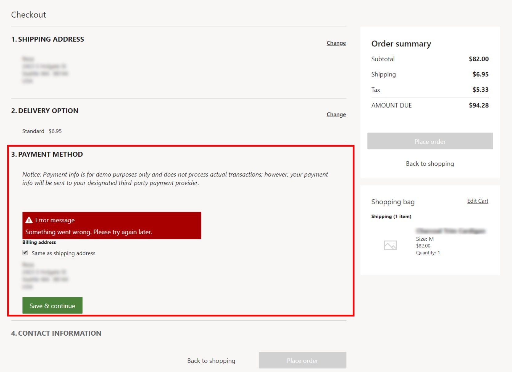

# Credit card entry page shows an error at checkout

[!include [banner](../../includes/banner.md)]

This article provides troubleshooting guidance that can help when the **Payment method** section isn't loaded and shows an error message.

## Description

When you open the checkout page of an online store, the **Payment method** section isn't loaded, and the following error message is shown: "Something went wrong. Please try again later."

## Resolution

### Wait for the Commerce Scale Unit cache to expire

The payment service settings on the online store's checkout page are cached on the Commerce Scale Unit and can take up to 15 minutes to appear on the e-commerce site. These payment service settings include changes to the merchant account ID, cloud API key, and various configuration settings that are related to the payment method.

## Additional resources

[Set up an online channel](../channel-setup-online.md)
