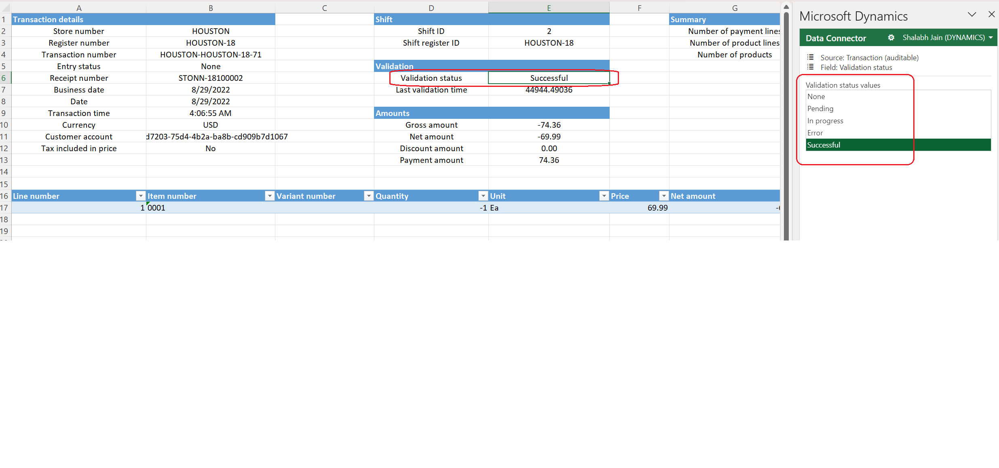

# Fix common statement posting issues by editing transactions
Error code: SYS103633, SYS328431

[!include [banner](../../includes/banner.md)]

This article provides troubleshooting guidance to help you fix common statement posting issues that require edits to transactions in Microsoft Dynamics 365 Commerce.

## Description

Sometimes, statement posting fails because the data in one or more transactions must be corrected before posting can proceed. Here are some of the scenarios where this type of data correction is required:

- The fiscal period mapping to the current transaction has been closed. Therefore, the transactions can't be posted.
- The transactions were created without values for required fields (for example, warehouse or batch number field values).

The data is corrected by editing the necessary transactions. The steps that are required to edit the transactions vary, depending on which stage of statement posting an issue occurs during. This article first lists the generic steps that are required to edit a transaction, depending on the stage of statement posting. It then lists common errors that occur during the stages and provides the specific steps that are required to fix each issue.

> [NOTE]
> For information about the structure of the Excel files that are downloaded when transactions are edited, see [Edit and audit cash and carry and cash management transactions](../edit-cash-trans.md).

## Resolutions

### Issues during statement calculation

Statement calculation is a prerequisite step of the statement posting process. The most common error that occurs during this stage is a transaction validation failure, where the system shows a warning message that states that some of the transactions couldn't be included in the statement because they failed validation.

#### Transaction validation failed

If the trickle feed feature is enabled, transactions must be validated before they can be included in a statement. This validation is done by running the **Validate store transactions** batch job. If transaction validation fails, follow these steps in Commerce headquarters to fix the issue.

1. Open the **Store financials** workspace, and select the **Cash and carry validation failures** tile.
1. Select the transaction, and then select **Validation errors** to identify the error.
1. In the upper right, select the Microsoft Office symbol, and then, under **Open in Excel**, select **Edit selected transaction**.
1. After the Excel file is downloaded, enable editing for it, and sign in.
1. Identify the entity and field that must be modified. If the field that you're looking for is missing, add it by following the instructions in [Add fields to an Excel workbook to edit retail transactions](../add-fields-excel.md).
1. Update the field values as needed, and then select **Publish** in the Excel workbook.
1. Run the **Validate store transactions** job again to validate the edited transaction.
1. If the transaction is validated, you can continue to post the statement without the newly validated transaction, because it will be included in the next statement posting. Alternatively, in the **Functions** group of the current statement, you can select **Clear statement** to free the transactions that were marked with the current statement and create a new statement.
	
### Issues during order creation

One step of the statement posting process is to create customer orders by grouping one or more transactions. If statement posting fails before the customer orders are created, follow these steps in headquarters to fix the issue.

1. Go to the failed statement.
1. In the upper right, select the Microsoft Office symbol, and then, under **Open in Excel**, select **Edit cash and carry transactions**. This command automatically pulls in all the cash and carry transactions that are part of the current statement.
1. After the Excel file is downloaded, enable editing for it, and sign in.
1. In the Excel file, change the **Validation status** value of the transaction that you have to fix to **None** or **Error**. This step must be completed before you make any changes to the transaction.

    

1. Identify the entity and field that must be modified. If the field that you're looking for is missing, add it by following the instructions in [Add fields to an Excel workbook to edit retail transactions](../add-fields-excel.md).
1. Update the field values as needed, and then select **Publish** in the Excel workbook.
1. On the page for the statement, on the Action Pane, on the **Statement** tab, under **Function**, select **Revalidate transactions**.
1. On the Action Pane, on the **Statement** tab, under the **Execution details**, select **Aggregated transactions**. Then, on the **Aggregated transactions** page, select **Re-generate aggregation data** to clear the aggregations that were generated by using the old values of the transaction. This step is required to ensure that the statement uses the edited transaction values to regenerate the aggregated values. 
1. Post the statement.

#### Common errors that occur during order creation

**While processing the state Customer order created, generic exception encountered in retail statement \[XXXXX\] in the controller : Inventory dimension Site is mandatory and must consequently be specified.**
	
**Resolution:** This issue occurs because the **Site** and **Warehouse** fields are configured as mandatory for the transactions, but some of the transactions are missing values or have incorrect values for those fields. This error is generated for transactions that are imported from external systems where validation might have missed the issue, or in cases where the values that are specified for the fields aren't valid. To fix the issue, follow the steps in the preceding procedure. In step 6, on the **Transactions** and **SalesTransactions** tabs of the Excel file (if those tabs are present), correct the **Site** and **Warehouse** values.

> [!NOTE]
> The **Site** and **Warehouse** fields aren't available by default in Excel. To add them, follow the instructions in [Add fields to an Excel workbook to edit retail transactions](../add-fields-excel.md).

**While processing the state Customer order created, generic exception encountered in retail statement \[XXXXX\] in the controller : Batch number \[XXXXX\] isn't created for item number \[XXXXX\].**
	
**Resolution:** This issue occurs because the batch number is configured as mandatory for an item, but it isn't provided. To fix the issue, follow the steps in the preceding procedure. In step 6, on the **Lines** or **Sales transaction** tab of the Excel file, update the **Batch number** value for the item.

> [!NOTE]
> The **Batch number** field isn't available by default in Excel. To add it, follow the instructions in [Add fields to an Excel workbook to edit retail transactions](../add-fields-excel.md).

### Issues during customer order invoicing

After customer orders are created, the next statement posting step is to try to invoice the customer orders. If statement posting fails while the customer orders are being invoiced, follow these steps in headquarters to fix the issue.

1. Go to the failed statement.
1. On the Action Pane, on the **Statement** tab, under **Execution details**, select **Aggregated transactions**.
1. Identify and select the aggregations that are failing to be invoiced, and then select **Delete customer order**. This step is required because it automatically deletes the aggregation data and ensures that the edited transaction information is used to generate new customer orders.
1. In the upper right, select the Microsoft Office symbol, and then, under **Open in Excel**, select **Edit cash and carry transactions**. This command automatically pulls in all the cash and carry transactions that are part of the current statement.
1. After the Excel file is downloaded, enable editing for it, and sign in.
1. In the Excel file, change the **Validation status** value of transaction that you have to fix to **None** or **Error**. This step must be completed before you make any changes to the transaction.
1. Identify the entity and field that must be modified. If the field that you're looking for is missing, add it by following the instructions in [Add fields to an Excel workbook to edit retail transactions](../add-fields-excel.md).
1. Update the field values as needed, and then select **Publish** in the Excel workbook.
1. On the page for the statement, on the Action Pane, on the **Statement** tab, under **Function**, select **Revalidate transactions**.
1. Post the statement.

#### Common errors that occur during order invoicing

**While processing the state Customer order invoiced, generic exception encountered in retail statement \[XXXXX\] in the controller : Posting Posting Sales order: \[XXXXX\] Voucher \[XXXXX\] Period for \[XXXXX\] does not exist. Posting Posting Sales order: XXXX Voucher \[XXXXX\] Fiscal year for 1/1/2000 does not exist.**

**Resolution:** This issue occurs because the transaction date belongs to a fiscal period that's no longer open. This error is generated when transactions haven't been posted for a long time. To fix the issue, follow the steps in the preceding procedure. In step 8, on the **Statement aggregations** tab of the Excel file, update the **Business date** field to a value that corresponds to an open fiscal period.

**While processing the state Payments posted, generic exception encountered in retail statement \[XXXXX\] in the controller : Posting results for journal batch number \[XXXXX\] Voucher \[XXXXX\] Voucher \[XXXXX\] Period for 1/1/2000 does not exist. Posting results for journal batch number \[XXXXX\] Voucher \[XXXXX\] Voucher \[XXXXX\] Fiscal year for 1/1/2000 does not exist.**
	
**Resolution:** This issue is similar to the previous one. To fix the issue, follow the steps in the preceding procedure. In step 8, on the **Transactions**, **Sales Transactions**, and **Payment Transactions** tabs of the Excel file, update the **Business date** field to a value that corresponds to an open fiscal period.

**While processing the state Customer order invoiced, generic exception encountered in retail statement \[XXXXX\] in the controller : Posting Posting Sales order: \[XXXXX\] Item: \[XXXXX\] Inventory dimension Location must be specified.**
	
**Resolution:** This issue occurs because the **Site** and **Warehouse** fields are configured as mandatory for the transactions, but some of the transactions are missing values or have incorrect values for those fields. This error is generated for transactions that are imported from external systems where validation might have missed the issue, or in cases where the values that are specified for the fields aren't valid. To fix the issue, follow the steps in the preceding procedure. In step 8, on the **Transactions** and **SalesTransactions** tabs of the Excel file (if those tabs are present), correct **Site** and **Warehouse** values.

> [!NOTE]
> The **Site** and **Warehouse** fields aren't available by default in Excel. To add them, follow the instructions in [Add fields to an Excel workbook to edit retail transactions](../add-fields-excel.md).

**While processing the state Customer order invoiced, generic exception encountered in retail statement \[XXXXX\] in the controller : Posting Posting Sales order: \[XXXXX\] You must select a value in the [Field name] field in combination with the following dimensions values that are valid.**
	
**Resolution:** This issue occurs because a required field for statement posting is missing a value. To fix the issue, follow the steps in the preceding procedure. In step 8, correct the values for the fields that are mentioned in the error message.

**While processing aggregation state Sales order is invoiced for this aggregation. Transaction state Customer order invoiced, the invoice couldn't be found for the manually invoiced sales order for this aggregation \[XXXXX\].**
	
**Resolution:** To fix the issue, follow the steps in the preceding procedure. In step 8, on the **Statement aggregations** tab of the Excel file, check whether the **Business date** value for the aggregation matches the invoice date of the manually invoiced sales order for the aggregation. If the values don't match, update the **Business date** value to the invoice date of the order.
