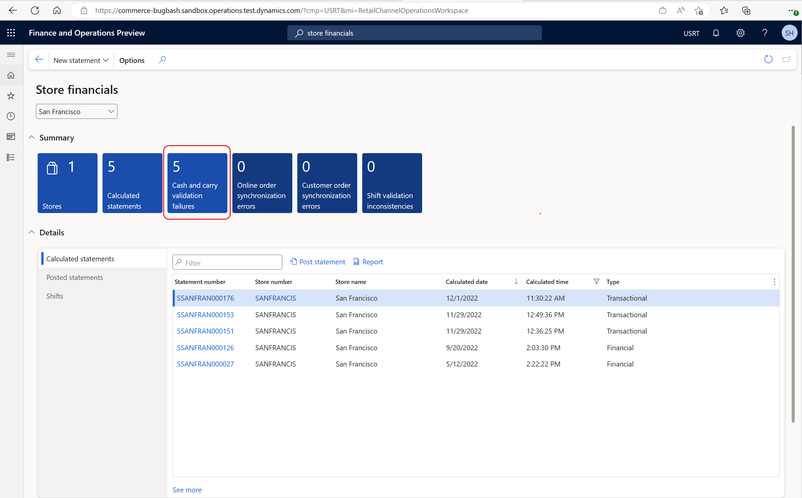
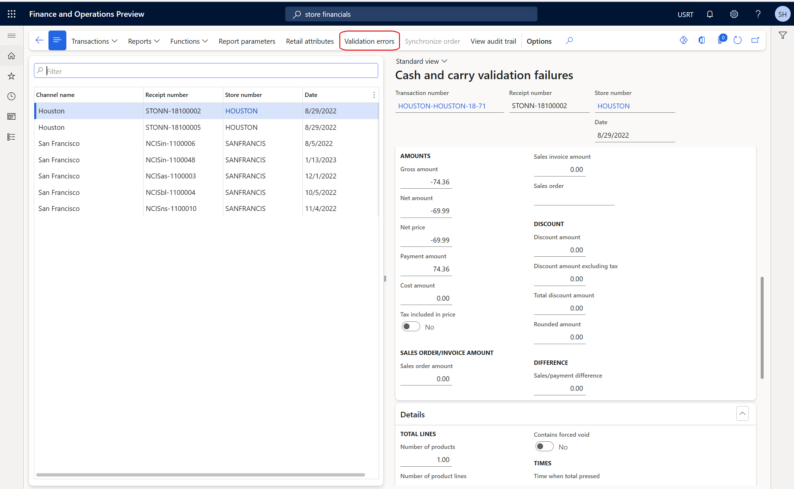
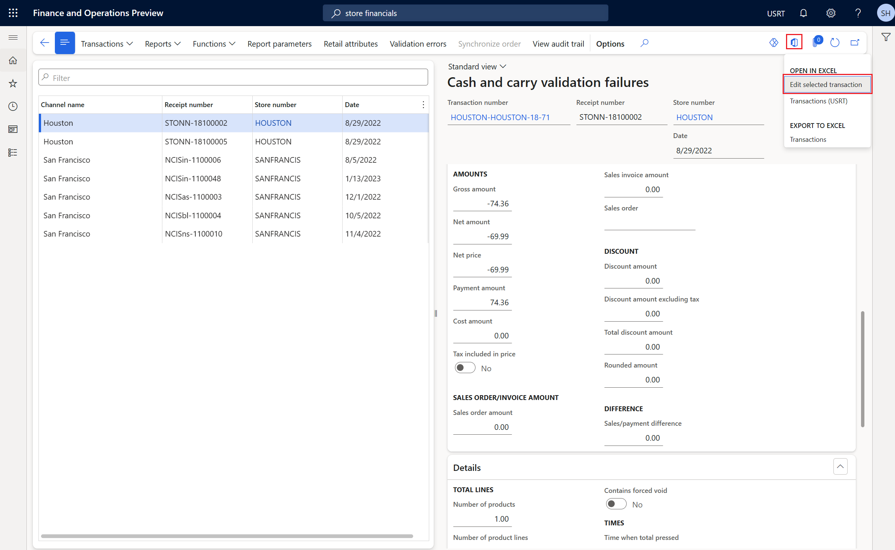
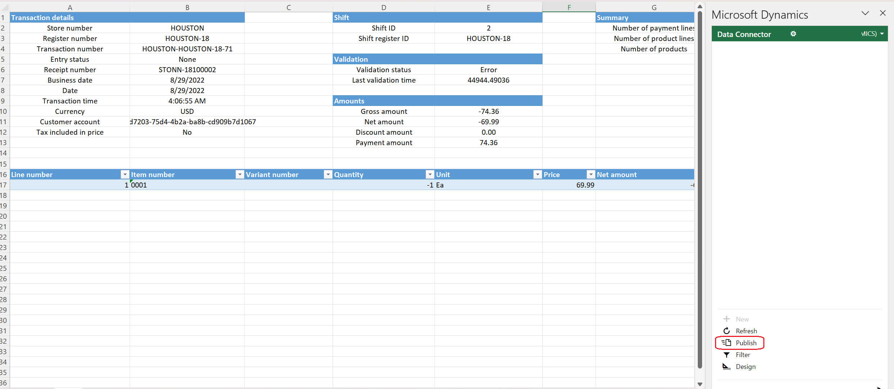
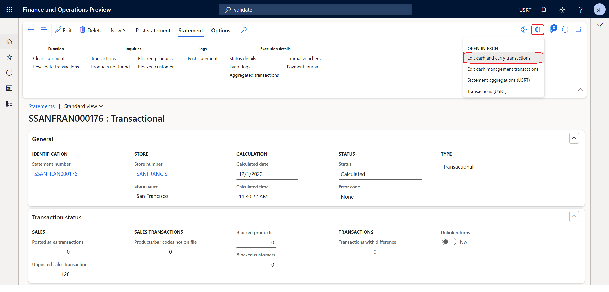
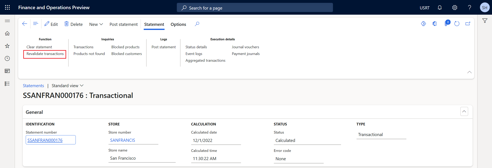
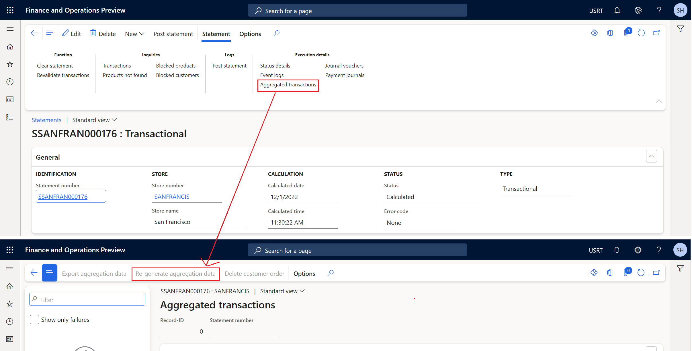

# Fix common posting issues by editing transactions using edit and audit capabilities
Error code: SYS103633, SYS328431

[!include [banner](../../includes/banner.md)]

This article provides troubleshooting guidance to fix common statement posting issues that require editing transactions in Microsoft Dynamics 365 Commerce.

## Description

Sometimes statement posting fails because the data in one or more transactions must be corrected before posting can proceed. Some of the scenarios where such data correction is needed are:
- The fiscal period mapping to the current transaction has been closed, so the transactions can't be posted.
- The transactions are created without values for required fields (for example, warehouse or batch number field values).

The data is corrected by editing the necessary transactions, and the steps required to edit the transactions vary based on which stage of the statement posting that an issue occurs. This article first lists the generic steps required to edit a transaction depending on the stage of statement posting, and then lists common errors that occur during the stages with the specific steps required to fix each issue.

> [NOTE]
> For information on the structure of the Excel files that are downloaded when editing transactions, see [Edit cash and carry transactions](../edit-cash-trans.md).

### Issues during statement calculation

Statement calculation is a prerequisite step of the statement posting process. The most common error that occurs during this stage is a transaction validation failure, where the system display a warning message that some of the transactions couldn't be included in the statement because they failed validation.

#### Transaction validation failed

If the trickle feed feature is enabled, it is required that transactions are validated before they can be included in a statement. This validation is usually done by running the **Validate store transactions** batch job. If transaction validation fails, follow these steps in Commerce headquarters to resolve the issue.

1. Go to the **Store financials** workspace and open the **Cash and carry validation failures** view. 
    
1. Select the transaction, and then select **Validation errors** to identify the error.
    
1. At the top right, select the Microsoft Office symbol, and then under **OPEN IN EXCEL**, select **Edit selected transaction**. 
    
1. Download the Excel file.
1. Once the file is downloaded, enable editing on the file and sign in.
1. Identify the correct entity and field that needs to be modified. If the field you're looking for is missing, to add the field, follow the instructions in [Add more fields to excel](../add-fields-excel.md).
1. Update the field values as needed, and then select **Publish** on the Excel spreadsheet.
    
1. Run the **Validate store transactions** job again to validate the edited transaction.
1. If the transaction gets validated, then you can continue posting the statement without the newly validated transaction since it will be included in the next statement posting, or under the **Functions** group of the current statement, you can select **Clear statement** to free the transactions that were marked with the current statement and create a new statement.
	
### Issues during order creation

One of the steps of statement posting is to create customer orders by grouping one or more transactions. If statement posting fails before the customer orders are created, follow these steps in headquarters to resolve the issue.

1. Navigate to the failed statement.
2. Click on office icon on top right and select **Edit cash and carry transactions**. Note, this will automatically pull in all the cash and carry transactions that are a part of the current statement. Refer the below image 
3. Download the file
4. Once the file is downloaded, enable editing on the file and sign in
5. Change the **Validation status** of transaction you need to fix to **None** or **Error** in excel. This is a **required step** to make any changes to the transaction. Refer the below image 
6. Identify the correct entity and field that needs to be modified. If the field you're looking for is missing, then please get it in excel  as described here [Add more fields to excel](../add-fields-excel.md)
7. Change the value of fields and select **Publish** on the Excel spreadsheet.
8. In Statement forms, click on **Revalidate transactions** under Function group. Refer the below image 
9. Press the **Aggregated transactions** button under the **Execution details** group and then click on **Re-generate aggregation data** to clear the aggregations that were generated using the old values of the transaction. This is a required step to ensure that the statement uses the edited transaction values to regenerate the aggregated values. Refer the below image 
10. Post the statement

#### Common issues that occur during order creation

Some of the common issues that occur during order creation are as following:

Error 1:
**While processing the state Customer order created, generic exception encountered in retail statement [XXXXX] in the controller : Inventory dimension Site is mandatory and must consequently be specified.**
	
Mitigation:
This issue occurs because the Site and warehouse are set up to be required fields for the transactions and some of the transactions are missing values or incorrect values for these fields. This usually happens for the transactions imported from external systems as this validation might have missed, or it could happen if the value specified for these fields isn't valid. To fix the issue, follow the steps mentioned above and on the step 7 and update the correct values for Site and Warehouse fields in the **Transactions** and **SalesTransactions** tabs of the excel, if these tabs are present.
**Note:** Site and Warehouse fields aren't available by default in Excel and can be added as explained here [Add more fields to excel](../add-fields-excel.md).

Error 2:
**While processing the state Customer order created, generic exception encountered in retail statement [XXXXX] in the controller : Batch number [XXXXX] isn't created for item number [XXXXX].**
	
Mitigation:
This issue occurs because the batch number is set up as required for an item but it isn't provided. To fix the issue, follow the steps mentioned above and on the step 7, navigate to the **Lines** tab or **Sales transaction** tab of excel and update the **Batch number** for this item. 
**Note:** Batch number field isn't available by default in Excel and can be added as described here [Add more fields to excel](../add-fields-excel.md).

## Issues during customer order invoicing

After the customer orders are created, the statement posting next step is to attempt invoicing the customer orders. If the statement posting fails during invoicing the customer orders, then follow the below steps to resolve the issue.

1. Navigate to failed statement and press the **Aggregated transactions** button under the **Execution details** group.
2. Identify and select the aggregations failing to be invoiced, and click on **Delete customer order**.  This is a **required step** as it automatically deletes the aggregation data as well and ensures that the edit transactions information is used to generate new customer orders.
3. Click on office icon on top right and select **Edit cash and carry transactions**. Note, this will automatically pull in all the cash and carry transactions that are a part of the current statement. 
4. Download the file
5. Once the file is downloaded, enable editing on the file and sign in
6. Change the **Validation status** of transaction you need to fix to **None** or **Error** in excel. This is a **required step** to make any changes to the transaction.
7. Identify the correct entity and field that needs to be modified. If the field you're looking for is missing, then please get it in excel as described here [Add more fields to excel](../add-fields-excel.md)
8. Change the value of fields and select **Publish** on the Excel spreadsheet.
9. In Statement forms, click on **Revalidate transactions** under Function group. Refer the below image.
10. Post the statement

Some of the common issues that occur during order creation are as following:

Error 1: 
**While processing the state Customer order invoiced, generic exception encountered in retail statement [XXXXX] in the controller : Posting Posting Sales order: [XXXXX] Voucher []XXXXX Period for [XXXXX] does not exist. Posting Posting Sales order: XXXX Voucher [XXXXX] Fiscal year for 1/1/2000 does not exist.**

Mitigation:
This issue occurs because the transaction date belongs to a fiscal period which isn't open anymore. This usually happens when transactions haven't been posted for a long time. To fix the issue, follow the steps mentioned above and on the step 7, navigate to the **Statement aggregations** tab of the excel and update the **Business date** field to a value that corresponds to an open fiscal period

Error 2: 
**While processing the state Customer order invoiced, generic exception encountered in retail statement [XXXXX] in the controller : Posting Posting Sales order: [XXXXX] Item: [XXXXX]Inventory dimension Location must be specified.**
	
Mitigation:
This issue occurs because the Site and warehouse are set up to be required fields for the transactions and some of the transactions are missing values or incorrect values for these fields. To fix the issue, follow the steps mentioned above and on the step 7, update the correct values for Site and Warehouse fields in the **Transactions** and **SalesTransactions** tabs of the excel, if these tabs are present.
**Note:** Site and Warehouse fields aren't available by default in Excel and can be added as described here [Add more fields to excel](../add-fields-excel.md).

Error 3: 
**While processing the state Customer order invoiced, generic exception encountered in retail statement [XXXXX] in the controller : Posting Posting Sales order: [XXXXX] -> You must select a value in the [Field name] field in combination with the following dimensions values that are valid.**
	
Mitigation:
This issue occurs because a required field for statement posting is missing a value. To fix the issue, follow the steps mentioned above and on the step 7, update the correct values for fields mentioned in the error message

Error 4: 
**While processing aggregation state Sales order is invoiced for this aggregation. Transaction state Customer order invoiced, the invoice couldn't be found for the manually invoiced sales order for this aggregation [XXXXX].**
	
Mitigation:
To fix this issue, follow the steps mentioned above and on the step 7, navigate to the **Statement aggregations** tab of the excel. Now check if **Business date** for the aggregation isn't the same as the invoice date of manually invoiced sales order for this aggregation, then update the **Business date** to the invoice date of the order.

Error 5: 
**While processing the state Payments posted, generic exception encountered in retail statement [XXXXX] in the controller : Posting results for journal batch number [XXXXX] Voucher [XXXXX] Voucher [XXXXX] Period for 1/1/2000 does not exist. Posting results for journal batch number [XXXXX] Voucher [XXXXX] Voucher [XXXXX] Fiscal year for 1/1/2000 does not exist.**
	
Mitigation:
This issue is similar to the error 1 mentioned above. To fix the issue, follow the steps mentioned above and on the step 7, navigate to the **Transactions**, **Sales Transactions** and **Payment Transactions** tab and fix the **Business date** that corresponds to an open fiscal period.
