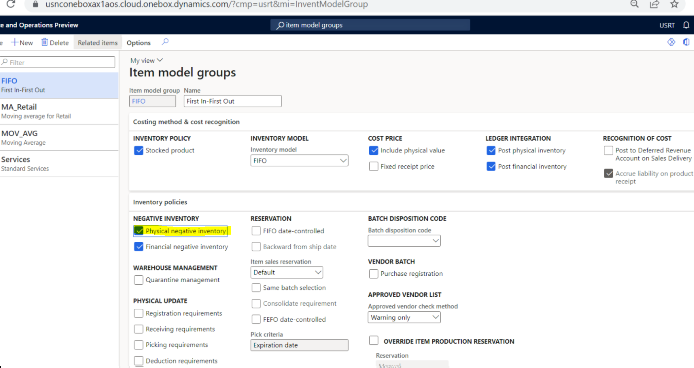

# Statement posting errors due to unavailable inventory or update conflicts
Error code: CannotPickWithEnoughInventory

[!include [banner](../../includes/banner.md)]

This article provides possible workarounds for inventory-related issues during statement posting in Microsoft Dynamics 365 Commerce.

## Description

During the posting of Commerce transactions, you might receive error messages that are related to inventory issues or update conflicts.

### Inventory issues error message

If you encounter inventory issues, the error message that you receive will resemble this example:

> xx cannot be picked because only yy is/are available from the inventory

### Update conflict error messages

An update conflict issue can occur when the inventory valuation method is either *standard cost* or *moving average*. Because both these methods are perpetual costing methods, the final cost is determined at the time of posting.

If you're using the *moving average* method, the update conflict error message that you receive will resemble this example:

> Inventory value xx.xx is not expected after the proportional expense calculation

If you're using the *standard cost* method, the update conflict error message that you receive will resemble this example:

> The standard cost does not match with the financial inventory value after the update. Value = xx.xx, Qty = yy.yy, Standard cost = zz.zz

## Resolutions

### Workaround for the inventory error

You can mitigate the inventory error either by manually updating the inventory for the item or by enabling physical negative inventory for the item model group that's associated with the item in Commerce headquarters.

For a consistent posting experience, Microsoft recommends that you enable physical negative inventory for the item model group. In some scenarios, statements might not be able to be posted unless physical negative inventory is enabled.

For example, no inventory is available for an item, but a cashier returns the item and then adds it back to the same transaction at a reduced price to mimic a price match. In this case, both the return transaction and the sales transaction will be pulled into the same statement of the single customer order. However, because there's no guarantee that the return line (which increases the inventory) will be posted before the sales line (which reduces the inventory) is posted, inventory errors can occur. If physical negative inventory is enabled in this scenario, transaction posting isn't negatively affected, and the system correctly reflects the inventory.

#### Enable negative physical inventory for an item model group

To enable negative physical inventory for an item model group in Commerce headquarters, follow these steps.

1. Go to **Inventory management \> Setup \> Inventory**.
1. In the left navigation pane, select the item model group.
1. In the **Inventory policies** section, under **Negative inventory**, select the **Physical negative inventory** checkbox.

### Workaround for the update conflict error

For possible workarounds to fix the update conflict error, see [An update conflict occurs when the inventory valuation method is either standard cost or moving average](/troubleshoot/dynamics-365/supply-chain/costing/update-conflict-standard-cost-moving-average-inventory-valuation).

> [!NOTE]
> For the update conflict error, you don't have to delete the customer orders that were generated by using the aggregation step of posting. After you implement the suggested workarounds, the statement should be posted if you reattempt statement posting.
