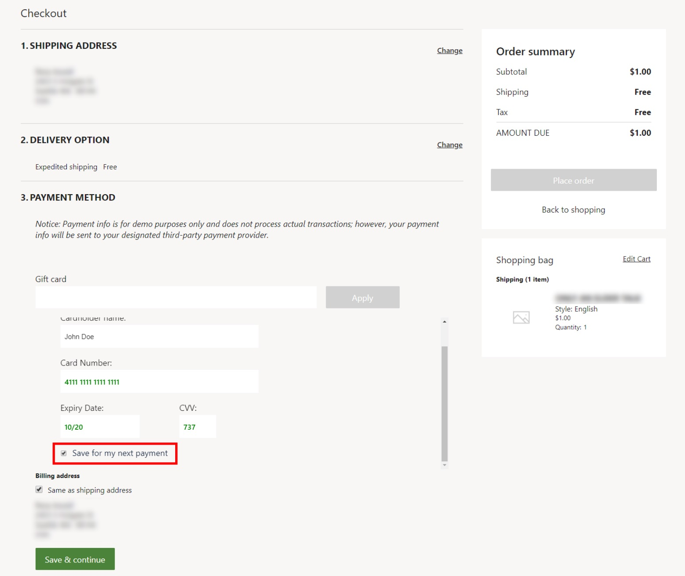
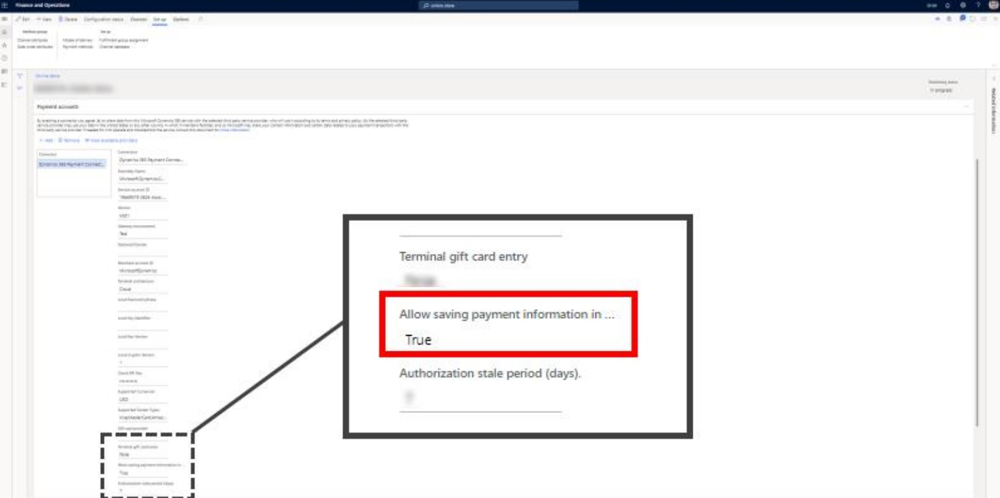

---
# required metadata

title: Save for my next payment option doesn't appear
description: This topic provides troubleshooting guidance that can help when the Save for my next payment check box doesn't appear under Payment method on an e-commerce site's checkout page.
author: Reza-Assadi
ms.date: 03/11/2021
ms.topic: Troubleshooting
ms.prod: 
ms.technology: 

# optional metadata

# ms.search.form: 
# ROBOTS: 
audience: Application user
# ms.devlang: 
ms.reviewer: v-chgri
# ms.tgt_pltfrm: 
ms.custom: 
ms.assetid: 
ms.search.region: Global
ms.search.industry: Retail
ms.author: rassadi
ms.search.validFrom: 2021-01-31
ms.dyn365.ops.version: 10.0.18

---

# "Save for my next payment" option doesn't appear

[!include [banner](../../includes/banner.md)]

This topic provides troubleshooting guidance that can help when the **Save for my next payment** check box doesn't appear under **Payment method** on an e-commerce site's checkout page.

## Description

The **Save for my next payment** check box doesn't appear in the **Payment method** section on an e-commerce site's checkout page.

The following illustration shows an example of a checkout page that includes the **Save for my next payment** check box.

## Resolution

### Verify that the Dynamics 365 Payment Connector for Adyen is correctly configured in Commerce headquarters

To verify that the Dynamics 365 Payment Connector for Adyen is correctly configured in Commerce headquarters, follow these steps.

1. Go to **Retail and Commerce \> Channels \> Online Stores**.
1. Select the online store.
1. On the **Payment accounts** FastTab, make sure that the **Allow saving payment information in e-commerce** field is set to **True**.

## Additional resources

[Payment module](../payment-module.md)

[Saving online payment instruments with the Adyen connector](../dev-itpro/adyen-connector-listPI.md)
