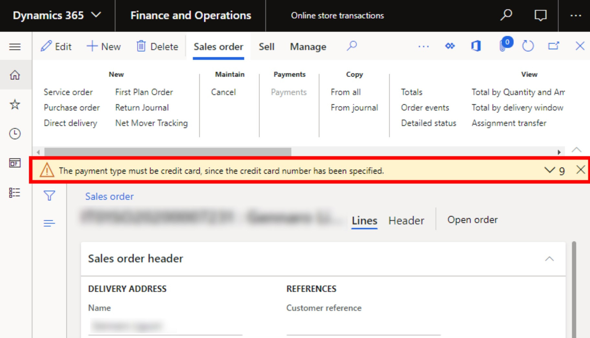

---
# required metadata

title: Payment type must be credit card error on the sales order page
description: This topic provides troubleshooting guidance that can help when an error message is shown on the sales order page after an order is synced.
author: Reza-Assadi
ms.date: 03/11/2021
ms.topic: Troubleshooting
ms.prod: 
ms.technology: 

# optional metadata

# ms.search.form: 
# ROBOTS: 
audience: Application user
# ms.devlang: 
ms.reviewer: v-chgri
# ms.tgt_pltfrm: 
ms.custom: 
ms.assetid: 
ms.search.region: Global
ms.search.industry: Retail
ms.author: rassadi
ms.search.validFrom: 2021-01-31
ms.dyn365.ops.version: 10.0.18
---

# "Payment type must be credit card" error on the sales order page

[!include [banner](../../includes/banner.md)]

This topic provides troubleshooting guidance that can help when an error message is shown on the sales order page after an order is synced.

## Description

When you open the sales order page after you sync an order, you receive the following error message: "The payment type must be credit card, since the credit card number has been specified."

## Resolution

### Set the payment type in Commerce headquarters

1. Go to **Accounts receivable \> Payment setup \> Terms of payment**.
1. In the left navigation, select your terms of payment.
1. In the **Payment type** field, make sure that **Credit card** is selected.

## Additional resources

[Posting of online sales and payments](../tasks/posting-online-sales-payments.md)
