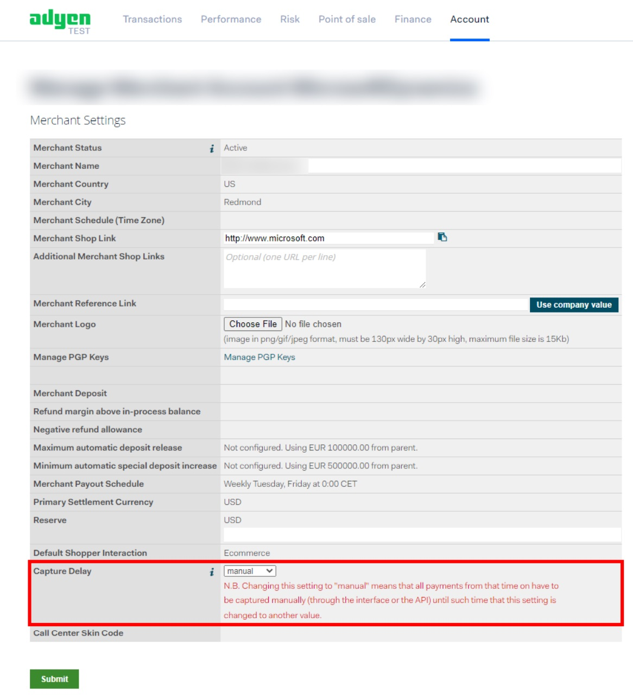

---
# required metadata

title: Payments are automatically settled before orders are invoiced or shipped
description: This topic provides troubleshooting guidance that can help when a payment is settled in the Adyen portal immediately after an order is placed, even though the sales order hasn't been invoiced or shipped.
author: Reza-Assadi
ms.date: 03/11/2021
ms.topic: Troubleshooting
ms.prod: 
ms.technology: 

# optional metadata

# ms.search.form: 
# ROBOTS: 
audience: Application user
# ms.devlang: 
ms.reviewer: v-chgri
# ms.tgt_pltfrm: 
ms.custom: 
ms.assetid: 
ms.search.region: Global
ms.search.industry: Retail
ms.author: rassadi
ms.search.validFrom: 2021-01-31
ms.dyn365.ops.version: 10.0.18

---

# Payments are automatically settled before orders are invoiced or shipped

[!include [banner](../../includes/banner.md)]

This topic provides troubleshooting guidance that can help when a payment is settled in the Adyen portal immediately after an order is placed, even though the sales order hasn't been invoiced or shipped.

## Description

After an order is placed, the payment is immediately settled in the Adyen portal, even though the sales order hasn't been invoiced or shipped.

## Resolution

### Configure manual capture for e-commerce payments in the Adyen portal

To configure manual capture for e-commerce payments in the Adyen portal, follow these steps.

1. Sign in to the Adyen portal.
1. In the upper-right corner, select your merchant account for the e-commerce channel.
1. On the top navigation, select **Account**, and then select **Settings**.
1. In the **Capture Delay** field, select **manual**.

    

## Additional resources

[Adyen payment capture](https://docs.adyen.com/point-of-sale/capturing-payments)

[Dynamics 365 Payment Connector for Adyen](../dev-itpro/adyen-connector.md)

[Set up the Adyen payment connector for Dynamics 365](https://docs.adyen.com/plugins/microsoft-dynamics)
