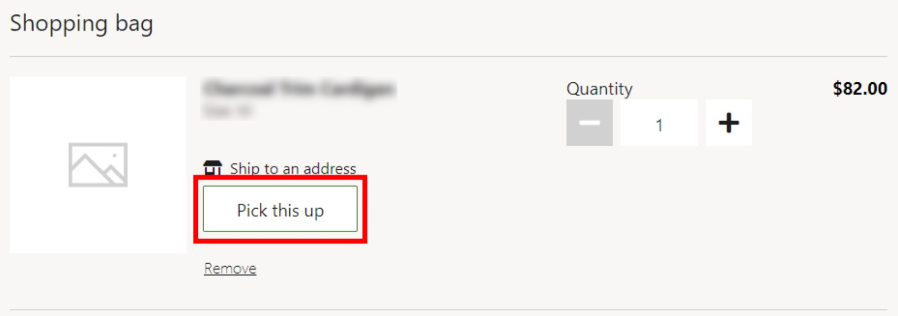

---
# required metadata

title: Pick this up option doesn't appear on cart or product details pages
description: This topic provides troubleshooting guidance that can help when the option for in-store pickup doesn't appear on the cart page or product details pages.
author: Reza-Assadi
ms.date: 03/11/2021
ms.topic: Troubleshooting
ms.prod: 
ms.technology: 

# optional metadata

# ms.search.form: 
# ROBOTS: 
audience: Application user
# ms.devlang: 
ms.reviewer: v-chgri
# ms.tgt_pltfrm: 
ms.custom: 
ms.assetid: 
ms.search.region: Global
ms.search.industry: Retail
ms.author: rassadi
ms.search.validFrom: 2021-01-31
ms.dyn365.ops.version: 10.0.18

---

# "Pick this up" option doesn't appear on cart or product details pages

[!include [banner](../../includes/banner.md)]

This topic provides troubleshooting guidance that can help when the option for in-store pickup doesn't appear on the cart page or product details pages.

## Description

The **Pick this up** button doesn't appear on the cart page or product details pages.

The following illustration shows an example of a page that includes the **Pick this up** button.

## Resolution

### Enable the BOPIS extension in Commerce site builder

To enable the "buy online, pick up in store" (BOPIS) extension in Commerce site builder, follow these steps.

1. Select your site.
1. Select **Site settings**, and then select **Extensions**.
1. Make sure that the **Disable BOPIS** option is cleared.

### Configure modes of delivery in Commerce headquarters

To configure modes of delivery in Commerce headquarters, follow these steps.

1. Go to **Procurement and sourcing \> Setup \> Modes of delivery**.
1. Make sure that a **Customer pickup** mode of delivery has been created, and that products and addresses are assigned to it.
1. Go to **Retail and Commerce \> Headquarters setup \> Parameters**.
1. In the left navigation, select **Customer orders**.
1. Make sure that **Pickup mode of delivery** is correctly configured.

### Configure customer orders payments

To configure customer orders payments in Commerce headquarters, follow these steps.

1. Go to **Retail and Commerce \> Headquarters setup \> Parameters**.
1. In the left navigation, select **Customer orders**.
1. On the **Payments** FastTab, make sure that the **Terms of payment** and **Method of payment** fields are correctly set.

## Additional resources

[Configure BOPIS](../cpe-bopis.md)

[Enable multiple pickup delivery modes for customer orders](../multiple-pickup-modes.md)

[Omni-channel Commerce order payments](../dev-itpro/commerce-payments.md)

[Store selector module](../store-selector.md)
