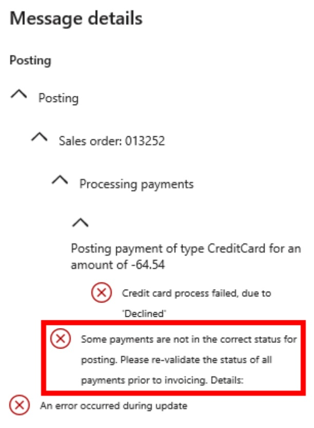

---
# required metadata

title: Refund on a return order is declined
description: This topic provides troubleshooting guidance that can help when a refund on a return order is declined because the credit card that is used for invoicing differs from the card that was used during the original payment authorization.
author: Reza-Assadi
ms.date: 03/11/2021
ms.topic: Troubleshooting
ms.prod: 
ms.technology: 

# optional metadata

# ms.search.form: 
# ROBOTS: 
audience: Application user
# ms.devlang: 
ms.reviewer: v-chgri
# ms.tgt_pltfrm: 
ms.custom: 
ms.assetid: 
ms.search.region: Global
ms.search.industry: Retail
ms.author: rassadi
ms.search.validFrom: 2021-01-31
ms.dyn365.ops.version: 10.0.18

---

# Refund on a return order is declined

[!include [banner](../../includes/banner.md)]

This topic provides troubleshooting guidance that can help when a refund on a return order is declined because the credit card that is used for invoicing differs from the card that was used during the original payment authorization.

## Description

A refund is declined when the credit card that is used to invoice a return order differs from the card that was used during the original payment authorization. You receive the following error message: "Some payments are not in the correct status for posting. Please re-validate the status of all payments prior to invoicing."

The payment authorization details will include the following error message: "Adyen gateway SendRequest() failed with status 'InternalServerError'.22144; Empty response returned from Adyen.(22001);"

## Resolution

### Enable blind returns in Adyen

To enable blind returns, follow the steps in [Troubleshoot Dynamics 365 Payment Connector for Adyen issues](adyen-support.md) to contact the Adyen support team and request that blind returns be enabled on your Adyen merchant account.

## Additional resources

[Dynamics 365 Payment Connector for Adyen](../dev-itpro/adyen-connector.md)

[Set up the Adyen payment connector for Dynamics 365](https://docs.adyen.com/plugins/microsoft-dynamics)
