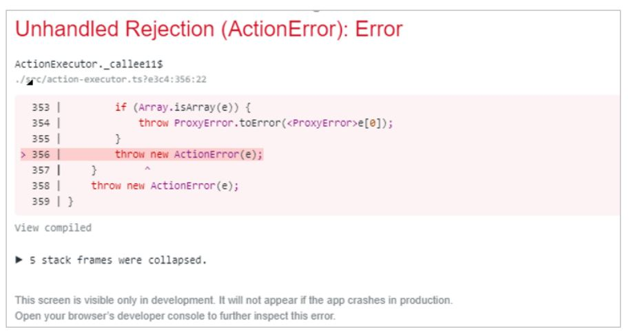
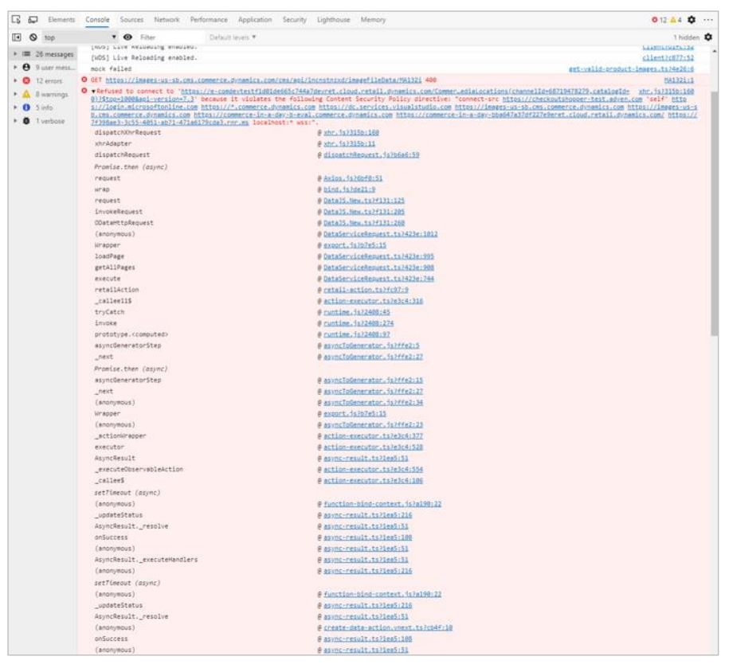

---
# required metadata

title: Set up an e-commerce development environment to debug against a Tier 1 Retail Server virtual machine
description: This topic explains how to set up an e-commerce development environment to debug against a Tier 1 Retail Server virtual machine (VM).
author: Reza-Assadi
ms.date: 03/11/2021
ms.topic: Troubleshooting
ms.prod: 
ms.technology: 

# optional metadata

# ms.search.form: 
# ROBOTS: 
audience: Application user
# ms.devlang: 
ms.reviewer: v-chgri
# ms.tgt_pltfrm: 
ms.custom: 
ms.assetid: 
ms.search.region: Global
ms.search.industry: Retail
ms.author: rassadi
ms.search.validFrom: 2021-01-31
ms.dyn365.ops.version: 10.0.18

---

# Set up an e-commerce development environment to debug against a Tier 1 Retail Server virtual machine

[!include [banner](../../includes/banner.md)]

This topic explains how to set up an e-commerce development environment to debug against a Tier 1 Retail Server virtual machine (VM).

## Description

Microsoft Dynamics 365 Commerce Tier 1 environments are typically deployed for Commerce runtime (CRT) and point of sale (POS) extension development. They are standalone environments. Because of the software as a service (SaaS) nature of the architecture, they don't include e-commerce components.

In some scenarios, you might want to test calls to extensions in a Tier 1 environment, so that you can debug extensions from e-commerce components. For general instructions, see [Debug against a Tier 1 Commerce development environment](../e-commerce-extensibility/debug-tier-1.md).

When you debug against a Tier 1 environment, because the site is now calling a different Retail Server, cross-server calls might cause various errors that are related to the content security policy.

The following illustration shows an example of an error that might occur when a variant is selected on a product details page.

The following illustration shows an example of a similar error in a browser's debugger tools (F12 Developer Tools). The error message mentions violation of the content security policy directive.

## Resolution

### Disable the content security policy for the site in Commerce site builder

1. Select the site that you're working on.
1. Select **Settings**, and then select **Extensions**.
1. On the **Content security policy** tab, select **Disable content security policy**.
1. Select **Save and publish**.

> [!NOTE]
> Business-to-consumer (B2C) sign-in won't work in a local development environment. However, you can use guest checkouts or build page mocks to simulate a user sign-in as required.

## Additional resources

[Get started with e-commerce online extensibility development](../e-commerce-extensibility/sdk-getting-started.md)

[Manage content security policy (CSP) on e-commerce site](../manage-csp.md)
