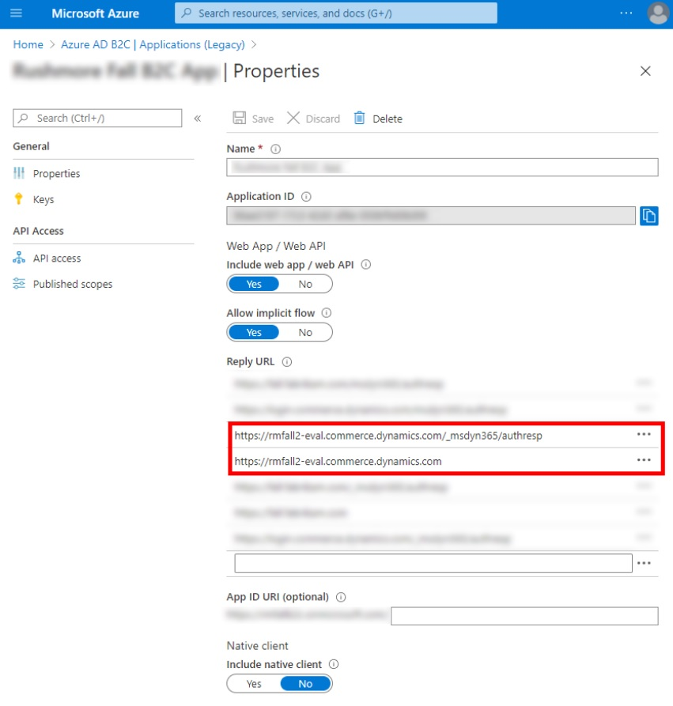

---
# required metadata

title: Sign-in link redirects back to an e-commerce site
description: This topic provides troubleshooting guidance that can help when a sign-in link redirects back to the e-commerce site instead of going to the sign-in page.
author: Reza-Assadi
ms.date: 03/11/2021
ms.topic: Troubleshooting
ms.prod: 
ms.technology: 

# optional metadata

# ms.search.form: 
# ROBOTS: 
audience: Application user
# ms.devlang: 
ms.reviewer: v-chgri
# ms.tgt_pltfrm: 
ms.custom: 
ms.assetid: 
ms.search.region: Global
ms.search.industry: Retail
ms.author: rassadi
ms.search.validFrom: 2021-01-31
ms.dyn365.ops.version: 10.0.18

---

# Sign-in link redirects back to an e-commerce site

[!include [banner](../../includes/banner.md)]

This topic provides troubleshooting guidance that can help when a sign-in link redirects back to the e-commerce site instead of going to the sign-in page.

## Description

After you configure a new Microsoft Azure Active Directory B2C (Azure AD B2C) tenant in Commerce site builder, users who select the **Sign in** link are redirected back to the main e-commerce landing page without going to the sign-in page.

## Resolution

### Confirm that the reply URL is correctly configured in the Azure AD B2C application

To confirm that the reply URL is correctly configured in the Azure AD B2C application, follow these steps.

1. Go to the [Azure portal](https://portal.azure.com/).
1. Select the Azure AD B2C application that you created for your site access.
1. Select the application that you created during the Azure AD B2C setup.
1. Under **Reply URL**, make sure that the list includes entries for both the site domain URL and the e-commerce-generated URL, as shown in the example in the following illustration.

    

> [!NOTE]
> Both the site domain URL and the e-commerce-generated URL must be in a valid URL format that doesn't include leading or trailing slashes.

## Additional resources

[Register a web application in Azure Active Directory B2C](/azure/active-directory-b2c/tutorial-register-applications?tabs=app-reg-ga#register-a-web-application)

[Set up a B2C tenant in Commerce](../set-up-b2c-tenant.md)