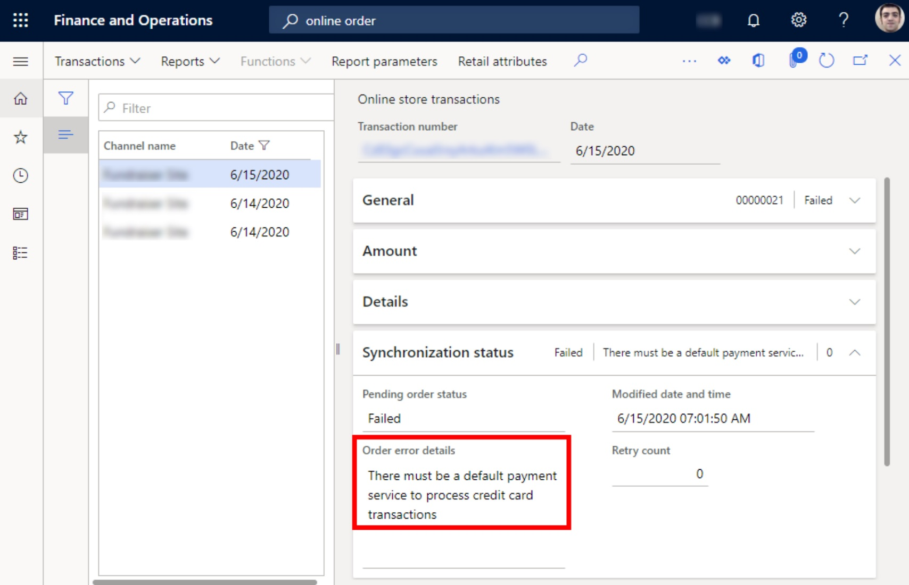

---
# required metadata

title: Order synchronization error related to the default payment service
description: This topic provides troubleshooting guidance that can help fix an error that might occur when an online order is synced.
author: Reza-Assadi
ms.date: 03/11/2021
ms.topic: Troubleshooting
ms.prod: 
ms.technology: 

# optional metadata

# ms.search.form: 
# ROBOTS: 
audience: Application user
# ms.devlang: 
ms.reviewer: v-chgri
# ms.tgt_pltfrm: 
ms.custom: 
ms.assetid: 
ms.search.region: Global
ms.search.industry: Retail
ms.author: rassadi
ms.search.validFrom: 2021-01-31
ms.dyn365.ops.version: 10.0.18

---

# Order synchronization error related to the default payment service

[!include [banner](../../includes/banner.md)]

This topic provides troubleshooting guidance that can help fix an error that might occur when an online order is synced.

## Description

When you sync an online order, you receive the following error message: "There must be a default payment service to process credit card transactions."

## Resolution

### Confirm or set the default payment service in Commerce headquarters

To confirm or set the default payment service in Commerce headquarters, follow these steps.

1. Go to **Accounts receivable \> Payment setup \> Payment services**.
1. Make sure that the **Default processor for new credit cards** option is set to **Yes** for one payment service.

## Additional resources

[Credit card setup, authorization, and capture](../../finance/accounts-receivable/credit-card-authorizations.md)