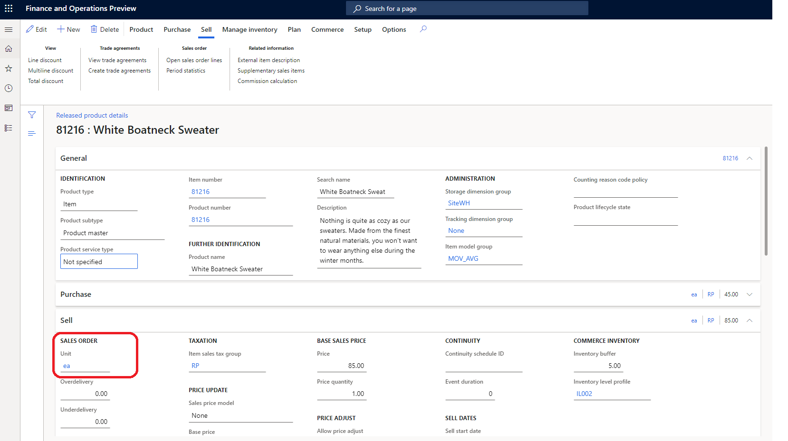
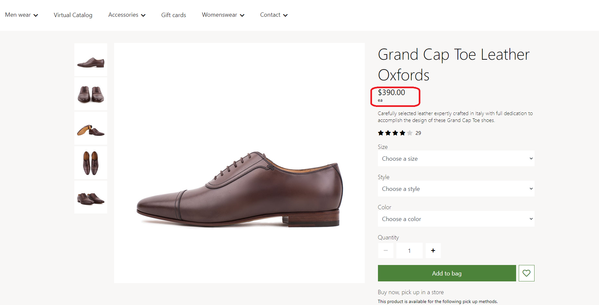
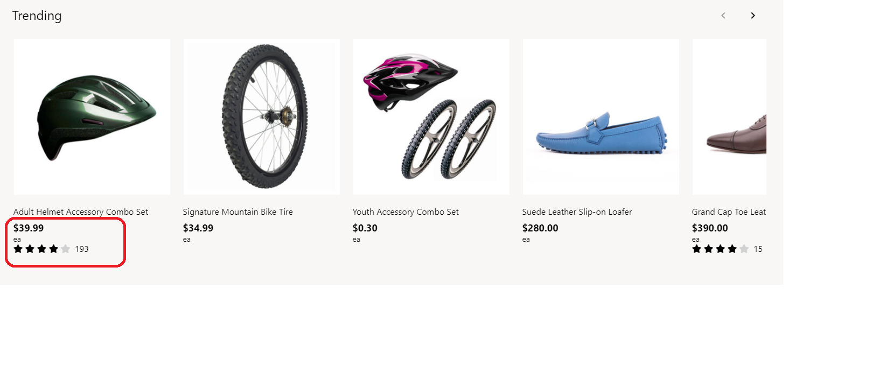

# Apply unit of measure settings

[!include [banner](includes/banner.md)]

This article covers unit of measure settings and describes how to apply them in Microsoft Dynamics 365 Commerce.

A product can be sold in different units, such as "each," "pair," and "dozen." In Commerce headquarters, the sell-by unit of measure can be defined for a product and shown on an e-commerce site. For example, if a retailer sells a product both individually and in dozens, the available units of measure can be shown together with other product information.

In the example in the following illustration, a sell-by unit of measure of **ea** (each) has been configured for a product in Commerce headquarters.

> [!NOTE]
> Support for applying and showing the unit of measure is available as of the Commerce version 10.0.19 release.

## Unit of measure settings

Unit of measure display settings are defined in Commerce site builder, at **Site settings \> Extensions \> Display unit of measure for products**. There are three supported settings:

- **Do not display** – When this setting is selected, the e-commerce site won't show the unit of measure for the product. This behavior is the default behavior.
- **Display in the product buying experience** – When this setting is selected, the unit of measure is shown on product details, cart, checkout, order history, and order details pages.
- **Display in the product browsing and buying experience** – When this setting is selected, the unit of measure is shown on the product buying experience pages and also during the product browsing experience. As part of this behavior, units of measure are shown in search results and product collection modules.

> [!IMPORTANT]
> Unit of measure display settings are available as of the Commerce version 10.0.19 release. If you're updating from an older version of Commerce, you must manually update the appsettings.json file. For instructions, see [SDK and module library updates](e-commerce-extensibility/sdk-updates.md#update-the-appsettingsjson-file).

## Modules that use unit of measure settings

Modules that use the unit of measure settings include the buy box, wishlist, cart, cart icon, search results container, product collection, checkout, and order details modules.

In the example in the following illustration, a product details page (PDP) shows the unit of measure (**ea**) for a product.

In the example in the following illustration, a product collection module shows the unit of measure (**ea**) for a product.

## Additional resources

[Module library overview](starter-kit-overview.md)

[Cart module](add-cart-module.md)

[Buy box module](add-buy-box.md)

[Account management pages and modules](account-management.md)

[SDK and module library updates](e-commerce-extensibility/sdk-updates.md)

[!INCLUDE[footer-include](../includes/footer-banner.md)]
