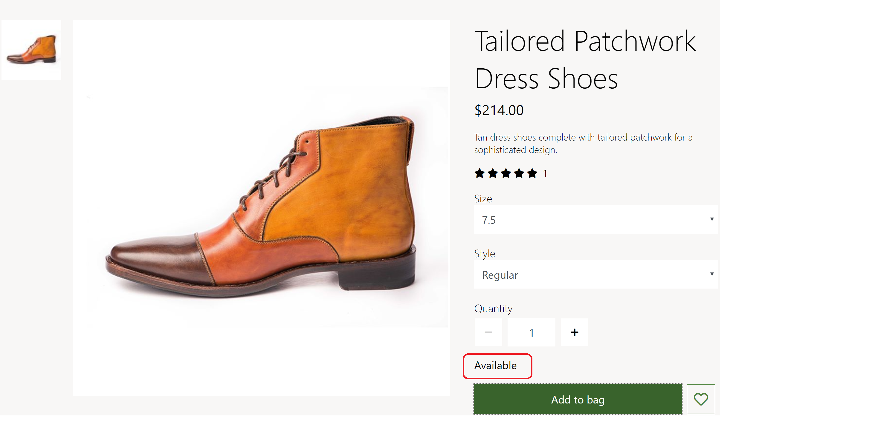
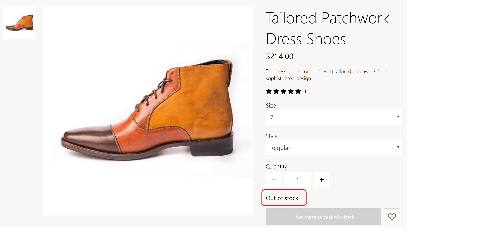

---
# required metadata

title: Display unit of measure settings
description: This topic covers inventory settings and describes how to apply them in Microsoft Dynamics 365 Commerce.
author:  anupamar-ms
manager: annbe
ms.date: 09/15/2020
ms.topic: article
ms.prod: 
ms.technology: 

# optional metadata

# ms.search.form: 
# ROBOTS: 
audience: Application User
# ms.devlang: 
ms.reviewer: v-chgri
# ms.tgt_pltfrm: 
ms.custom: 
ms.assetid: 
ms.search.region: Global
ms.search.industry: 
ms.author: anupamar
ms.search.validFrom: 2019-10-31
ms.dyn365.ops.version: 
---

# Display Unit of Measure Settings

[!include [banner](includes/banner.md)]

This topic covers settings that can be leveraged to display the product unit of measure in Microsoft Dynamics 365 Commerce.

A product can be sold in ... 

> [!NOTE]
> Support for displaying unit of measure is available in 10.0.19 Dynamics Commerce 365 release.

## Unit of Measure

In Commerce, unit of measure settings are defined at **Site Settings \> Extensions \> Display unit of measure for products** in site builder.  There are 3 settings supported.

** ** 

> [!IMPORTANT] 
> These settings are available in the Dynamics 365 Commerce 10.0.19 release. If you are updating from an older version of Dynamics 365 Commerce, you must manually update the appsettings.json file. For instructions on updating the appsettings.json file, see [SDK and module library updates](e-commerce-extensibility/sdk-updates.md#update-the-appsettingsjson-file).

## Modules that use unit of measure settings

Buy box, wishlist, cart, cart icon, search results container, product collection, checkout and order details modules use the unit of measure settings.

The following image shows an example of a product details page (PDP) that is showing the unit of measure  for a product

The following image shows an example of a search results page showing the unit of measure for a product

## Additional resources

[Module library overview](starter-kit-overview.md)

[Configure inventory buffers and inventory levels](inventory-buffers-levels.md)

[Cart module](add-cart-module.md)

[Buy box module](add-buy-box.md)

[Account management pages and modules](account-management.md)

[Store selector module](store-selector.md)

[SDK and module library updates](e-commerce-extensibility/sdk-updates.md)

[!INCLUDE[footer-include](../includes/footer-banner.md)]
