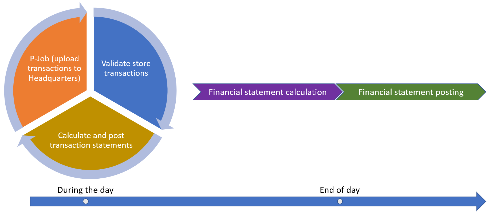
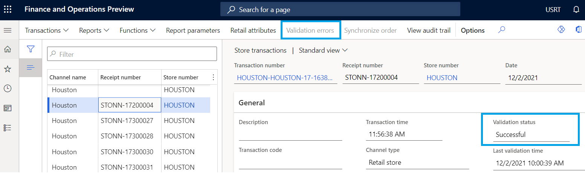
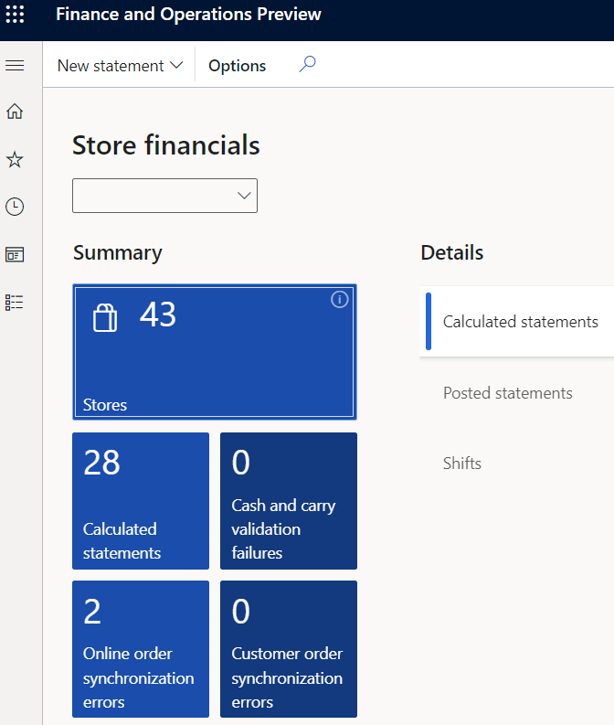

---
# required metadata

title: Validate store transactions for statement calculation
description: This article describes the functionality for validating store transactions in Microsoft Dynamics 365 Commerce.
author: analpert
ms.date: 05/28/2024
ms.topic: conceptual
audience: Application User
ms.reviewer: v-chrgriffin
ms.assetid: ed0f77f7-3609-4330-bebd-ca3134575216
ms.search.region: Global
ms.author: shajain
ms.search.validFrom: 2019-01-15
---

# Validate store transactions for statement calculation

[!include [banner](includes/banner.md)]

This article describes the functionality for validating store transactions in Microsoft Dynamics 365 Commerce. The validation process identifies and marks transactions that will cause posting errors, before they are picked up by the statement posting process.

When you try to post a statement, the validation process can fail because of inconsistent data in the commerce transaction tables. Here are some examples of factors that can cause these inconsistencies:

- The transaction total in the header table doesn't match the transaction total on the lines.
- The number of items that is specified in the header table doesn't match the number of items in the transaction table.
- Taxes in the header table don't match the tax amount on the lines. 

If inconsistent transactions are picked up by the statement posting process, sales invoices and payment journals that are created can cause statement posting to fail. The **Validate store transactions** process prevents these issues by ensuring that only transactions that pass the transaction validation rules are passed to the transaction statement calculation process.

The following illustration shows the recurring daytime processes for uploading transactions, validating transactions, and calculating and posting transaction statements and the end of day processes for financial statement calculation and posting.

## Store transaction validation rules

The **Validate store transactions** batch process checks the consistency of the commerce transaction tables, based on the following validation rules.

> [!NOTE]
> Validation rules will continue to be added in subsequent releases.

### Transaction header validation rules

The following table lists the transaction header validation rules that are checked against the header of retail transactions before those transactions are passed to statement posting.

| Rule | Description |
|-------|-------------|
| Business date | This rule validates that the business date of the transaction is associated with an open fiscal period in the ledger. |
| Currency rounding | This rule validates that the transaction amounts are rounded according to the currency rounding rule. |
| Customer account | This rule validates that the customer that is used in the transaction exists in the database. |
| Discount amount | This rule validates that the discount amount on the header equals the sum of discount amounts of the lines. |
| Fiscal document posting status (Brazil) | This rule validates that the fiscal document can be successfully posted. |
| Gross amount | This rule validates that the gross amount on the transaction header matches the net amount, including tax, of the transaction lines plus charges. |
| Net | This rule validates that the net amount on the transaction header matches the net amount, excluding tax, of the transaction lines plus charges. |
| Net + tax | This rule validates that the gross amount on the transaction header matches the net amount, excluding tax, of the transaction lines plus all taxes and charges. |
| Number of items | This rule validates that the number of items that is specified on the transaction header matches the sum of quantities on the transaction lines. |
| Payment amount | This rule validates that the payment amount on the transaction header matches the sum of all payment transactions. |
| Tax exempt calculation | This rule validates that the sum of the calculated amount and the exempted tax amount of charge lines equals the original calculated amount. |
| Tax included pricing | This rule validates that the **Tax is included in price** flag is consistent across the transaction header and the tax transactions. |
| Transaction not empty | This rule validates that the transaction contains lines, and that at least one line isn't voided. |
| Under/over payment | This rule validates that the difference between the gross amount and the payment amount isn't more than the maximum underpayment/overpayment configuration. |

### Transaction line validation rules

The following table lists the transaction line validation rules that are checked against the line details of retail transactions before those transactions are passed to statement posting.

| Rule | Description |
|-------|-------------|
| Barcode | This rule validates that all item bar codes that are used on the transaction lines exist in the database. |
| Charge lines | This rule validates that the sum of the calculated amount and the exempted tax amount of charge lines equals the original calculated amount. |
| Gift card returns | This rule validates that there are no returns of gift cards in the transaction. |
| Item variant | This rule validates that all items and all variants that are used on the transaction lines exist in the database. |
| Line discount | This rule validates that the line discount amount matches the sum of the discount transactions. |
| Line tax | This rule validates that the line tax amount matches the sum of the tax transactions. |
| Negative price | This rule validates that no negative prices are used on the transaction lines. |
| Serial number controlled | This rule validates that the serial number is present on the transaction line for items that are serial number controlled. |
| Serial number dimension | This rule validates that no serial number is provided if the item's serial number dimension is inactive. |
| Sign contradiction | This rule validates that the sign of the quantity and the sign of the net amount are the same on all transaction lines. |
| Tax exempt | This rule validates that the sum of the line item price and the exempted tax amount equals the original price. |
| Tax group assignment | This rule validates that the combination of the sales tax group and the item tax group produces a valid tax intersection. |
| Unit of measure conversions | This rule validates that the unit of measure of all lines has a valid conversion to the inventory unit of measure. |

## Enable the store transaction validation process

Configure the **Validate store transactions** job for periodic runs in Commerce headquarters (**Retail and Commerce \> Retail and Commerce IT \> POS posting**). The batch job is scheduled based on the store's organization hierarchy. We recommend that you configure this batch process to run at the same frequency as your **P-Job** and **Transactional statement calculation** batch jobs.

## Results of the validation process

The results of the **Validate store transactions** batch process can be viewed on each retail store transaction. The **Validation status** field on the transaction record is set to **Successful**, **Error**, or **None**. The **Last validation time** field shows the date of the last validation run.

The following table describes each validation status.

| Validation status | Description |
|-------------------|-------------|
| Successful | All enabled validation rules passed. |
| Error | An enabled validation rule has identified an error. You can view more details about the error by selecting **Validation errors** on the Action Pane. |
| None | The transaction type doesn't require that validation rules be applied. |

Only transactions that have a validation status of **Successful** will be pulled into the transactional statements. To view transactions that have a status of **Error**, review the **Cash and carry validation failures** tile in the **Store financials** workspace.

For more information about how to fix cash and carry validation failures, see [Edit and audit cash and carry and cash management transactions](edit-cash-trans.md).

## Additional resources

[Edit and audit cash and carry and cash management transactions](edit-cash-trans.md)

[!INCLUDE[footer-include](../includes/footer-banner.md)]
