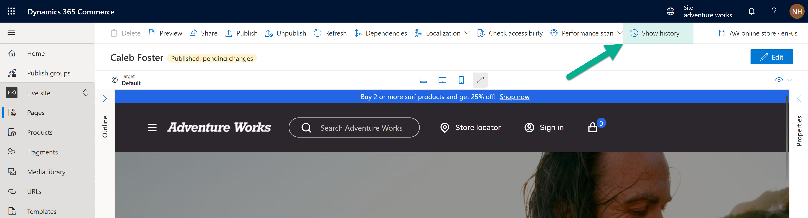
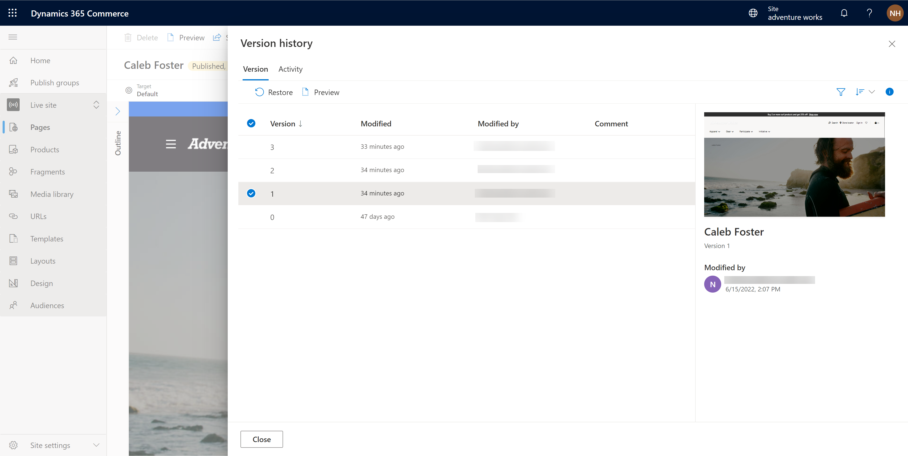
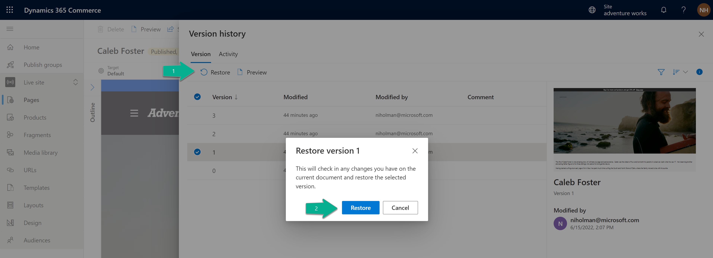

---
 # required metadata

title: View version history to revert pages and fragments
description: This article describes how to view the version history for a page or fragment and revert to an older version in Microsoft Dynamics 365 Commerce site builder.
author: phinneyridge
ms.date: 08/02/2024
ms.topic: how-to
audience: Application User
ms.reviewer: v-chrgriffin
ms.search.region: Global
ms.author: asharchw
ms.search.validFrom: 2017-06-20
ms.custom: 
  - bap-template
---

# View version history to revert pages and fragments

[!include [banner](includes/banner.md)]

This article describes how to view the version history for a page or fragment and revert to an older version in Microsoft Dynamics 365 Commerce site builder.

Commerce site builder lets you view the version history of a page or fragment and revert to a specific previous version of a document if needed. While a document is open, you can select **Show history** on the command bar to open a **Version history** dialog box, where the **Version** tab lists the history of all versions and save activities for the page or fragment. You can then select a previous version of the document in the list, preview it, and restore it as the current version. The **Activity** tab of the dialog box lists the full activity history of the document, including all save, publish, and unpublish events.

> [!NOTE]
> A new version of a document is created each time that a site author makes changes and then selects **Finished editing** for the document. 

To view the version history for a page or fragment and revert to a previous version, follow these steps.

1. In site builder, open the page or fragment that you want to view the version history for.
1. On the command bar, select **Show history**.

    

1. In the **Version history** dialog box, on the **Version** tab, select a previous version of the document. The properties pane on the right shows a thumbnail preview of the selected version, and information about who modified it and when.

    

1. To view a fully rendered preview of the selected version of the document, select **Preview**. To close the preview and return to the **Version history** dialog box, select **Exit preview**.
1. To restore a previous version of a document, select it in the list on the **Version** tab, and then select **Restore**. A **Restore version \<version number\>** message box appears and prompts you to confirm the restore action. 

    

1. To proceed with the restore action, select **Restore**. Site builder is refreshed and shows the restored version of the page or fragment.
1. To publish the restored version, select **Finish editing**, and then select **Publish**.
