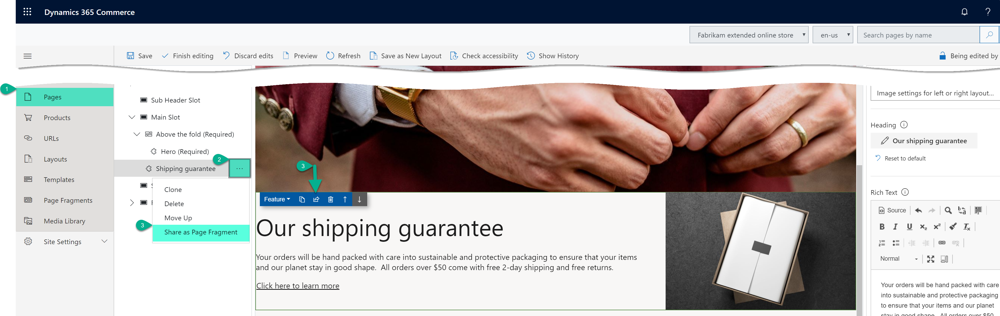
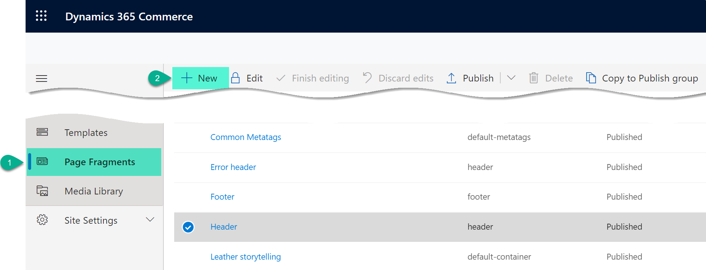
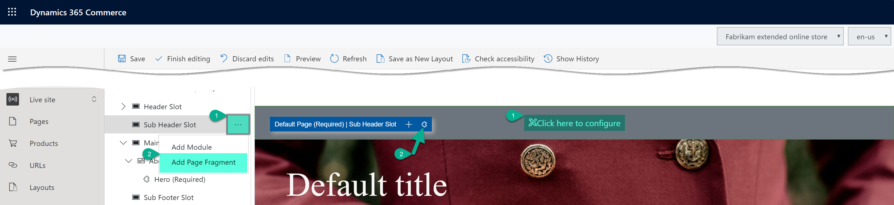
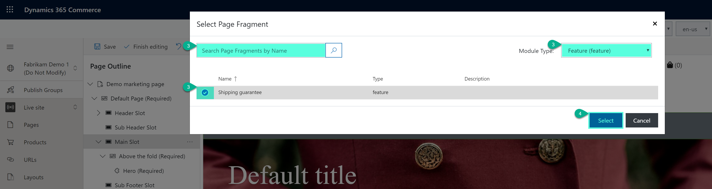

# Work with fragments 

[!include [banner](includes/banner.md)]

This article describes why, when, and how to use fragments in Microsoft Dynamics 365 Commerce.

Fragments allow for a centralized authoring experience for module configurations that must be reused throughout your site. For example, headers, footers, and banners are often configured as fragments, because they are shared across many pages. You can think of fragments as miniature webpages that can be inserted into other pages on your site. Fragments have their own lifecycle. In other words, they are created, referenced, updated, and deleted as independent entities in the authoring tools.

After fragments are configured, they can be used wherever modules can be used in your site structure. Fragments can be referenced on pages, in layouts, in templates, and in other fragments.

> [!NOTE]
> Fragments can be nested up to seven levels deep inside other fragments.

For example, if you want to promote a seasonal event cross many pages on our site, you can use a fragment. The first step in the process of creating a new fragment is to select the type of module that you want to start from. For this example, you can build the fragment from a hero module.

> [!NOTE]
> Fragments can be built from any module type.

You can then configure the hero fragment with your specific promotional content. You can also localize it as you require. The new stand-alone hero fragment can then be consumed as a preconfigured module throughout your site. You can easily add it to templates, to specific pages, or to other fragments that can contain hero modules.

All the places where the fragment is added are references to the central hero fragment that you created. If you publish changes to the fragment, those changes are immediately reflected in all the places where the fragment is referenced across the site. Therefore, fragments provide a powerful and efficient way to reuse and centrally manage module configurations on a site. By effectively using them, you can significantly increase agility and help reduce the cost that is associated with managing site content.

The following illustration shows how fragments can be used to centralize authoring of shared module configurations across an e-Commerce site.

## Create a fragment

You can either create a new fragment or save an existing module configuration as a fragment.

### Save an existing module configuration as a fragment

To convert a previously configured module to a reusable fragment in Commerce site builder, follow these steps.

1. Open a page or template that contains the module that you want to convert to a fragment.
1. In the outline pane on the left or directly in visual page builder, select the previously configured module.
1. Select the ellipsis (**...**) next to the name of the module in either the outline pane or the selected module's toolbar in visual page builder. 
1. Select **Share as fragment**. 
1. In the **Save as fragment** dialog box, enter a name for the fragment.
1. Select **OK** to save the module configuration as a fragment that can be added to other pages.
<!-- The following image shows how to save a module configuration as a fragment.-->
<!---->

### Create a new fragment

To create a new fragment in Commerce site builder, follow these steps.

1. In the navigation pane on the left, select **Fragments**.
1. Select **New**. A **New fragment** dialog box appears that shows all the available module types. As was mentioned earlier, fragments can be created from any module type.
1. Select a module type for your fragment.

<!-- The following image shows where to create a new fragment.-->
<!-- -->
> [!TIP]
> By selecting a generic container module type, you get the most flexibility when you need to update and configure your fragment later.

## Add, remove, or edit fragments on a page

The following procedures describe how to add, remove, and edit fragments.

### Add a fragment

To add a fragment to a page in Commerce site builder, follow these steps.

1. In the outline pane on the left or directly in visual page builder, select a container or slot to which child modules can be added.
1. Select the ellipsis (**...**) next to the name of the container or slot.  Alternately, if using visual page builder, select the plus symbol (**+**).  
1. Select **Add fragment**.
    <!-- -->
 
    > [!NOTE]
    > If the container or slot doesn't support new child modules, the **Add fragment** option is unavailable.
    
1. In the **Select fragment** dialog box, search for and select a fragment to add. If no available fragments are listed, you might first have to create a fragment from a module type that the selected container or slot supports.
1. Select your desired fragment to add it to the container or slot on your page.
<!--    -->

> [!NOTE]
> The modules that are allowed in a container or slot are defined by the page's template or the modules' own definitions.

### Remove a fragment

To remove a fragment from a slot or container on a page in Commerce site builder, follow these steps.

1. In the outline pane on the left, select the ellipsis (**...**) next to the name of the fragment to be removed, and then select the trash can symbol.  Alternately, you can select the fragment in visual page builder and select the trash can symbol in the fragment's toolbar.
1. When you're prompted to confirm that you want to remove the fragment, select **OK**.

> [!NOTE]
> When you remove a fragment from a page, you just remove the reference to it from that page. You do **not** delete the fragment from your site. To delete fragments from your site, you must use the fragment inspector user interface (UI). You can delete fragments from a site only if they aren't currently referenced by any pages, templates, or other fragments.

### Edit a fragment

To edit fragments, you must use the fragment editor UI. This restriction is by design. It helps guarantee that authors don't confuse the process of editing the modules for a specific page with the process of editing fragments that might be shared across many pages.

To edit a fragment in Commerce site builder, follow these steps.

1. In the navigation pane on the left, select **Fragments**.
1. Under **Fragments**, select the fragment to edit.
1. Edit the fragment's module properties and structure as you require. The process resembles the process for editing modules are edited in the page editor view.

You can also edit a fragment by selecting it on a page, in a template, or in a parent fragment, and then selecting **Edit Fragment** in the properties pane on the right.

### Rename a fragment

To rename an existing fragment in site builder, follow these steps.

1. In the left navigation pane, select **Fragments**.
1. Select the fragment name of the fragment that you want to rename.
1. Select **Edit** to start editing the fragment. Note that you cannot edit a fragment if someone else is already editing the fragment.
1. In the fragment properties pane, select the pen symbol next to the fragment name.
1. Edit the fragment name as needed.
1. Select the check mark to confirm the name change.
1. Select **Finish editing**.

You can rename a fragment after it is created by editing it and then selecting the pen symbol next to the fragment name in the property pane.

## Additional resources

[Templates and layouts overview](templates-layouts-overview.md)

[Work with templates](work-with-templates.md)

[Work with preset layouts](work-with-layouts.md)

[Work with publish groups](publish-groups.md)

[View version history to revert pages and fragments](version-history-revert.md)

[!INCLUDE[footer-include](../includes/footer-banner.md)]
