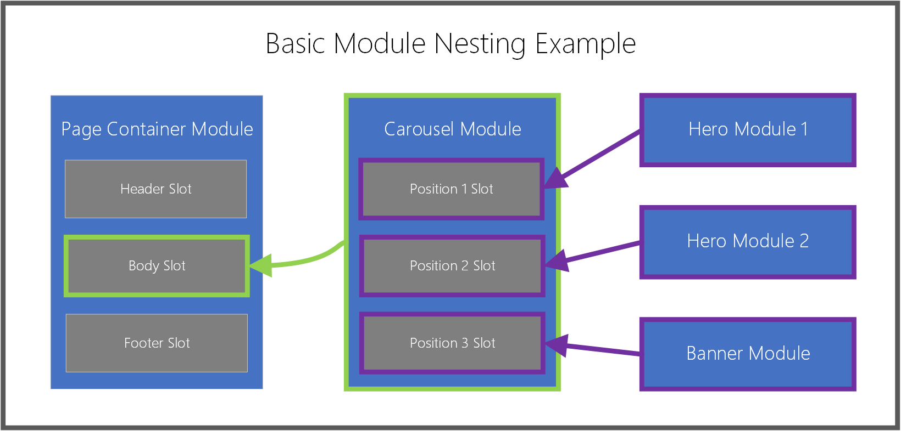

# Work with modules

[!include [banner](includes/banner.md)]

This article describes how and when to use modules in Microsoft Dynamics 365 Commerce site builder.

Modules are logical building blocks that make up your page structure, and they have various purposes and scopes. Some modules are high-level containers, and their only purpose is to hold and organize other modules (child modules). Other modules, such as a simple image placement module, have a very specific purpose. Other modules, such as a carousel module, fall somewhere between those two categories.

By default, your Dynamics 365 Commerce site includes a module library that lets you achieve most basic e-Commerce scenarios. You should be able to construct an end-to-end e-Commerce site just by using these modules. However, you might also want to customize these modules or build new, custom modules for specific needs. If you want to build custom modules, a module design software development kit (SDK) is available to help you create a custom module library.

## Container modules and slots

As was mentioned earlier, some modules are designed to hold child modules. These modules are known as *containers*, and they allow for hierarchies of nested modules. Container modules include *slots*. Slots are used to handle the layout and purpose of child modules in the container. An example is a basic page container module (a top-level module for any page) that defines several important slots:

- A header slot
- A sub-header slot
- A main slot
- A footer slot
- A sub-footer slot

The module's developer defines these slots, and determines which child modules and how many child modules can be put directly inside it. For example, the header slot might support only one module of the **Header Module** type, whereas the body slot might support an unlimited number of modules of any type (except other page container modules).

In the authoring tools, page authors don't have to know in advance which modules can and can't be put in each slot. When page authors select a slot and then try to select a module to add to it, they see a filtered view of module types that are supported for that slot.

## Content modules

Content modules contain content and media elements, such as text (for example, headlines, paragraphs, and links) or asset references (for example, images, video, and PDFs). Typical content module types include content block, text block, and promo banner modules. Modules of these three types can contain text or media, and they don't require any child modules to make something visible on a page.

The majority of typical, day-to-day page and content authoring activities involve content modules, primarily because these modules define the actual content that is rendered in their parent container modules. Many content modules are available, and these modules are typically the last pieces that you will add to a page's hierarchy of nested modules.

The following illustration shows how modules are nested inside parent container module slots.

## Add or remove modules

The following procedures describe how to add and remove modules.

### Add a module

To add a module to a slot or container on a page, follow these steps.

1. In the outline pane on the left or directly in the main canvas, select a container or slot to which a child module can be added.

    > [!NOTE]
    > The module designer defines the list of modules types that can be added to a specific module slot. Template authors can then refine the allowed module options to help guarantee consistent search engine optimization (SEO) and authoring efficiency for all the pages that are built from a specific template. When adding a module to a slot, the **Add Module** dialog box is automatically filtered so that it shows only modules that are supported in the selected container or slot. This list of allowed modules is determined by the page's template or the container's module definition.

1. If using the outline pane, select the ellipsis (**...**) next to the module name, and then select **Add Module**. If using the controls directly within the canvas, select the plus symbol (**+**) in an empty slot or adjacent to the currently selected module, and then select **Add Module**.

    > [!NOTE]
    > If a container or slot doesn't support new child modules, the **Add Module** option is unavailable.

1. In the **Add Module** dialog box, select a module to add to your page.

    > [!TIP]
    > **Content block** is a good module type for beginners to work with.

1. Select **OK** to add the selected module to the selected container or slot on your page.

### Remove a module

To remove a module from a slot or container on a page, follow these steps.

1. In the outline pane on the left, select the ellipsis (**...**) next to the name of the module to be removed, and then select the trash can symbol. Alternately, in the main canvas you can select the trash can symbol on a selected module's toolbar.
1. When prompted to confirm that you want to remove the module, select **OK**.

## Move a module to a new position

To move a module to a new position within your page, use any of the following methods.

### Move a module using the outline pane

To move a module using the outline pane, follow these steps.

1. Select and hold the module you want to move in the outline pane, then drag the module to a new position in the outline. The blue line in the outline and on the canvas indicates where the module can be placed.
1. Release the module to drop it into the new position.

### Move a module directly within the canvas

To move a module directly within the canvas, follow these steps.

1. Select the module you want to move in the canvas. 
1. Select either an upward or downward pointing arrow symbol in the module's toolbar, and then drag the arrow to a new position on the page. The blue line in the canvas and outline indicates where the module can be placed. If a module cannot be moved up or down, that arrow symbol will be grayed out. 
1. Release the module to drop it into the new position.

### Move a module using the ellipsis menu

To move a module using the ellipsis menu, follow these steps.

1. Select a module in either the outline or the canvas.
1. Select the ellipsis (**...**) next to the module's name in the outline pane, or in the module's toolbar in the canvas.
1. If the module can be moved up or down within the container or slot, you will see options for **Move up** or **Move down**. Select the desired move option to move the module up or down relative to its siblings.

## Configure modules

The following procedures describe how to configure content and container modules.

### Configure a content module

To configure a content module on a page, follow these steps.

1. In the outline pane on the left, expand the tree and select any content module (for example, **Content block**). Alternately, you can select the module in the main canvas.
1. In the module properties pane on the right, enter properties for any desired module controls.
1. On the command bar, select **Save**. This will also refresh the preview canvas.

### Edit module text properties

Module text properties that are not read-only can be edited directly in the canvas.

To edit module text properties, follow these steps.

1. Select the text control in the canvas, then place your cursor where you wish to edit text.
1. Enter your text content.
1. Select anywhere outside the text content to continue editing other content.

### Inline image selection

Module images that are not read-only can be changed directly from the canvas.

To choose a new image for a content module, follow these steps.

1. In the canvas, double-click the image. This will bring up the media picker window.
1. Find and select a new image you want to use, and then select **OK**. The new image is now rendered in the canvas.

### Configure a container module

To configure a container module on a page, follow these steps.

1. Select a container module on your page (for example, a carousel or fluid container module).
1. In the properties pane on the right, expand the nested controls by selecting the headers, and set any required control values.
1. In the outline pane on the left, select the ellipsis button next to the name of either the container or any slots inside the container, and then select **Add Module**. Then, add child modules to the selected container. For more information, see the [Work with modules](#add-a-module) section earlier in this article.
1. If multiple child modules exist as siblings in a parent container, you can change their display order in the parent container. Select the ellipsis button for a module, and then use the up arrow and down arrow buttons.

## Additional resources

[Templates and layouts overview](templates-layouts-overview.md)

[Work with templates](work-with-templates.md)

[Work with preset layouts](work-with-layouts.md)

[Work with fragments](work-with-fragments.md)

[Add a container module to a page](add-container-module.md)

[Work with publish groups](publish-groups.md)

[!INCLUDE[footer-include](../includes/footer-banner.md)]
