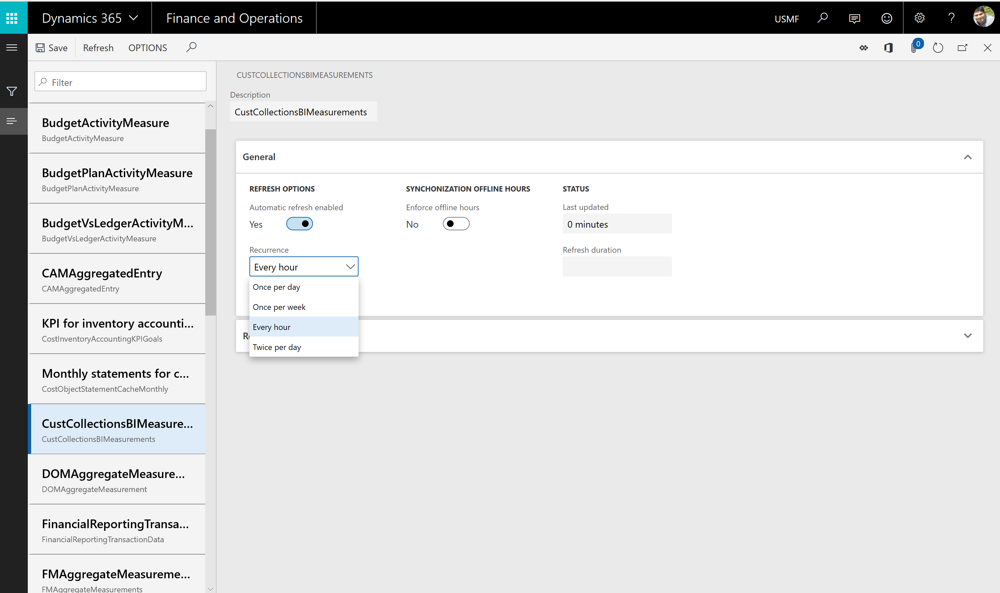

---
# required metadata

title: Automated Entity store refresh
description: This topic describes how to enable automated entity store refresh feature in PU23.
author: MilindaV2
manager: AnnBe
ms.date: 11/01/2019
ms.topic: article
ms.prod: 
ms.service: dynamics-ax-platform
ms.technology: 

# optional metadata

ms.search.form: AutomatedEntityStoreRefresh
# ROBOTS: 
audience: IT Pro
# ms.devlang: 
ms.reviewer: sericks
ms.search.scope: Core, Operations
# ms.tgt_pltfrm: 
ms.custom: 27661
ms.assetid: 861cfa94-c6f3-4c84-89ac-22c78bf6b7a4
ms.search.region: Global
# ms.search.industry: 
ms.author: milindav
ms.search.validFrom: 2016-02-28
ms.dyn365.ops.version: AX 7.0.0

---

# Automated Entity store refresh

[!include [banner](../includes/banner.md)]

## Overview

When you transition to this feature, Entity store refresh is automated and managed by the system. Administrators do not need to schedule and monitor Entity store refresh via system batch schedules. System manages the refresh operation based on desired latency. This feature is enabled in Platform update 23. As an administrator you do need to opt-in to this feature.

## Enabling automated refresh
1. Go to **System administration** \> **Set up** \> **Entity store**.

    On the **Entity store** page, a message indicates that you can switch to the **Automated Entity store refresh** option. This option is managed by the system. An admin doesn't have to schedule or monitor the Entity store refresh.

2. Select **Switch now**.

    > [!IMPORTANT]
    > This action isn't reversible. After you switch to the **Automated Entity store refresh** option, you can't revert to the old user interface (UI) experience.

3. Select **Yes** to continue.

You will now see the new experience.

After the new experience is turned on, you can define the refresh for each aggregate measurement. The following refresh options are available:

- Every hour
- Twice a day
- Once a day
- Once a week

In addition, an admin can refresh any aggregate measurement on demand by selecting the **Refresh** button. Additional options will be added in future platform updates. These options will include options for real-time refresh.

> [!IMPORTANT]
> When the automated refresh is enabled, in some cases the system may disable refresh of Aggregate measurements. You must revisit aggregate measurements and validate that appropriate refresh intervals have been applied by the system.
>

