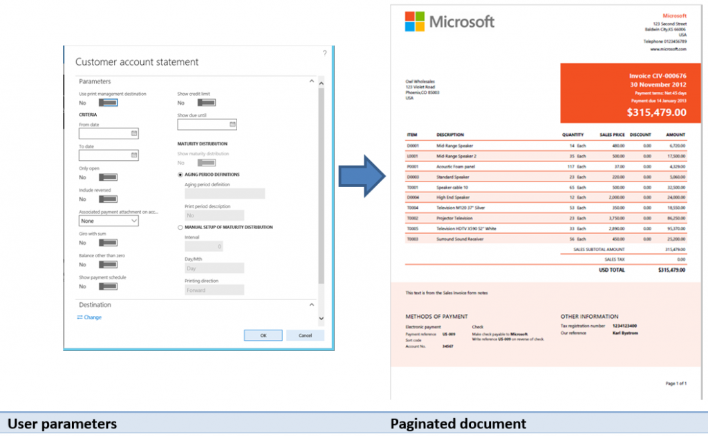
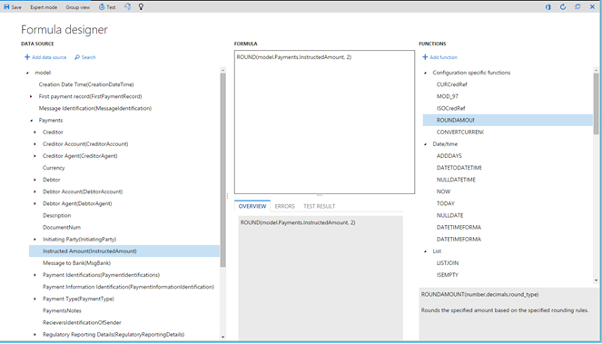

---
# required metadata

title: Intelligence
description: This topic points you to resources that you can use to learn more about the business intelligence and reporting tools that are available in Microsoft Dynamics 365 for Finance and Operations, Enterprise edition.
author: sericks007
manager: AnnBe
ms.date: 09/07/2017
ms.topic: index-page
ms.prod: 
ms.service: dynamics-ax-platform
ms.technology: 

# optional metadata

# ms.search.form: 
# ROBOTS: 
audience: Application User, IT Pro
# ms.devlang: 
ms.reviewer: sericks
ms.search.scope: Operations
# ms.tgt_pltfrm: 
ms.custom: 27681
ms.assetid: c4624bc8-3661-49e6-9cb4-87778acdc302
ms.search.region: Global
# ms.search.industry: 
ms.author: sericks
ms.search.validFrom: 2016-02-28
ms.dyn365.ops.version: AX 7.0.0

---

# Intelligence

[!include[banner](../includes/banner.md)]

This topic points you to resources that you can use to learn more about the business intelligence (BI) and reporting tools that are available in Microsoft Dynamics 365 for Finance and Operations, Enterprise edition.

## Get started
- [Information access and reporting](information-access-reporting.md)
- [Tech Talk: Reporting options](https://www.youtube.com/watch?v=NzZONjKs5xA) (video)
- [Finance and Operations: Business intelligence](https://blogs.msdn.microsoft.com/dynamicsaxbi/) (blog)

## Analytical workspaces
Finance and Operations delivers interactive reports that are seamlessly integrated into application workspaces. Workspaces can use rich infographics and visuals that are supported by Microsoft Power BI. These infographics and visuals include many controls that are provided by third parties. Therefore, workspaces can provide a highly visual, interactive experience for users.

Users can interact with data by clicking or touching visuals on the page. They can see cause and effect, and do simple what-if operations without leaving the workspace. Thanks to stunning, interactive visuals, your users will have fun exploring data and discovering hidden trends.

 To learn more, see the following topics:

 - [Embedded Power BI in workspaces](embed-power-bi-workspaces.md)
 - [Power BI Embedded integration](power-bi-embedded-integration.md)
 - [Add analytics to workspaces by using Power BI Embedded](add-analytics-tab-workspaces.md)
 - [Publish analytical applications on Power BI](publish-apps-powerbi.md)
 - [Help secure analytical workspaces and reports by using Power BI Embedded](secure-analytical-workspaces.md)
 - [Power BI content for Finance and Operations](power-bi-home-page.md)

## Business documents and printing
Reporting solutions are often used to capture and communicate the details of business transactions. Therefore, a reporting solution must be able to produce physical manifestations of business data by using existing devices, such as network printers. Examples of business documents include sales invoices, customer statements, and checks.

To learn more, see the following topics:

- [Document Reporting Services overview](document-reporting-services.md)
- [Printing in Finance and Operations applications](print-documents.md)
- [Install the Document Routing Agent to enable network printer devices](install-document-routing-agent.md)

## Electronic reporting
Electronic reporting (ER) is the tool that you use to configure electronic document formats that comply with the legal requirements of various countries or regions. The applications of electronic reporting include financial auditing, tax reporting, and electronic invoicing.

To learn more, see the following topics:

- [Electronic reporting overview](general-electronic-reporting.md)
- [Manage the Electronic reporting configuration lifecycle](general-electronic-reporting-manage-configuration-lifecycle.md)
- [Create an Electronic reporting configuration](electronic-reporting-configuration.md)

## Financial reporting
Standard financial reports are provided that use the default main account categories in Finance and Operations. You can use the report designer to create or modify traditional financial statements, such as income statements and balance sheets. You can then share the results with other members of your organization. Examples of financial reporting include balance sheets, cash flow, and summary trial balance year over year.

To learn more, see the following topics:

- [Financial reporting for Finance and Operations](financial-reporting-intro.md)
- [Generate a financial report](generate-financial-report.md)
- [Financial report components](financial-report-components.md)

## Technical reference reports
The following reports provide reference information about the objects in Finance and Operations:

- [Aggregate data entities report](aggregate-data-entities-report.md)
- [Aggregate measurements report](aggregate-measurements-report.md)
- [Data entities report](../data-entities/data-entities-report.md)
- [Key performance indicators (KPIs) report](key-performance-indicators-report.md)
- [License codes and configuration keys report](../sysadmin/license-codes-configuration-keys-report.md)
- [SQL Server Reporting Services reports report](SSRS-report.md)
- [Workflow types report](../../fin-and-ops/organization-administration/workflow-types-report.md)
