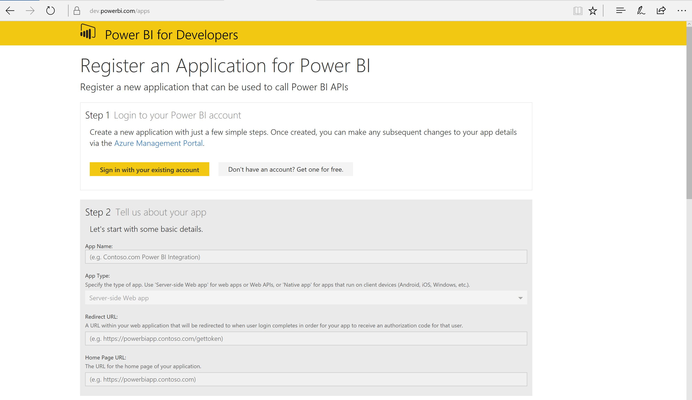
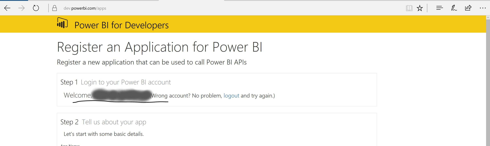
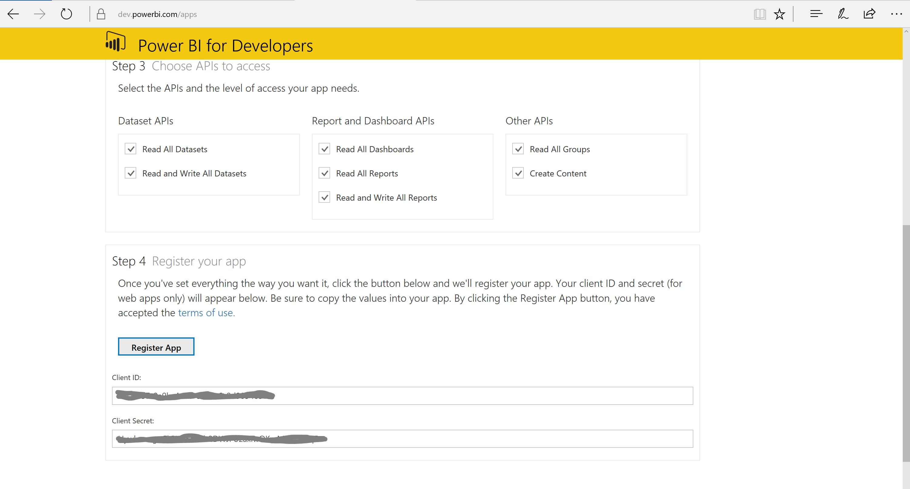
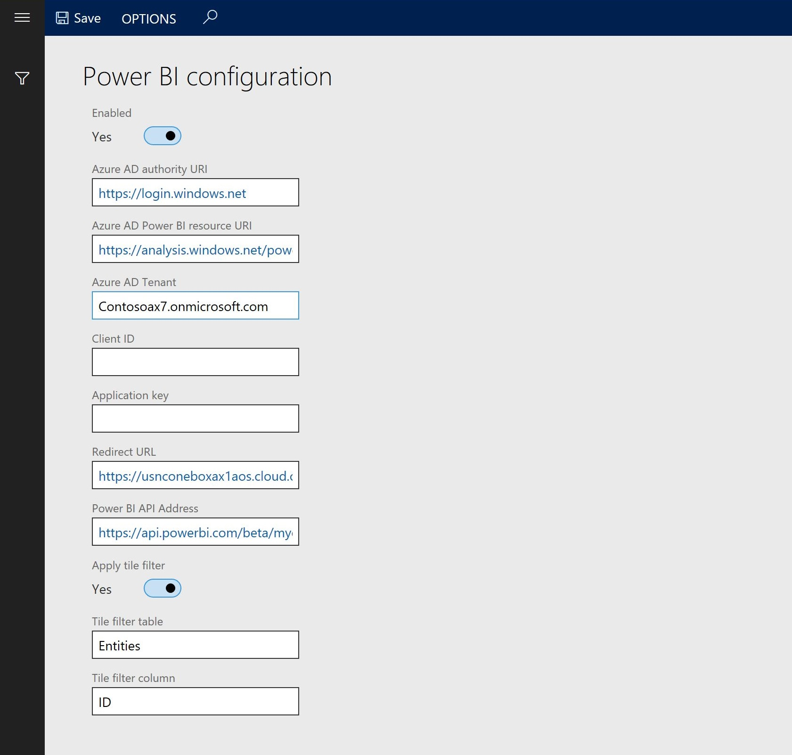
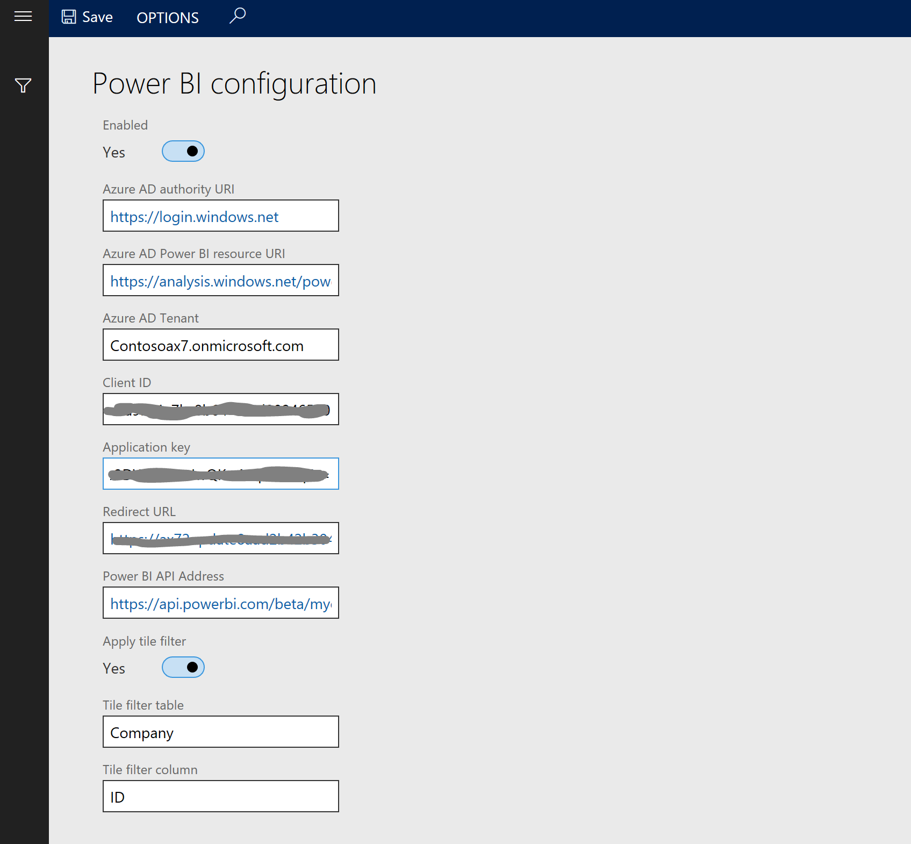
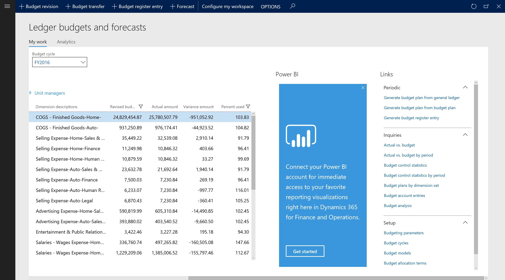
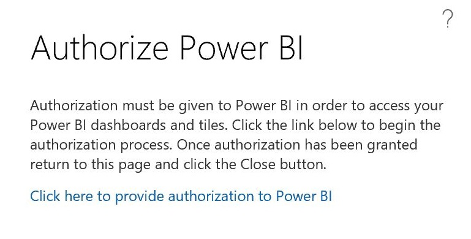
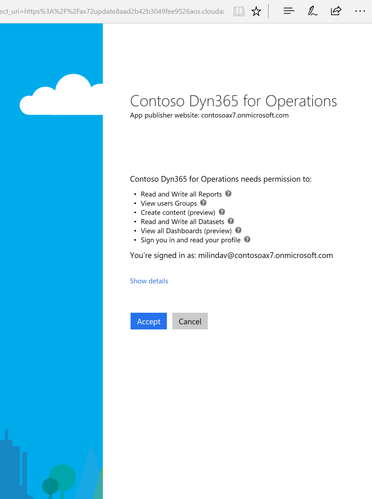
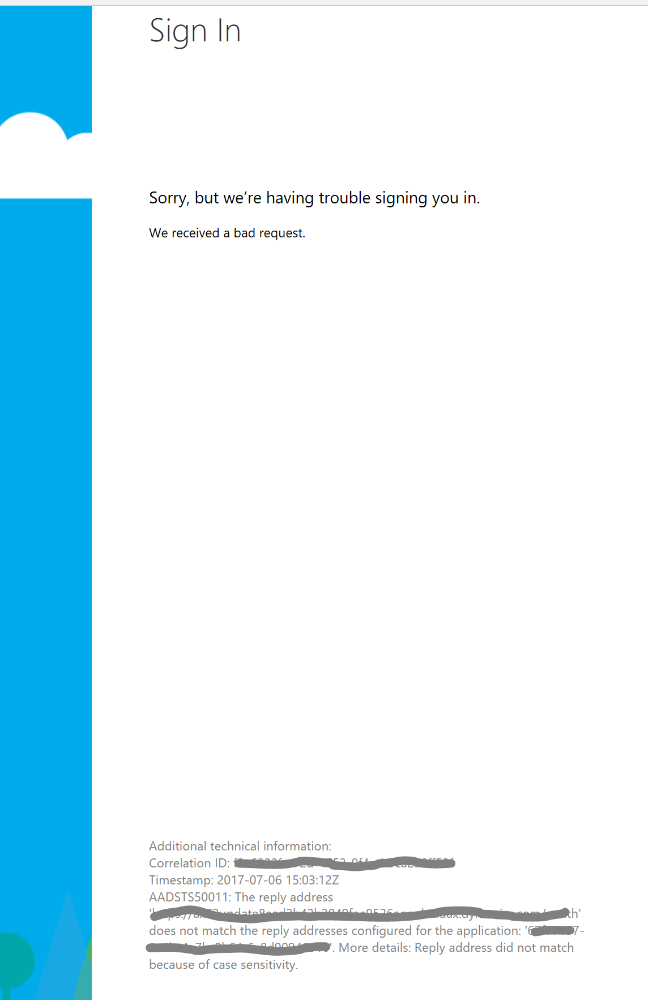
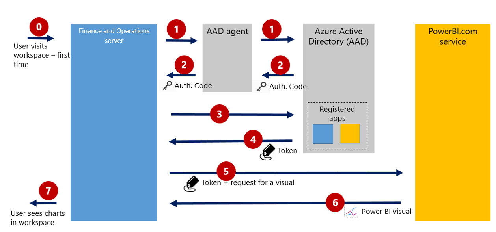

---
# required metadata

title: Configure Power BI integration for workspaces
description: This tutorial describes how to configure a new Microsoft Dynamics 365 for Finance and Operations, Enterprise edition, environment to support integration with PowerBI.com. This configuration enables workspaces to show the Power BI control and lets users pin visualizations to a workspace.
author: MilindaV2
manager: AnnBe
ms.date: 07/07/2017
ms.topic: article
ms.prod: 
ms.service: dynamics-ax-platform
ms.technology: 

# optional metadata

ms.search.form: PowerBIConfiguration
# ROBOTS: 
audience: IT Pro
# ms.devlang: 
ms.reviewer: sericks
ms.search.scope: Core, AX 7.0.0, Operations, UnifiedOperations
# ms.tgt_pltfrm: 
ms.custom: 27661
ms.assetid: 861cfa94-c6f3-4c84-89ac-22c78bf6b7a4
ms.search.region: Global
# ms.search.industry: 
ms.author: milindav
ms.search.validFrom: 2016-02-28
ms.dyn365.ops.version: AX 7.0.0

---

# Configure Power BI integration for workspaces

[!include[banner](../includes/banner.md)]

## Overview

Microsoft Dynamics 365 for Finance and Operations, Enterprise edition, lets users pin tiles and reports from their own PowerBI.com account to workspaces.

This functionality requires a one-time configuration of your environment. An administrator must do this step to enable Finance and Operations and Microsoft Power BI to communicate and authenticate correctly.

Both Finance and Operations and PowerBI.com are cloud-based services. For a Finance and Operations workspace to show a Power BI tile, the Finance and Operations server must contact the Power BI service on behalf of a user and access the visualization. It must then redraw the visualization in the Finance and Operations workspace. The fact that the Finance and Operations server contacts the Power BI service “on behalf of a user” is important. When a user, such as `Tim@ContosoAX7.onmicrosoft.com`, contacts the PowerBI.com service, Power BI should show only tiles and reports from Tim’s own PowerBI.com account.

By completing this configuration step, you enable Finance and Operations to contact the PowerBI.com service on behalf of a user. The flow between Finance and Operations and the Power BI service is based on the OAuth 2.0 Authorization Code Grant Flow, which is discussed later in this topic.

## Things you must know before you start 

- You must be a system administrator in Finance and Operations. This option is available on the **System administration** menu.
- You must have a PowerBI.com account. You can create a trial account if you don't have an account. (A Pro license isn't required for this configuration step.)
- You must have at least one dashboard and one report in your Power BI account. Although the dashboard and report aren't required for this configuration step, you might not be able to validate the configuration if you don't have any content in your PowerBI.com account.
- You must be an administrator for your Microsoft Azure Active Directory (Azure AD) account. If you aren't the administrator, an administrative user must perform this configuration step for you.
- The Azure AD domain that is configured for Finance and Operations must be the same domain that you used for your PowerBI.com account. For an example, if you provisioned Finance and Operations in the Contoso.com domain, you must have Power BI accounts in that domain, such as `Tim@ContosoAX7.onmicrosoft.com`.

## Registration process 

1. Open a new browser session, and start the Power BI app registration at [https://dev.powerbi.com/apps](https://dev.powerbi.com/apps). A page that resembles the following illustration appears.

    

2. Select **Sign in with your existing account**. Make sure that your browser signed you in by using the same Azure AD account that you use for Finance and Operations. After sign-in, the user’s name should appear on the page.

    

3. In the **App name** field, enter a name, such as **Contoso Dyn365 for Operations**.
4. In the **Redirect URL** field, copy and paste the base URL of your Finance and Operations client, and then add the OAuth suffix. Here is an example: `http://contosoax7.cloud.dynamics.com/oauth`
5. In the **Home page URL** field, enter your home page URL, and add a mock extension. Here is an example: `http://contosoax7.cloud.dynamics.com/testenv/`

    This value is mandatory, but it isn't required for the workspace integration. Make sure that the App ID URI is a mock URL. If you use the real URL of your deployment, you might cause sign-in issues in other Azure AD applications, such as the Microsoft Excel Add-in. Here is an example: `http://contosoax7.cloud.dynamics.com/testenv/`

6. Under **Step 3 Choose APIs to access**, select all the check boxes.
7. Select **Register App**.
8. Make a note of the values in the **Client ID** and **Client secret** fields. You will use these values in the next procedure.

    

## Specify Power BI settings in Finance and Operations

1. In the Finance and Operations client, open the **Power BI configuration** page.

    

2. Select **Edit**.
3. Set the **Enabled** option to **Yes**.

    The **Azure AD Tenant** field should show your tenant (or domain name). For example, if you provisioned Finance and Operations with the ContosoAX7.onmicrosoft.com tenant, the field should have the value that is shown in the previous illustration. If the field is blank, you can enter the correct tenant.

    Note that the Power BI integration feature doesn’t work on pre-production and test Azure AD domains. You must change to a production Azure AD domain by running the Admin user tool.

4. In the **Client ID** field, enter the **Client ID** value that you got from Power BI in the previous procedure.
5. In the **Application Key** field, enter the **Client Secret** value that you got from Power BI in the previous procedure.
6. Make sure that the **Redirect URL** field is set to the same redirect URL that you entered in Power BI in the previous procedure.

    For example, copy and paste the base URL of your Finance and Operations client, and then add the OAuth suffix. Here is an example: `http://contosoax7.cloud.dynamics.com/oauth`

7. In the **Tile filter table** field, enter **Company**. In the **Tile filter column** field, enter **ID**.

    These two values enable filtering of Power BI tiles that are pinned to a workspace. For an example, if the company context of a workspace is **USMF**, the data on the Power BI tile will be filtered for the USMF company.

    You can apply the company filter only if your Power BI content has a table that is named **Company** and a column that is named **ID**. Ready-made Power BI content that is released with Finance and Operations uses this convention.

    If the Power BI content (that you wish to pin) doesn't have a table and a field that are named **Company** and **ID** respectively, the filter is ignored, and the tile will show unfiltered data.

    

8. Select **Save**, and close the page.

## Pin tiles to a workspace

1. To validate the configuration, open a workspace, such as **Ledger budgets and forecasts** or **Reservation management**. For this example, we will use the **Ledger budgets and forecasts** workspace.

    You should see the **Power BI** section and a banner. You might have to scroll to the right.

    

3. In the banner, select **Get started**. If you're starting Power BI from Finance and Operations for the first time, you're prompted to authorize sign-in to Power BI from the Finance and Operations client. Select **Click here to provide authorization to Power BI**.

    Your users will have to complete this step the first time that they pin Power BI content.

    

4. The Azure AD consent page asks for your consent. User consent is required for Finance and Operations to access PowerBI.com on behalf of the user. Select **Accept**.

    

5. Because you're already signed in to Azure AD in Finance and Operations, you don't have to enter your credentials again. A new tab appears, where you're prompted to authorize the connection between Finance and Operations and Power BI. Authorize the connection, and then return to the original tab.
6. A list of tiles from your PowerBI.com account appears. Select one or more tiles to pin to the selected workspace.

## Troubleshooting common errors

After you select **Accept** in the previous procedure, you might receive the following error message if the process is unsuccessful. Notice that details of the error appear at the bottom of the message. Additional technical information provide clues that can help you determine what went wrong (values are obscured in the following illustration).

### Some common issues and the resolution steps

| Error                                                       | Resolution |
|-------------------------------------------------------------|------------|
| The reply address didn't match because of case-sensitivity. | The URL that you entered in Power BI might not match the application ID. Start Power BI, and rerun the registration process. |
| The Power BI service is unavailable.                        | This issue doesn't occur very often, but the Power BI service might sometimes be unreachable. You don't have to re-register. Try to pin a tile to a workspace later. |
| You can’t access the application.                           | You probably didn't select all the check boxes under **Step 3 Choose APIs to access** during the registration process. Start Power BI, and rerun the registration process. |
| The Power BI tiles page is empty (no content is shown).     | Your PowerBI.com account might not have a dashboard or any tiles. Add a dashboard, such as a sample dashboard, and try to pin a tile again. |

## Technical details about OAuth 2.0 Authorization Code Grant Flow

This section describes the authorization flow between Finance and Operations and the PowerBI.com service just before the list of tiles is shown to the user during the authentication phase. The Azure AD service runs this flow to enable two services to securely communicate on behalf of a user.

The following illustration shows the authorization flow.

1. When a user visits a workspace in Finance and Operations for the first time, the Power BI banner prompts the user to start the first-time connection. If the user agrees to start the first-time connection, an OAuth 2.0 Authorization Code Grant Flow is started.
2. Finance and Operations redirects the user agent to the Azure AD authorization endpoint. The user is authenticated and consents, if consent is required. Because the user is running Finance and Operations, he or she is already signed in to Azure AD. Therefore, the user doesn't have to enter her or his credentials again.
3. The Azure AD authorization endpoint redirects the Azure AD agent back to the client application together with an authorization code. The user agent returns the authorization code to the client application’s redirect URL. The application redirect URL is a parameter that is maintained in your Power BI configuration, as described in this topic.
4. Now that Finance and Operations has an authorization code on behalf of the user, it requests an access token from the Azure AD token issuance endpoint. Finance and Operations presents the authorization code to prove that the user has consented.
5. The Azure AD token issuance endpoint returns an access token and a refresh token. Finance and Operations must have the access token to request a visualization from Power BI. Access tokens expire after a short time. The refresh token can be used to request a new token.
6. Finance and Operations uses the access token to authenticate to the Web API that is provided by Power BI. Finance and Operations uses the Web API to request that Power BI visualizations be shown on behalf of the user.
7. After the client application is authenticated, the Power BI Web API returns the requested visualization to the user. Note that Power BI returns only the data that the user is allowed to see. Because the Power BI Web API detects that the user is connecting via Finance and Operations, it can correctly resolve the user.
8. The user sees Power BI tiles in the Finance and Operations workspace.

For subsequent visits, this whole flow doesn't occur. Because Finance and Operations has the access token on behalf of the user, steps 1 through 4 don't have to be repeated.

## What’s next

Now that you've enabled the PowerBI.com integration feature, you might want to perform the following steps:

- If your organization uses PowerBI.com, you can invite users to pin tiles and reports from their own PowerBI.com account to workspaces for easy access.
- If you're using Microsoft Dynamics 365 for Finance and Operations, Enterprise edition (July 2017) or later, ready-made analytical workspaces might be built into your workspaces. Currently, this feature is available only in multi-box environments. If you're using a previous version, you can deploy the ready-made reports to your PowerBI.com account. The reports are distributed in Microsoft Dynamics Lifecycle Services (LCS). For more information, see [Power BI content in LCS from Microsoft and your partners](power-bi-content-microsoft-partners.md).
- You might want to create your own Power BI content by using data that is available in Entity store. (Entity store is the operational data warehouse that is included with Finance and Operations.) For more information, see [Overview of Power BI integration with Entity store](power-bi-integration-entity-store.md).
- You might want to mash up external data with ready-made Power BI content that is provided with Finance and Operations. You can do this data mash-up by using Power BI solution templates.
