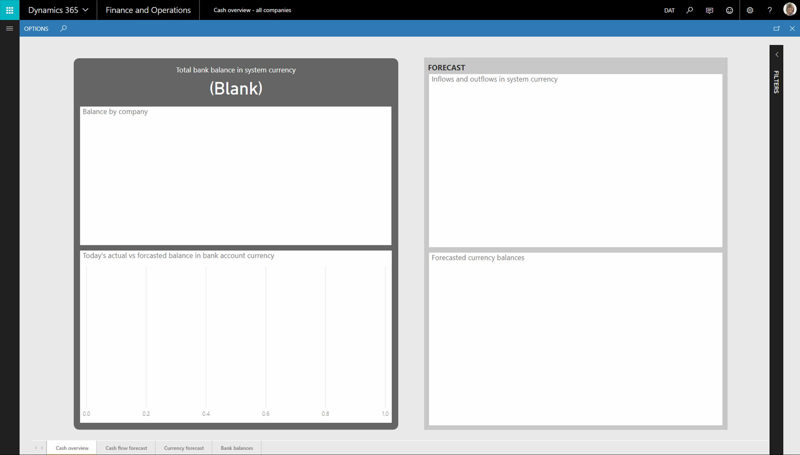

---
# required metadata

title: Entity store maintenance
description: When maintenance is performed on the entity store, you'll need to complete the procedures listed in this topic.
author: sarvanisathish
manager: AnnBe
ms.date: 03/28/2018
ms.topic: article
ms.prod: 
ms.service: dynamics-ax-applications
ms.technology: 

# optional metadata

# ms.search.form:  [Operations AOT form name to tie this topic to]
audience: IT Pro
# ms.devlang: 
ms.reviewer: sericks
ms.search.scope: Operations
# ms.tgt_pltfrm: 
# ms.custom: [used by loc for topics migrated from the wiki]
ms.search.region: [Global for most topics. Set Country/Region name for localizations]
# ms.search.industry: [leave blank for most, retail, public sector]
ms.author: sarvanis
ms.search.validFrom: 2018-3-30 
ms.dyn365.ops.version: Platform update 15 
---

# Entity store maintenance

[!include[banner](../includes/banner.md)]

When maintenance is performed on the entity store, it impacts the following components:

- Application Analytical Workspaces, if you are on Dynamics 365 for Finance and Operations 7.2 or higher and have configured analytical workspaces for embedded analytical reports.
- Entity store-based reports that have been deployed to PowerBI.com.

To resolve issues with these components, complete the procedures in this topic.

## If you are using Application Analytical Workspaces
You should be able to access your analytical reports until the migration starts. After the migration completes, your embedded analytical reports will not render any data. The following screenshot shows an example of this. 

 
To resolve this issue:

1.	Sign in to Dynamics 365 for Finance and Operations. 
2.	Go to the **Entity store** page (**System Administration** > **Setup** > **Entity Store**). 
3.	Select all entities that need to be refreshed. 
4.	Click **Refresh**, and then click **OK**. 

After the refresh completes, the Application Analytical Workspaces and Reports will render data.

## If you have deployed entity store-based reports to PowerBI.com and are using the reports within PowerBI.com
Redeploy the reports using the **Deploy Power BI report files** page in Finance and Operations (**System Administration** > **Setup** > **Deploy Power BI files**).

> [!Note]
> Reports that were previously deployed to PowerBI.com may produce errors. If this occurs, you may need to delete the report.

