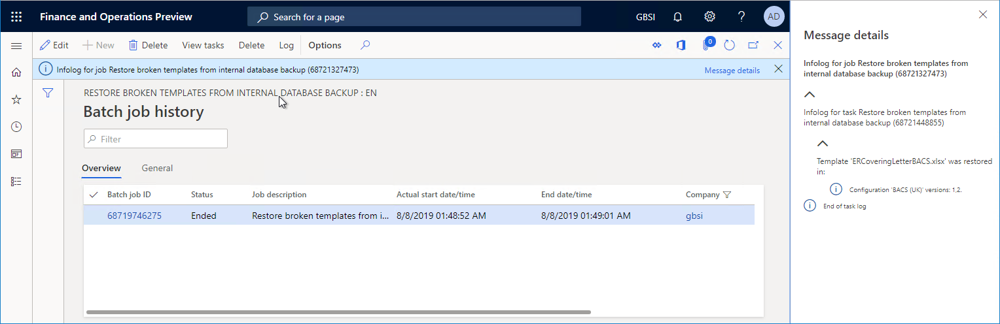

---
# required metadata

title: Backup storage of ER templates
description: This topic explains how to use the Electronic reporting (ER) backup storage for recovery of templates.
author: NickSelin
manager: AnnBe
ms.date: 08/13/2019
ms.topic: article
ms.prod: 
ms.service: dynamics-ax-platform
ms.technology: 

# optional metadata

ms.search.form: ERWorkspace, ERSolutionTable
# ROBOTS: 
audience: Application User, Developer, IT Pro
# ms.devlang: 
ms.reviewer: kfend
ms.search.scope: Operations
# ms.tgt_pltfrm: 
ms.custom: 27621
ms.assetid:
ms.search.region: Global
# ms.search.industry: 
ms.author: nselin
ms.search.validFrom: 2019-08-13
ms.dyn365.ops.version: 10.0.5

---

# Backup storage of ER templates

[Electronic reporting (ER) framework](general-electronic-reporting.md) empowers business users to configure formats for outbound documents in accordance with the legal requirements of various countries/regions. Configured ER formats can generate outbound documents in different formats (Excel workbooks, Word documents or PDF documents) by using predefined templates. The templates are populated with required data in accordance to configured dataflow while required documents are generated. Each configured format can be published as part of an ER solution to generate specific outbound documents. This is represented by an ER format configuration that can contain templates you can use to generate different outbound documents. Each ER solution can be exported from one instance of Dynamic 365 for Finance and Operations (Finance and Operations) and imported to another one.

ER framework uses the [Document management framework](https://docs.microsoft.com/en-us/dynamics365/unified-operations/fin-and-ops/organization-administration/configure-document-management) to keep required templates for the current instance of Finance and Operations. Depending on the settings of ER framework, either **Azure** blob storage or **SharePoint** folder can be selected as the physical primary storage of templates (review the [Configure the ER framework](electronic-reporting-er-configure-parameters.md) for more details). The **DocuValue** table keeps an individual record for each template. Such record contains in the **AccessInformation** field the path to a physical file of a template located in the configured storage.

When you manage your Finance and Operations instances, you might decide to migrate the current instance to another location: for example, migrate your production instance to a new sandbox environment. If you configured ER to use the **Azure** blob storage for storing templates, the **DocuValue** table in your new sandbox environment will refer to the production **Azure** blob storage which is non-accessible from your sandbox environment any more as the migration process does not support the migration of artifacts of the Azure blob storage. If you try to execute in such environment an ER format that uses a template to generate business documents, an exception will be thrown informing you about missing template. You will also be guided to use the ER cleanup tool to delete containing this template ER format configuration and re-import it back to this environment. As you might have many of such ER format configurations, this procedure might be time consuming.

Starting from the 10.0.5 release, the **Backup storage of templates** ER feature can help you to have your templates always available for generation of business documents.

> [!NOTE]
> This feature can only be used when the Azure blob storage has been selected as the physical storage of ER templates.

This feature implies that every template of a new ER format configuration of the current environment is automatically saved in the backup storage of templates (the **ERDocuDatabaseStorage** database table):

- When you import a new containing templates ER format configuration.
- When you complete the draft version of a new containing templates ER format configuration.

Backup copies of templates will migrate to a new instance of Finance and Operations as part of application database.

This feature also presumes the following logic while containing template ER format configuration is executed (for example, as shown in the picture below, to process vendor payments generating payment advice and control reports) and required template has not been found in the primary storage:

- This template is automatically taken from the backup storage (when available), restored to the primary storage and used for the current execution.
- Every user playing either **Electronic reporting developer** or **System administrator** role is informed via the Action center about this situation with missing templates.

Depending on the value of the **Automatically run the procedure of restoring the broken templates in batch** ER user parameter, this message will inform about the following:

- When this parameter is **Off**, the message will contain a suggestion to start the batch process for automatic fixing of similar issues for other containing templates ER format configurations. This message will contain a link by clicking which you can automatically start this batch process. 
- When this parameter is **On**, the message will contain a notification that the missing templates issue has been discovered and a new batch process **Restore broken templates from internal database backup** has been automatically scheduled for automatic fixing of similar issues for other containing templates ER format configurations. This example is shown in the pictures below.

Execution log of the completed batch process **Restore broken templates from internal database backup** for automatic fixing of broken templates issues contains information about ER templates that have been restored from the backup storage to the permanent location.

By default, the process of automatic creation of backup copies of templates residing in ER format configurations is turned on. If you want to stop making backup copies of templates, turn on the **Stop making backup copies of template** option in the Electronic reporting parameters page that can be opened from the ER workspace.

If you upgraded your environment to the 10.0.5 release and want to migrate it to a new environment having your ER format configurations runnable, select the **Fill in backup storage** option in the Electronic reporting parameters page before this migration. It will start the process of making backup copies of all available templates to store them in the ER backup storage of templates.

If you decided to stop making backup copies of templates enabling the **Stop making backup copies of template** option and don’t want to keep already collected backup copies of templates, select the **Clean backup storage** option in the Electronic reporting parameters page.

## Supported deployments
Starting from the 10.0.5 release, the **Backup storage of ER templates** feature is implemented only for cloud deployments. The implementation for on-premises deployments is planned for the 10.0.6 release.

## Additional resources

[Electronic reporting overview](general-electronic-reporting.md)

[Configure the Electronic reporting framework](electronic-reporting-er-configure-parameters.md)
