---
# required metadata

title: Business document management overview
description: This topic provides information about how to use the Business document management feature of the ER framework.
author: NickSelin
manager: AnnBe
ms.date: 08/06/2019
ms.topic: article
ms.prod: 
ms.service: dynamics-ax-platform
ms.technology: 

# optional metadata

# ms.search.form: ERBDWorkspace, ERBDParameters, ERBDRowLevelSecurityAccessEditor
# ROBOTS: 
audience: Application User, Developer, IT Pro
# ms.devlang: 
ms.reviewer: kfend
ms.search.scope: Core, Operations
# ms.tgt_pltfrm: 
ms.custom: 
ms.assetid: 
ms.search.region: Global
# ms.search.industry: 
ms.author: nselin
ms.search.validFrom: 
ms.dyn365.ops.version: 10.0.5

---

# Business document management overview

[Electronic reporting (ER) framework](https://docs.microsoft.com/dynamics365/unified-operations/dev-itpro/analytics/general-electronic-reporting) can be used by business users to configure formats for outbound documents in accordance with the legal requirements of various countries/regions. Such users can also define the dataflow specifying what application data will be placed to generated documents. ER framework is capable to generate outbound documents in Microsoft office formats (Excel workbook, Word document) by using predefined templates. Such templates are filled in by required data in accordance to configured dataflow while required documents are generated. Each configured format can be published as part of an ER solution to generate specific outbound documents. This part of an ER solution is represented by an ER format configuration that may contain templates for generation of different outbound documents. This ER capability allows business users to use this framework for managing required business documents.

**Business document management** (BDM) is built on top of the ER framework. It enables business users to edit templates of business documents from the provided ER solutions by using either Microsoft Office 365 service or appropriate Microsoft Office desktop application including changing business documents designs and adding placeholders for additional data from within Dynamics 365 for Finance and Operations without source code changes and new deployments. No knowledge of the ER framework is required from such business users to update templates of business documents.

## Configure ER parameters

As BDM is built on top of the ER framework, you must configure necessary ER parameters to start working with BDM. Set up the ER parameters as described in the [Configure the ER framework](https://docs.microsoft.com/dynamics365/unified-operations/dev-itpro/analytics/electronic-reporting-er-configure-parameters) page. Add a new configuration provider as described in the  [Create configuration providers and mark them as active](https://docs.microsoft.com/dynamics365/unified-operations/dev-itpro/analytics/tasks/er-configuration-provider-mark-it-active-2016-11) page.

## Import ER solutions

You must import to the current instance of the Dynamics 365 for Finance and Operations some ER configurations containing templates of business documents. Download and locally store the following files to complete this procedure:

**Sample ER customer invoicing solution:**

| **File**                                  | **Content**                                |
|-------------------------------------------|--------------------------------------------|
| Customer invoicing model.version.2.xml    | [ER data model configuration](https://mbs.microsoft.com/customersource/Global/AX/downloads/hot-fixes/365optelecrepeg) |
| Customer FTI report (GER).version.2.3.xml | [Free text invoice ER format configuration](https://mbs.microsoft.com/customersource/Global/AX/downloads/hot-fixes/365optelecrepeg) |

**Sample ER payment cheques solution:**

| **File**                                  | **Content**                                |
|-------------------------------------------|--------------------------------------------|
| Model for cheques.version.10.xml          | [ER data model configuration](https://mbs.microsoft.com/customersource/Global/AX/downloads/hot-fixes/365optelecrepeg) |
| Cheques printing format.version.10.9.xml  | [Payment cheque ER format configuration](https://mbs.microsoft.com/customersource/Global/AX/downloads/hot-fixes/365optelecrepeg) |

**Sample ER foreign trade solution:**

| **File**                                  | **Content**                                |
|-------------------------------------------|--------------------------------------------|
| Intrastat model.version.1.xml             | [ER data model configuration](https://mbs.microsoft.com/customersource/Global/AX/downloads/hot-fixes/365optelecrepeg) |
| Intrastat report.version.1.9.xml          | [Intrastat control report ER format configuration](https://mbs.microsoft.com/customersource/Global/AX/downloads/hot-fixes/365optelecrepeg) |

Use the following procedure for each mentioned above XML file to perform this import. Import ER data model configuration of each mentioned above ER solution before importing the corresponding ER format configuration.

1. Open the **Organization administration \> Electronic reporting \> Configurations** page.
2. On the top-most ribbon, select the **Exchange** option.
3. Select the **Load from XML file** option.
4. Select **Browse** to load the required XML file.
5. Select **OK** to confirm configuration’s import.

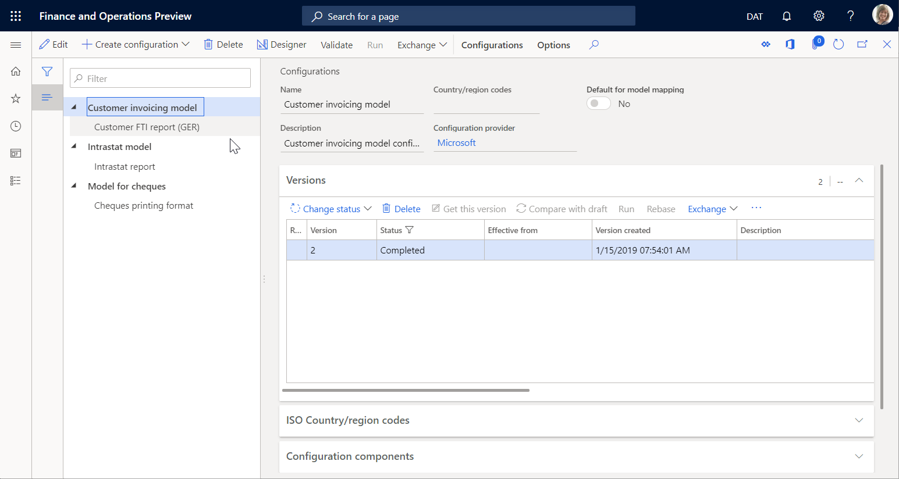

Find more details about the import ER configurations in the [Manage the ER configuration lifecycle](https://docs.microsoft.com/dynamics365/unified-operations/dev-itpro/analytics/general-electronic-reporting-manage-configuration-lifecycle) page.

## Initiate BDM

To initiate the BDM usage, you need to open the **Feature management** workspace and enable the **Business document management** feature.
Use the following procedure to enable the BDM functionality for all legal entities.

1.	Open the **Feature management** workspace page.
2.	Activate the **New** tab.
3.	Select the **Business document management** feature in the list.
4.	Select the **Enable now** option to turn on the selected feature.
5.	Refresh the application page in using browser to access new feature related UI elements.

Find more details about the activation of new features in the [Feature management overview](https://docs.microsoft.com/dynamics365/unified-operations/fin-and-ops/get-started/feature-management/feature-management-overview) page.

## Configure BDM parameters

This topic explains how to set up the basic parameters for BDM. It also describes the steps that you must complete before you can set up BDM.

### Prerequisites for BDM parameters setup
Before you can set up BDM, you must set up the required document type in the Document management (DM) framework. This document type is used in BDM to specify a temporary storage of documents in Office formats (Excel, Word) that are used as templates for ER reports. Storing in this temporary storage templates can be edited by using the Office desktop applications.

For this document type, the following attribute values must be selected:

| **Attribute name**  | **Attribute value**   |
|---------------------|-----------------------|
| Class               | Attach file           |
| Group               | File                  |
| Location            | SharePoint            |

Review the [Configure document management](https://docs.microsoft.com/dynamics365/unified-operations/fin-and-ops/organization-administration/configure-document-management) page to set up the required DM parameters and document type.

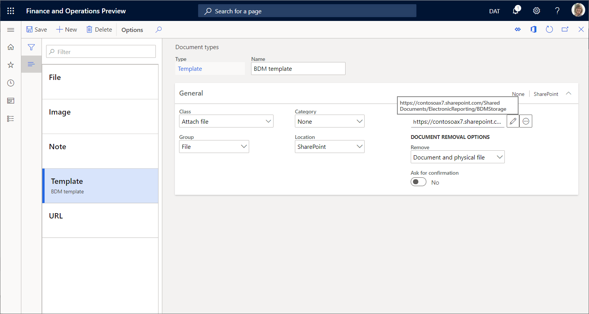

### Set up BDM parameters

Basic parameters of BDM can be set up in the **Business document parameters** page. Note that the only following users can access it:

- Users playing the **System administrator** role.
- Users playing any other role that is configured to perform the **Maintain Business document management parameters** (AOT name **ERBDMaintainParameters**) duty.

Use the following procedure to set up the basic parameters of BDM for all legal entities.

1.	Login to the current instance of the Dynamics 365 for Finance and Operations as a user having access to the **Business document parameters** page.
2.	Open the **Organization administration \> Electronic reporting \> Business document management \> Business document parameters** page.
3.	On the **Business document parameters** page, on the **Attachments** tab, for the **SharePoint document type** parameter define the document type that should be used to temporary store templates in Microsoft Office formats while they are edited by using the Office desktop applications. Note that the only configured as using SharePoint location document types are available for this parameter.

Pay attention to the fact that the selected document type is company specific. It will be used when user is working with the BDM in the company for which the selected document type is configured. When user is working with the BDM in any other company, selected in this parameter document type will be used as well if the document type with same name has not been configured for this company. When such document type has been configured for this company, it will be used instead of the one selected in the **SharePoint document type** parameter.

## Configure BDM access permissions

By default when the usage of access permissions for BDM is disabled, every user that has access to the BDM workspace will see in this workspace all templates of the ER solutions that are available in the current instance of the Dynamics 365 for Finance and Operations. Note that the BDM workspace will show only templates that reside in ER format configurations that are marked by any **Business document type** tag.

The list of offered for a single user in the BDM workspace templates can be restricted by configuring BDM access permissions. It is rather important when different templates are used to produce business documents for different business domains (functional areas), and you want to allow accessing different templates for editing in the BDM workspace for users playing different roles.

BDM access permissions can be set up in the **Configurator of access permissions** page. Note that the only following users can access it:

- Users playing the **System administrator** role.
- Users playing any other role that is configured to perform the **Configure permissions to access Business document templates for editing** (AOT name **ERBDTemplatesSecurity**) duty.

Use the following procedure to set up access permissions of BDM for all legal entities.

- Login to the current instance of the Dynamics 365 for Finance and Operations as a user having access to the **Configurator of access permissions** page.
- Open the **Organization administration \> Electronic reporting \> Business document management \> Manage access permissions** to edit templates page.

Pay attention to the notification informing you that currently the usage of access permissions for BDM is disabled.

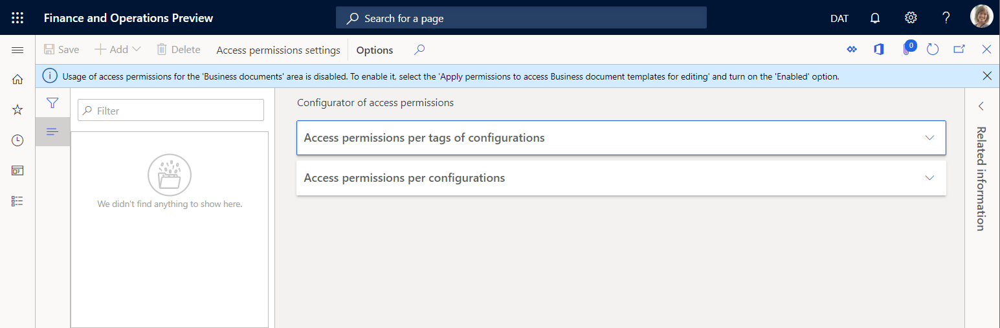

It means that, with this setting, every user playing any security role that is configured to perform the **Manage Business document templates** (AOT name **ERBDManageTemplates**) duty is able to open the BDM workspace accessing for editing every template that is available in the current instance of the Dynamics 365 for Finance and Operations.

The presented below picture shows what the BDM workspace will offer for **ALICE** persona playing the **Accounts receivable clerk** role – with the current BDM access permissions setting she is able to edit templates of business document from different functional areas (**Invoicing**, **Foreign trade** and **Payments**).

- On the **Configurator of access permissions** page, select the **Access permissions setting**.
- On the **Settings of access permissions to edit templates** dialog, turn on the **Apply configured access permissions** option.
- Select **OK** to confirm that the usage of BDM access permissions has been turned on.

Note that now you are informed about the necessity of setting access permissions. Lack of access permissions now means that none of templates will be shown in the BDM workspace for any user.

- Select **Add** to enter a new business role for which permissions to access BDM templates must be configured.
- On the **Security roles** pop-up dialog, select the **Accounts receivable clerk** role.
- Select **OK** to confirm the role selection.
- On the **Access permissions per tags of configurations** tab, select the **New** option.
- Select the **Functional area** value in the **Tag type** field.
- Select the **Invoicing** value in the **Id** field.
- Select **Save** to store configured access permissions for the selected role.

The current setting means that for any user playing the **Accounts receivable clerk** role and performing the **Manage Business document templates** (AOT name **ERBDManageTemplates**) duty the BDM workspace will offer for editing templates from only ER format configurations having the **Invoicing** value for the **Functional area** tag.

- Toggle the **Related information** pane from the right-hand side of the current page.

Note that the **Related information** pane shows how the configured access permissions will be applied – templates from what ER format configurations will be available for what users playing the currently selected **Accounts receivable clerk** role.

- On the **Access permissions per configurations** tab, select the **Add** option.
- On the **Select configuration** pop-up dialog, mark the **Intrastat report** ER format configuration.
- Select **OK** to confirm the entry of the selected configurations.
- Select **Save** to store configured access permissions for the selected role.

The current setting means that for any user playing the **Accounts receivable clerk** role and performing the **Manage Business document templates** (AOT name **ERBDManageTemplates**) duty the BDM workspace will offer for editing the following templates:

- Templates from ER format configurations having the **Invoicing** value for the **Functional area** tag.
- Templates from ER format configurations mentioned in the **Access permissions per configurations** tab (templates from the **Intrastat report** format configuration of the **Statutory reporting** domain in our case).

The presented below picture shows what the BDM workspace will offer for **ALICE** persona playing the **Accounts receivable clerk** role – with the current BDM access permissions setting she is able to edit templates of business document from the only **Invoicing** domain and the **Intrastat report** ER format configuration. Templates of business document from the **Payments** domain are not accessible for **ALICE** persona any longer.

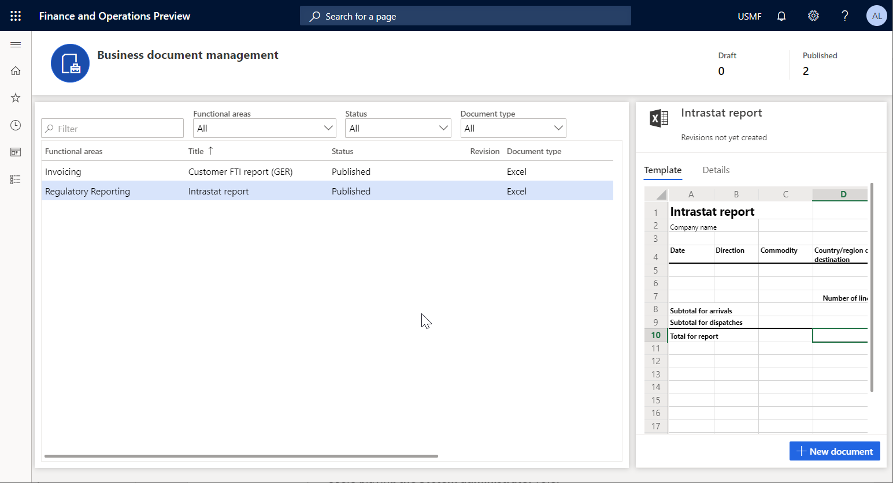

Be aware that the **Access permissions per configurations** rules are stored by using the unique identification ID of an ER format configuration. It means that these rules will not be deleted while referred ER configurations are deleted. When you imported deleted configurations back to this instance of the Dynamics 365 for Finance and Operations, these rules will refer to them again. There is no need to set these rules up again after the re-importing of earlier deleted ER format configurations.

## Use BDM to edit templates

Business users can access for editing templates of business documents in the BDM workspace. Note that the only following users can access this workspace:

- Users playing the **System administrator** role.
- Users playing any other role that is configured to perform the **Manage Business document templates** (AOT name **ERBDManageTemplates**) duty.

Use the following procedure to utilize the BDM workspace for editing the template using to generate free text invoices. Make sure that all the described above procedures have been previously completed.

- Login to the current instance of the Dynamics 365 for Finance and Operations as a user having access to the BDM workspace.
- Open the BDM workspace.

Note that the **Template** tab presents the content of the selected template. Select the **Details** tab to review details of the selected template as well as details of an ER format configuration this template resides in. Note that all templates are in **Published** status with no details in the **Revision** column. It means that nobody is currently editing these templates.

### Initiate editing process for own templates

- Select the **Cheques printing format** template in the list.
- Select the **Details** tab.

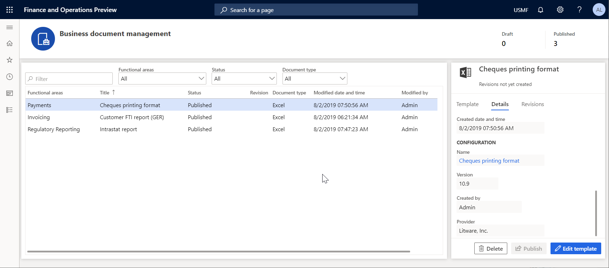

Note that the **Edit template** option is available for the selected template. This option is always available for a template residing in an ER format configuration owned by the ER configuration provider that is currently selected as active (**Litware, Inc.** in our case). When this option is executed, the existing template from the draft version of the underlying ER format configuration will be offered for editing.

### Initiate editing process for templates owned by other providers

- Select the **Customer FTI report (GER)** template in the list.
- Select the **Details** tab.

Note that the **New document** option is available for the selected template. This option is always available for a template residing in an ER format configuration provided by other (**Microsoft** in our case) than the currently selected as active provider (**Litware, Inc.** in our case). When this option is executed, a new template will be offered for editing. It will be resided in a new derived ER format configuration creating automatically.

### Start editing template

- Select **New document**.
- If needed, in the Title field change the title of the editable template. Note that same text will be used to name the automatically created derived ER format configuration. Be aware that the draft version of this configuration (**Customer FTI report (GER) Copy** in this case) that will contain the edited template will be automatically marked as using to run this ER format for the current user. At the same time non-modified original template from the base ER format configuration will be used to run this ER format for any other user.
- If needed, in the **Name** field change the name of the 1st revision of the editable template that will be created automatically.
- If needed, in the **Comment** field change the remark for the automatically created revision of the editable template.

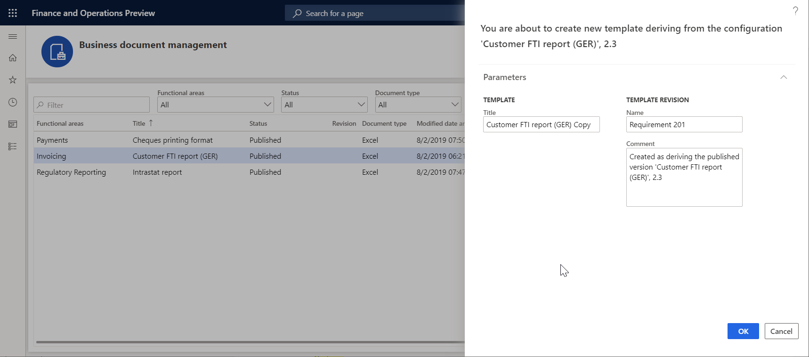

- Select **OK** to confirm the initiation of editing process.

BDM template editor page of the Dynamics 365 for Finance and Operations is opened offering the selected template for online editing by using the Office 365.

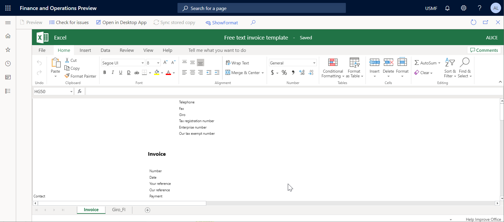

### Edit template in Office 365

- Modify the template by using the functionality of the Office 365. For example, in the presented Office online control change the font of the fields prompts in the template header: update its style from **Regular** to **Bold**. Note that these changes are automatically stored for editable template that resides the primary template’s storage (by default, the Azure blob storage) configured for the ER framework.

### Edit template in Office desktop application

- Select the **Open in Desktop App** option to modify the template by using the functionality of the Office desktop application – Excel in this case. Note that the editable template is copied from the permanent storage to the temporary one configured in BDM parameters as a SharePoint folder.
- Upon request, confirm the opening of the editable template from the temporary file storage in the Office desktop Excel application.

- Modify located in the temporary storage template by using the functionality of the Excel desktop application. For example, change the font of the fields prompts in the template header: update its color from **Black** to **Blue**.

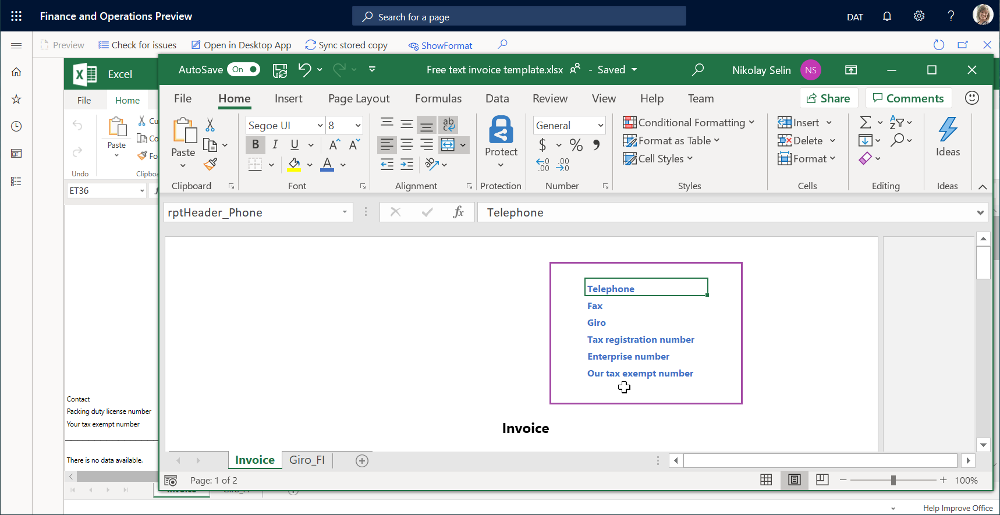

- Select **Save** in the Excel desktop application to store template’s changes in the temporary storage.

- Close the Excel desktop application.
- Select **Sync stored copy** to bring changes of the template introduced by using the Excel desktop application from the temporary to the permanent template’s storage.

Note that the copy of the editable template in the temporary file storage is kept for the only current session of template editing. When you finish this session by closing the **BDM template editor** page, this copy will be deleted.  If you adjusted the templated in the temporary file storage, did not select **Sync stored copy** and try to close the **BDM template editor** page,  the confirmation dialog will be offered asking whether you want to store introduced changes. Select **Yes** if you want to store introduced changes of the editable template in the permanent file location.

### Validate template

- Select **Check for issues** to validate the modified template against the underlying ER format configuration. Follow the recommendations (if any) to align the template with the structure of the format from the base ER format configuration.
- Select **Show format** toggle button to open the pane presenting the current structure of the format from the base ER format configuration that must be aligned with the editable template. Select **Hide format** to toggle this pane off.

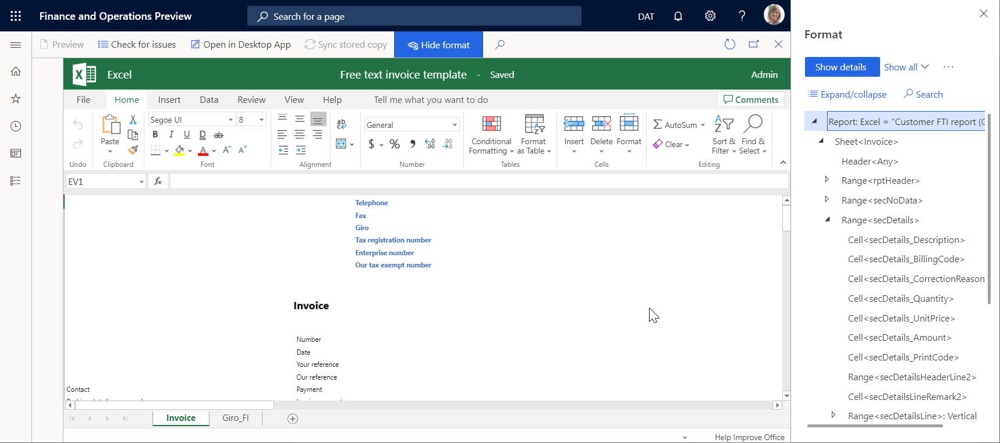

- Close the **BDM template editor** page.

Note that the updated template is shown in the **Template** tab. Note that the status of the edited template has been changed to **Draft** and the current revision is not empty any longer. It means that the process of this template’s editing has been started.

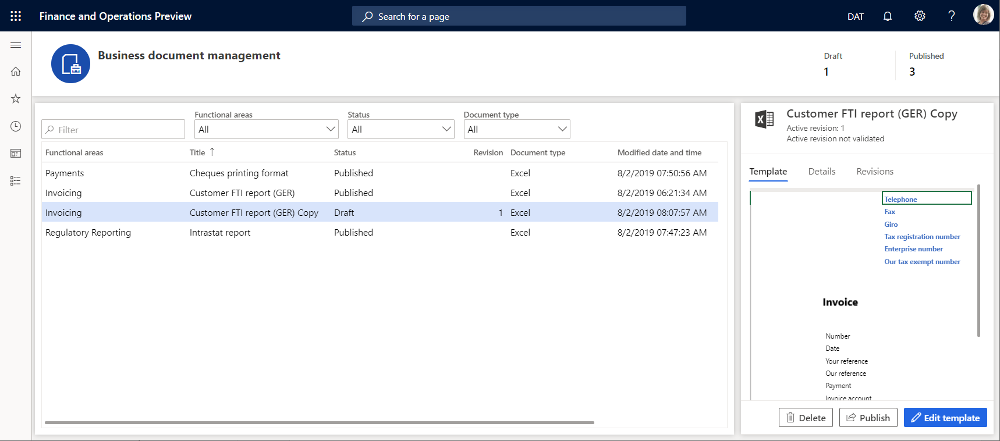

### Test modified template using it to generate business documents

- Change the currently logged company to **USMF**.
- Go to **Accounts receivable \> Invoices \> All free text invoices**.
- Select the **FTI-00000002** invoice.
- Select **Print management**.
- Select the **Module - accounts receivable \> Documents \> Free text invoice \> Original document** level to specify the scope of invoices for processing.
- Select the **Customer FTI report (GER) Copy** ER format for the specified document level in the **Report format** field.

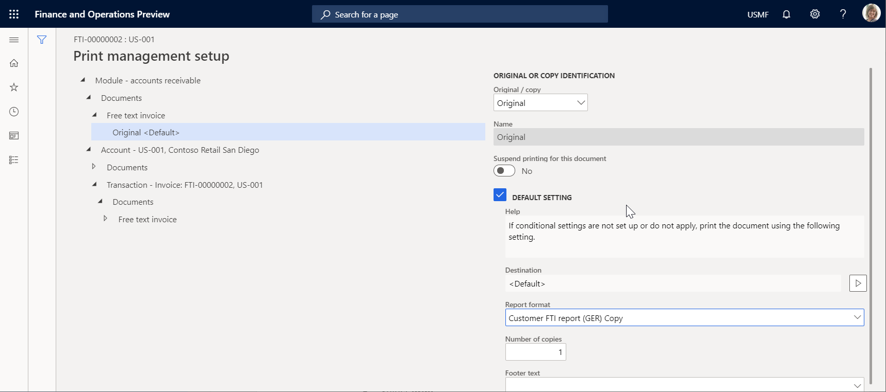

- Press **Escape** to close the current page.
- Select **Print**.
- Select **Selected**.
- Download the offered by browser document and open it by using the Excel desktop application.

Note that the modified template is used to generate the free text invoice report for the selected item. To analyze how this report is affected by changes of the template that you introduced, run this report in one application session any time right after you modified the template in another application session.

### Create alternative revision of template

- Open the **BDM template editor** page.
- Select the **Customer FTI report (GER) Copy** template.
- Select the **Revisions** tab.
- Select **New**.
- If needed, in the **Name** field change the name of the 2nd revision of the editable template that will be created automatically based on the currently active 1st revision.
- If needed, in the **Comment** field change the remark for the automatically created revision of the editable template.

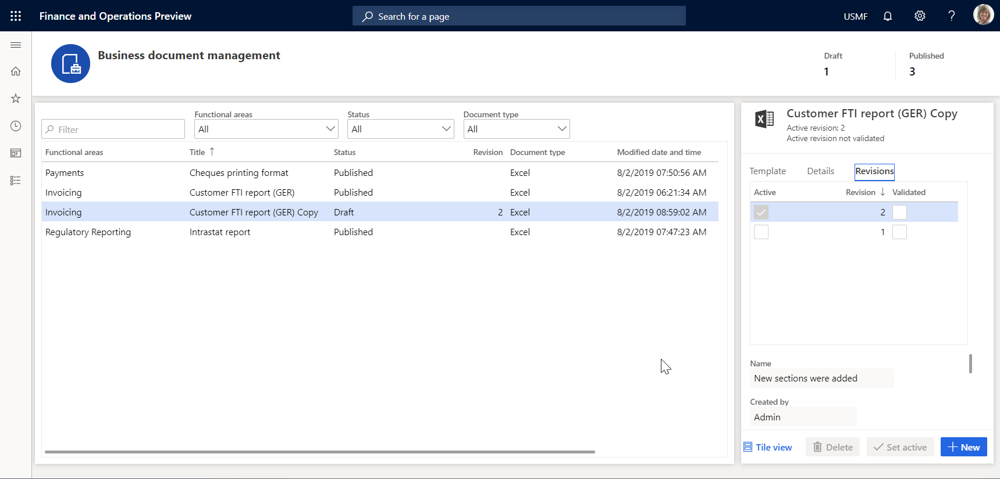

You created a new revision of your template that has been stored in the permanent template’s storage.  Now you will continue editing the template of the 2nd revision that is currently selected as active.

- Select the 1st revision.
- Select **Set active**. You can select any other revision (the 1st one in this case) as active at any time you want to come back to this revision of the template.
- Select the 2nd revision.
- Select **Delete**.
- Select **OK** to confirm the deletion of the selected revision. You can delete any of non-active revision when you think you don’t need it any longer.

### Delete modified template

- Select the **Template** tab.
- Select **Delete**.
- If you select **OK** to confirm deletion, the derived **Customer FTI report (GER) Copy** ER format containing the modified template will be deleted. Select **Cancel** to explore other options.

### Revoke changes of template

When you started editing the template from an ER format that is owned by the currently marked as active provider, you will be offered by the option to revoke changes introduced for the template residing in such ER format.

- Select the **Template** tab.
- Select **Undo**.
- If you select **OK** to revoke changes introduced for the template, the modified template will be replaced by the original one removing all introduced changes of it. As soon as you revoked changes of the template, the template deletion option **Delete** will be offered. Select **Cancel** to explore other options.

### Publish modified template

- Select the **Template** tab.
- Select **Publish**.
- If you select **OK** to confirm publishing, the draft version of the derived **Customer FTI report (GER) Copy** ER format containing the modified template will be marked as completed. The modified template becomes available for other users of the instance of the Dynamics 365 for Finance and Operations. Note that the completed versions of this ER format will keep the only last active revision of your template. Other revisions will be deleted. Select **Cancel** to explore other options.

## Business document availability

The following reports with well-designed Microsoft Excel templates are available by the beginning of the Public preview program.

**Account Receivable** (August 2019):

- Sales advance invoice
- Sales order packing slip

**Account Payable** (August 2019):

- Purchase advance invoice
- Purchase order
- Purchase order packing slip

More reports will be available during the Public preview program. Special notifications about additional reports readiness will be separately sent. 

The complete list of all the reports planned for October 2019 release can be found here: [Configurable business documents reporting in Word and Excel](https://docs.microsoft.com/en-us/dynamics365-release-plan/2019wave2/dynamics365-finance-operations/configurable-business-documents-reporting-word-excel-pdf#feature-details).

## Related links

[Electronic reporting overview](https://docs.microsoft.com/dynamics365/unified-operations/dev-itpro/analytics/general-electronic-reporting)

[Design a configuration for generating reports in OPENXML format](https://docs.microsoft.com/dynamics365/unified-operations/dev-itpro/analytics/tasks/er-design-reports-openxml-2016-11)

[Design ER configurations to generate reports in Word format](https://docs.microsoft.com/dynamics365/unified-operations/dev-itpro/analytics/tasks/er-design-configuration-word-2016-11)

[Embed images and shapes in documents that you generate by using ER](https://docs.microsoft.com/dynamics365/unified-operations/dev-itpro/analytics/electronic-reporting-embed-images-shapes)

[Configure Electronic reporting to pull data into Power BI](https://docs.microsoft.com/dynamics365/unified-operations/dev-itpro/analytics/general-electronic-reporting-report-configuration-get-data-powerbi)

## Frequently asked questions

**Q**: I selected the **New document** option. But instead of the **BDM template editor** page of the Dynamics 365 for Finance and Operations, I have been navigated to the Office 365 web page.

**A**: It is the known issue with the Office 365 redirection back to the Dynamics 365 for Finance and Operations. It happens when you log on to the office 365 the first time. To work around this issue, click the **Back** button of your browser to navigate back to the Dynamics 365 for Finance and Operations.

**Q**: It has been described how I can edit a template by using the Office 365 in 1st  application session and execute the containing this template ER format in 2nd application session every time I adjusted this template to see how my changes affects the finally generated business document. can I do the same using the Office desktop application for editing same template?

**A**: Yes, you can do this. Select the **Open in Desktop App** option in 1st application session: your template will be stored in the temporary file storage and opened in the Office desktop application. Now you can perform the following steps to preview your template’s changes in the generated business document:

-	Make changes in the template by using the Office desktop application.
-	Select **Save** in using the Office desktop application.
-	Select **Sync stored copy** in the **BDM template editor** page of 1st application session.
-	Execute the containing this template ER format in 2nd application session.

**Q**: I selected the **Open in Desktop App** option but gets the ‘Value cannot be null. Parameter name: externalId’ error message. How this issue can be resolved to allow me using the Office desktop application for editing my templates?

**A**: Most likely, you logged into the current instance of the Dynamics 365 for Finance and Operations as a user configured as user of the Azure AD domain which differs from the Azure AD domain used to deploy this Dynamics 365 for Finance and Operations instance. As the SharePoint service (that is used to store templates for making them available for editing by using the office desktop applications) belongs to the same domain as the Dynamics 365 for Finance and Operations, we have no permissions to access the SharePoint service. To resolve this issue, login to the current instance of the Dynamics 365 for Finance and Operations using credentials of a user of the proper Azure AD domain.
