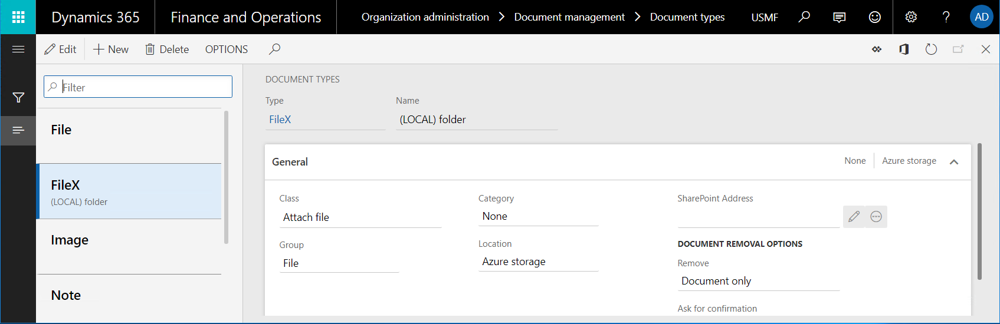
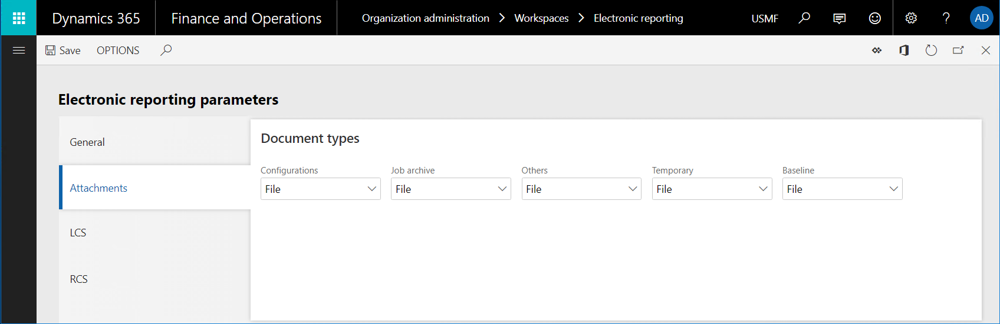
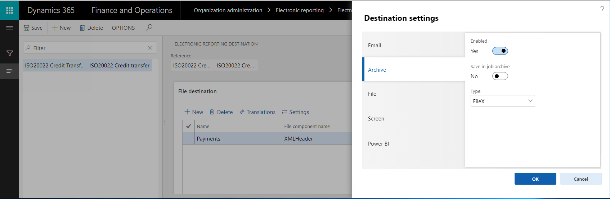

---
# required metadata

title: Specify a custom storage for generated documents
description: This topic provides information about how to extend the list of storages that you can use to save documents generated by ER formats.
author: NickSelin
manager: AnnBe
ms.date: 02/22/2019
ms.topic: article
ms.prod: 
ms.service: dynamics-ax-platform
ms.technology: 

# optional metadata

# ms.search.form: ERFormatDestinationTable, ERParameters
# ROBOTS: 
audience: Application User, Developer, IT Pro
# ms.devlang: 
ms.reviewer: kfend
ms.search.scope: Core, Operations
# ms.tgt_pltfrm: 
# ms.custom: 
# ms.assetid: 
ms.search.region: Global
# ms.search.industry: 
ms.author: nselin
ms.search.validFrom: 2019-3-31
ms.dyn365.ops.version: 10.0

---

# Split generated XML files based on file size and content quantity

[!include[banner](../includes/banner.md)]

API of the Electronic reporting (ER) framework allows you to extend the list of storages that can be used to save documents generated by ER formats. This article includes an overview of key tasks that you must complete to introduce such storage.

## Prerequisites

You must deploy Finance and Operations topology that supports continuous build (use this topic to learn how it can be done). You must have access to this Finance and Operations topology for one of the following roles:

- Electronic reporting developer
- Electronic reporting functional consultant
- System administrator

Access to the development environment of this Finance and Operations topology is required as well.

## Obtain an ER format configuration

In the current Finance and Operations topology either [create a new ER format](tasks/er-format-configuration-2016-11.md) or [import to this topology existing ER format](general-electronic-reporting-manage-configuration-lifecycle.md) for generation of documents for which you plan to introduce your own storage.


> [!NOTE]
> Be aware that obtained ER format must contain at least one of the following format elements:
> - File 
> - Folder
> - Merger
> - Attachment


## Create a new document type

To specify the routing of documents generated by an ER format, [ER destinations](electronic-reporting-destinations.md) must be configured. In each ER destination that is configured to store generated document as a file, a document type of the Document management framework must be specified. Different document types can be used for routing of documents generated by different ER format. 

1. Add a new [document type](../../fin-and-ops/organization-administration/configure-document-management.md) that will be used for obtained ER format (FileX document type show in the following image). 
2. To differentiate this document type from other ones, enter its name as having certain keyword. E.g., its name can be specified as **(LOCAL) folder**.



> [!NOTE]
> Be aware that added document type must be configured as follows:
> - In the Class field, specify Attach file;
> - In the Group field, specify File.
> Pay attention to the fact that document types are company specific. If you want to use ER format with configured destination in several companies, certain document type must be configured in each such company.

## Review source code

Review the code of the insertFile() method of the ERDocuManagement class and note that the AttachingFile() event is raised while the generated file is attached to a record. 

```
/// <summary>
/// Inserts file as attachment in Document Management.
/// </summary>
/// <param name = "_owner">A record as the attachment owner.</param>
/// <param name = "_stream">The file stream.</param>
/// <param name = "_filePath">The file path with name.</param>
/// <param name = "_attachmentName">The name of file attachment.</param>
/// <returns>The reference to inserted file.</returns>
[Hookable(false)]
public DocuRef insertFile(
        Common _owner, 
        System.IO.Stream _stream, 
        str _filePath, 
        str _attachmentName, 
        DocuTypeId _docuTypeId)
{
        DocuRef docuRef;
        if (_stream)
        {
            DocuType::createDefaults();
            
            if (!this.isDocuTypeValid(_docuTypeId))
            {
                throw error(strFmt("@ElectronicReporting:DocuTypeIsNotValid", _docuTypeId));
            }
            
            var args = ERDocuManagementAttachingFileEventArgs::construct(_owner, _stream, _filePath, _attachmentName, 
        _docuTypeId);
            ERDocuManagementEvents::onAttachingFile(args);
            if (args.isHandled())
            {
                docuRef = args.getDocuRef();
            }
            else
            {
                docuRef = this.attachFile(_owner, _stream, _filePath, _attachmentName, _docuTypeId);            
            }
        }

        return docuRef;
}
```

It happens when the following ER destinations are processed:
- **Archive** - When this destination is used, a new record is created in the **ERFormatMappingRunJobTable** for executed ER format with the **False** value in the **Archived** field. If the execution succeeded, generated document is attached to this record raising mentioned above event. The selected in this particular ER destination document type is used to specify the location to store the attached file (Azure storage or SharePoint folder).
- **Job archive** - When this destination is used, a new record is created in the **ERFormatMappingRunJobTable** for executed ER format with the True value in the **Archived** field. If the execution succeeded, generated document is attached to this record raising mentioned above event. The configured in ER parameters document type is used to specify the location to store the attached file (Azure storage or SharePoint folder).



## Configure an ER destination

1.	Following to the guidance of the Configure destinations topic, configure the archive destination for one of the mentioned above elements of obtained ER format. 
2.	Use the added document type (mentioned above FileX type) for configured destination.



## Modify source code

1.	Add to your Visual Studio project a new class and write your code subscribing to the mentioned above **AttachingFile()** event (find more details about used extensibility pattern in Respond by using EventHandlerResult the topic). For example, write in your class the code doing the following:
    1. Storing a generated file in a folder of the local file system  of the server running AOS service.
    2. Storing such files only when newly added document type (mentioned above FileX recognizing by the (LOCAL) keyword in its name) is used while a file is attached to the ER execution job log record.
    
```
    class ERDocuSubscriptionSample
{
    void new()
    {
    }

    [SubscribesTo(classStr(ERDocuManagementEvents), 
    staticDelegateStr(ERDocuManagementEvents, 
    attachingFile))]
    public static void ERDocuManagementEvents_attachingFile(ERDocuManagementAttachingFileEventArgs _args)
    {
        if (!_args.isHandled())
        {
            DocuType docuType = DocuType::find(_args.getDocuTypeId());
            if (strContains(docuType.Name, '(LOCAL)'))
            {
                _args.markAsHandled();
                var stream = _args.getStream();
                if (stream.CanSeek)
                {
                    stream.Seek(0, System.IO.SeekOrigin::Begin);
                }

                using (var localStream = System.IO.File::OpenWrite(@'c:\0\' + _args.getAttachmentName()))
                {
                    stream.CopyTo(localStream);
                }
            }
        }
    }
}
```
2. Rebuild your project with introduced source code changes.

## Run obtained ER format

1. Execute obtain ER format. 
    1. Go to **Organization administration > Electronic reporting > Electronic reporting jobs** to find the created for this execution  job record with the created file attached.
    2. Explore the local C:\0 folder to find same generated file in it.
    
## Additional resources
- [Electronic reporting destinations](electronic-reporting-destinations.md)
- [Extensibility home page](../extensibility/extensibility-home-page.md)

