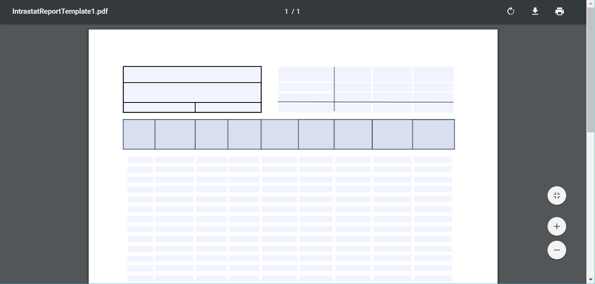
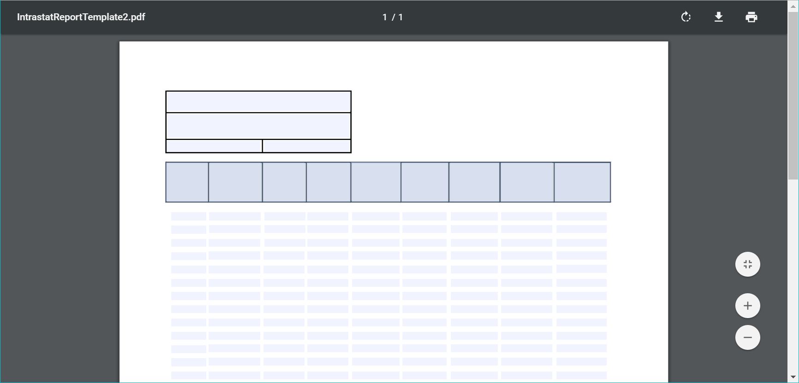
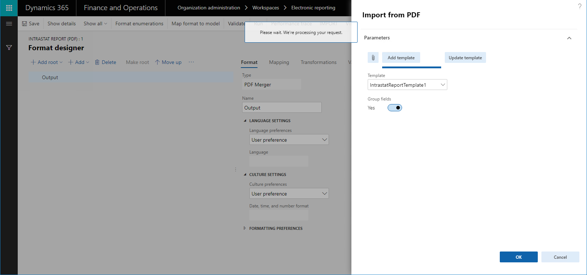
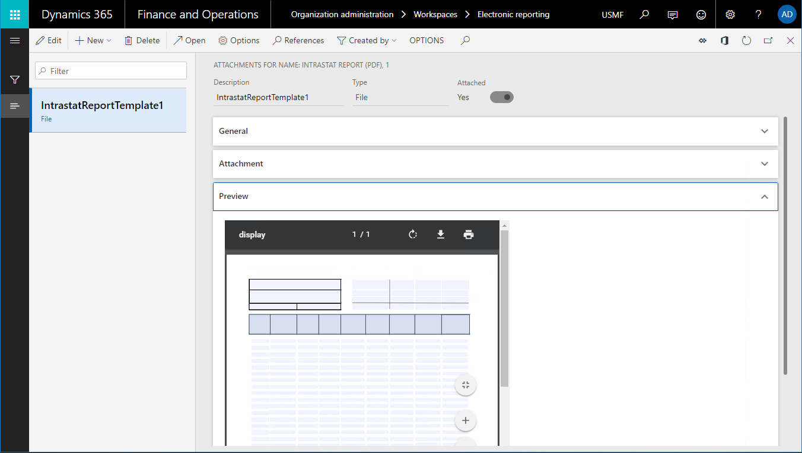
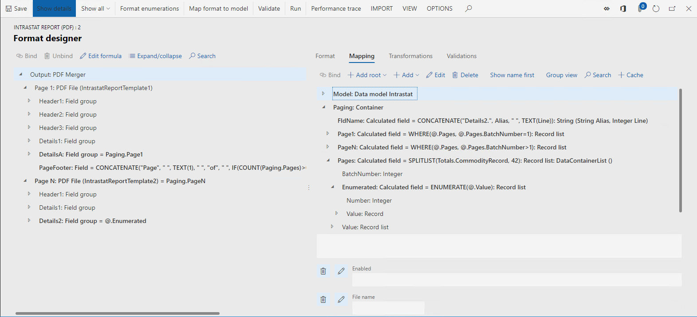
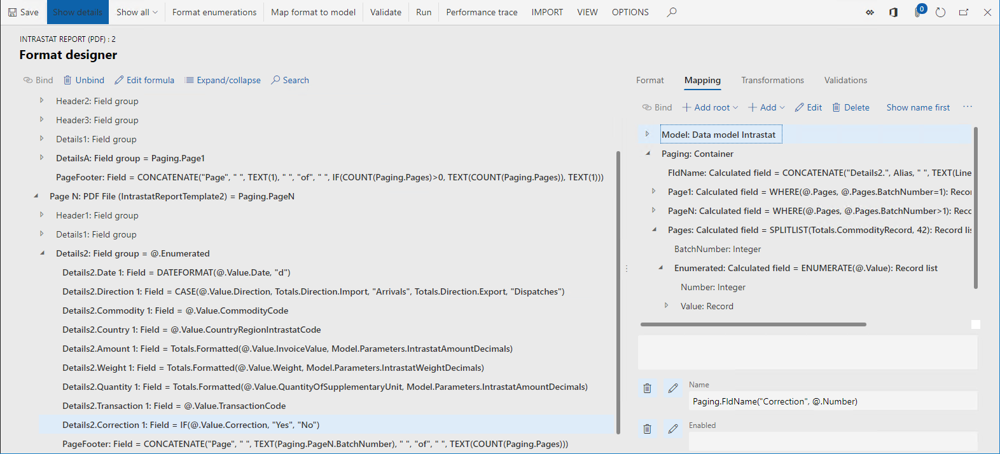
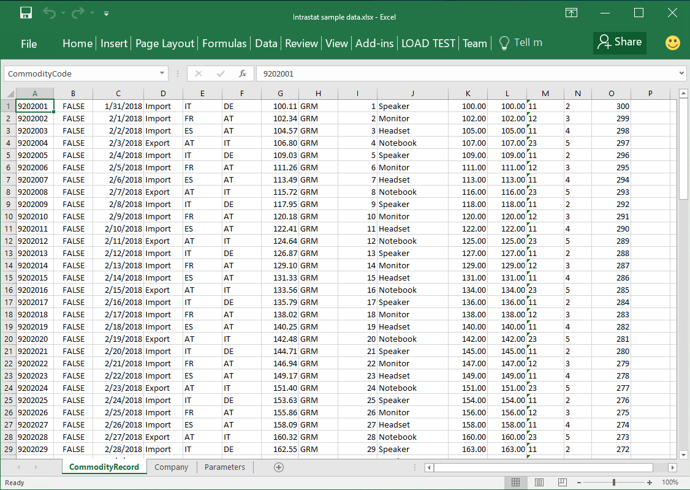

---
# required metadata

title: Design ER configurations to fill out PDF templates
description: This topic provides information about how to Design an ER format to fill out a PDF template.
author: NickSelin
manager: AnnBe
ms.date: 04/01/2019
ms.topic: article
ms.prod: 
ms.service: dynamics-ax-platform
ms.technology: 

# optional metadata

# ms.search.form: EROperationDesigner, ERParameters
# ROBOTS: 
audience: Application User, Developer, IT Pro
# ms.devlang: 
ms.reviewer: kfend
ms.search.scope: Core, Operations
# ms.tgt_pltfrm: 
ms.custom: 220314
ms.assetid: 2685df16-5ec8-4fd7-9495-c0f653e82567
ms.search.region: Global
# ms.search.industry: 
ms.author: nselin
ms.search.validFrom: 
ms.dyn365.ops.version: 10.0.1

---

# Design ER configurations to fill out PDF templates

[!include[banner](../includes/banner.md)]

The following steps explain how a user in either the System administrator or
Electronic reporting developer role can configure an Electronic reporting (ER)
format to generate reports as PDF files by using fillable PDF documents as
report templates. These steps can be performed in any company of Microsoft
Dynamics 365 for Finance and Operations (Finance and Operations) or Regulatory
Configuration Services (RCS).

## Prerequisites

To complete the examples in this topic, you must have one of the following access depending on what service is used to compete these steps:

Access to Finance and Operations for one of the following roles:

-   Electronic reporting developer

-   Electronic reporting functional consultant

-   System administrator

Access to RCS for one of the following roles:

-   Electronic reporting developer

-   Electronic reporting functional consultant

-   System administrator

You also must first complete the steps in the [Create a configuration provider and mark it as active](/tasks/er-configuration-provider-mark-it-active-2016-11.md)
procedure.

In advance, you must also download the following files from the [Microsoft Download Center](https://go.microsoft.com/fwlink/?linkid=000000):

| **Content description**                 | **File name**                                 |
|-----------------------------------------|-----------------------------------------------|
| Template for the 1st page of the report | IntrastatReportTemplate1.pdf                  |
| Template for other pages of the report  | IntrastatReportTemplate2.pdf                  |
| Sample ER format                        | Intrastat report (PDF).version.1.1.xml        |
| Sample ER format                        | Intrastat (import from Excel).version.1.1.xml |
| Sample dataset                          | Intrastat sample data.xlsx                    |

## Design the format configuration

### Get access to the list of configurations provided by Microsoft

1.  Go to **Organization administration \> Workspaces \> Electronic reporting**.

2.  Make sure that the 'Litware, Inc.' provider is available and marked as active.

3.  Click **Repositories** on the 'Microsoft' provider tile.

    1.  If a repository of the ‘LCS’ type already exists, skip the remaining steps of the current sub-task.

4.  Click **Add** to open the drop dialog.

5.  In the **Configuration repository type** field, select 'LCS'.

6.  Click **Create repository**.

7.  Click **OK**.

### Get the model configurations provided by Microsoft

1.  Click **Show filters**.

2.  Apply the following filter: Enter a filter value of "LCS" on the "Type" field using the "begins with" filter operator.

3.  Click **Apply**.

4.  Click **Open**.

5.  In the tree, select 'Intrastat model'.

6.  In the **Versions** fast tab, select the version 1.

    1.  If the **Import** button in the **Versions** fast tab is disabled, skip the remaining steps of the current sub-task.

7.  Click **Import**.

8.  Click **Yes** to confirm the import of the selected version of 'Intrastat
    model'.

### Create a new format configuration

1.  Click **Reporting configurations**.

2.  In the tree, select 'Intrastat model'.

3.  Click **Create configuration** to open the drop dialog.

> [!NOTE]
> If you don't see **Create configuration**, you must enable design mode on the **Electronic reporting parameters** page that is accessible from the **Electronic reporting** workspace.

4.  In the **New** field, enter **Format based on data model Intrastat**.

5.  In the **Name** field, type **Intrastat report (PDF)**.

6.  In the **Description** field, type **Intrastat report in PDF format**.

> [!NOTE]
> The active configuration provider is automatically entered here. This provider will be able to maintain this configuration. Other providers can use this configuration but will not be able to maintain it.
7. (Optional) A particular format of electronic document can be defined in the **Format type** field. Leave this field blank if you want to specify a format later at design time starting using in the ER Operations particular format elements. When you select the **PDF** option, the ER Operations designer will offer to you at design time the only format elements applicable to generate document in only PDF
format.

8.  Click **Create configuration**.

A new ER format configuration has been created. The draft version of it can be used to store the ER format component that is designed to generate electronic documents in PDF format.

### Design a format of an electronic document

In the added ER configuration, you will design the ER format to generate the Intrastat control report in PDF format. The first page of the report must present the summary of this report and details of reported foreign trade transactions. Other pages of this report must only present details of reported foreign trade transactions. As you expect to have in generated report pages with different layouts, two different templates in PDF format will be used in this ER format.

Open downloaded PDF templates by using any of PDF viewers available for review. Note that each template contains multiple fields that must be filled out. Details of foreign trade transactions are presented in each template as 42 rows each of which contains 9 fields. They are named in PDF template as having the row number at the end of field’s name (‘Date 1’ … ‘Date 42’, …, ‘Commodity 1’ …‘Commodity 42’, etc.).

1.  Click **Designer**.

2.  Click **Add root** to open the drop dialog.

3.  In the tree, select 'PDF\\PDF Merger'.

You selected the **PDF Merger** element as the root element of the format to merge all generated at run time PDF documents into a single final PDF document.

Note that the **PDF file** element can be selected as the root element as well. This can be done when the only one PDF template is needed for generation of required documents by using designed ER format.

1.  In the **Name** field, type 'Output'.

2.  In the **Language preferences** field, select the ‘User preference’ option.

    1.  Select this option to generate this report in the language preferred by a user running this report.

3.  In the **Culture preferences** field, select the ‘User preference’ option.

    1.  Select this option to present on the pages of generated report values and dates that are formatted based on the locale preferred by a user running this report.

4.  Click **OK**.

5.  On the Action Pane, click **Import**.

6.  Click **Import from PDF**.

    1.  When a fillable PDF document is imported as a template of this ER format, necessary ER format elements (**PDF file** ones, **Field group** ones, **Field** ones) are automatically created in the designing format based on the structure of the referring PDF document.

7.  Click **Browse**.

    1.  Navigate to and select **IntrastatReportTemplate1.pdf** that you previously downloaded.

8.  Click **OK**.

    1.  When the load of the selected file will have been completed, the **Template** field will have been filled out on the current page.

9.  Select **Yes** in the **Group fields** field.

    1.  When you turn this option on, field groups (if any) of selected PDF document will be used for grouping of creating ER format elements. Necessary **Field group** format element will be created for that. When this option is off, necessary ER format elements are created as a flat list of elements nested under the created **PDF File** format element.

10. Click **OK**.

1.  In the tree, expand 'Output'.

    1.  Note that the **PDF File** component has been automatically created to manage the creation of the first page of the report generating at run time.

2.  In the tree, expand 'Output\\PDF File'.

    1.  Note that the structured list of format elements has been automatically created in this ER format based on the structure of the imported fillable PDF document.

3.  In the tree, select 'Output\\PDF File'.

4.  In the **Name** field, type the ‘Page 1’ value.

    1.  This format element will be used to generate the first page of the control report showing report’s summary and details of foreign trade transactions.

    2.  As the **Language preferences** field is blank, the **Language preferences** setting of the parent **PDF Merger** element will be used to specify the language code for report generation by using this format element. You can select another option to override the setting of the parent element.

    3.  As the **Culture preferences** field is blank, the **Culture preferences** setting of the parent **PDF Merger** element will be used to specify the locale for values and dates formatting in the pages of the report generated by using this format element. generation by using this format element. You can select another option to override the setting of the parent element.

5.  On the Action Pane, click **Import**.

    1.  Note that the **Update from PDF** action became available for selected format element **PDF File**. It can be used to import the updated PDF template to the edited format. When the updated PDF template is imported, the list of format elements will be changed accordingly:

        1.  New format element will be created in the editing ER format for new fields of the updated PDF template.

        2.  Existing format elements will be deleted from the editing ER format if the updated PDF template does not contain corresponding to such format elements fields any longer.

6.  Click **Attachments**.

    1.  Note that the imported PDF document is attached to the edited format.

You can continue designing this format by importing the second PDF template, adding necessary bindings to data sources, etc. To learn how new format elements **PDF Merger**, **PDF File**, **Field group** and **Field** can be used to generate documents in PDF format, the sample ER format can be imported and analyzed.

1.  Close the page.

2.  Click **Save**.

3.  Close the page.

4.  Click **Delete**.

5.  Click **Yes**.

### Import the format configuration

You will import the already designed sample ER format to generate the Intrastat control report in PDF format. The first page of the report must present the summary of this report and details of reported foreign trade transactions. Other pages must only present details of reported foreign trade transactions.

1.  Click **Exchange**.

2.  Click **Load from XML file**.

3.  Click **Browse**.

    1.  Navigate to and select **Intrastat report (PDF).version.1.1.xml** that you previously downloaded.

4.  Click **OK**.

5.  In the tree, expand 'Intrastat model'.

6.  In the tree, select 'Intrastat model\\Intrastat report (PDF)'.

## Analyze the format configuration

### Format layout

1.  Click **Designer**.

2.  Click **Show details**.

3.  In the tree, expand 'Output: PDF Merger'.

4.  In the tree, expand 'Output: PDF Merger\\Page 1: PDF File (IntrastatReportTemplate1)'.

5.  In the tree, expand 'Output: PDF Merger\\Page N: PDF File (IntrastatReportTemplate2)'.

Note that this format contains 2 **PDF File** elements using different PDF templates to generate the first and other pages of outgoing document in PDF format. Due to different content of using templates, the structure of nested format elements of **PDF File** elements is different.

### Format mapping

1.  Click the **Mapping** tab.

2.  In the tree, expand ‘Paging’.

3.  In the tree, expand ‘Paging\\Pages’.

Note that the ‘'Output\\Page 1’ format element of the **PDF File** type is not bound to any of data sources and the **Enabled** expression of this format element is empty. It meant that at run time the PDF template ‘IntrastatReportTemplate1’ will be filled out only once generating an individual PDF document.

Note that the ‘'Output\\Page N’ format element of the **PDF File** type is bound to the data source ‘Paging.PageN’ of the **Record list** type and the **Enabled** expression of this format element is empty. It meant that at run time the PDF template ‘IntrastatReportTemplate2’ will be filled out for each record from the bound record list generating an individual PDF document.

As the ‘Page 1’ and ‘Page N’ **PDF File** format elements are children of the ‘Output’ **PDF Merger** format element, all filled PDF documents will be merged in a single final PDF document.

Note that ‘Paging.Page1’ and ‘Paging.PageN’ data sources are configured as filters of records from the ‘Paging.Pages’ data source. This data source is configured to split the entire set of foreign trade transactions into batches containing up to 42 records each. The following ER expression is used for this:
SPLITLIST(Totals.CommodityRecord,42). The ‘Paging.Pages’ data source also contains the ‘Paging.Pages.Enumerated’ element returning details of each record in a batch including the record sequence in the current batch (‘Paging.Pages.Enumerated.Number ’ field). This field is used in the Name expression of **PDF Field** format elements to dynamically generate a field name depending on the transaction number in a batch to fill out proper PDF field in using PDF template.

Note that the ‘'Output\\Page N\\Details 2’ format element of the **PDF Group** type is bound to the data source ‘Paging.PageN.Enumerated’ (or ‘\@.Enumerated’ by using the **Relative path** view mode) of the **Record list** type. It meant that at run time the nested elements of this PDF group will be filled out for each record from the bound record list virtually generating an individual PDF line. From this perspective, the behavior of this format element is similar to the behavior of **XML\\Sequence** and **Text\\Sequence** format elements.

1.  In the tree, expand 'Output\\Page N\\Details2’.

2.  In the tree, select 'Output\\Page N\\Details2\\PageFooter’.

    1.  Note that the **Name** attribute of this format element is defined as follows: ‘PageFooter’.

    2.  Note that the **Name** expression of the format element is empty.

3.  In the tree, select 'Output\\Page N\\Details2\\Correction 1’.

    1.  Note that the **Name** attribute of this format element is defined as follows: ‘Correction 1’.

    2.  Note that the **Name** expression of the format element is defined as follows: Paging.FldName("Correction",\@.Number).

Note that the **Field** format element is used to fill out an individual field of a fillable PDF document that is defined as a template of the parent **PDF File** format element. Binding of the **PDF File** format element (or its nested element when available) specifies the value that is populated to corresponding PDF field. Different properties of the **Field** format element can be used to specify which PDF field is filled out by an individual format element:

-   The **Name** attribute of the format element (**Format** tab)

-   The **Name** expression of the format element (**Mapping** tab)

As both properties are optional for a **Field** format element, the following rules are applied to specify the target PDF field:

-   When the **Name** attribute is blank and the **Name** expression returns empty string at run time, an exception is thrown at run time informing that a PDF field cannot be found in using PDF template for filling out.

-   When the **Name** attribute has been defined and the **Name** expression is blank, the PDF field with the same name as the **Name** attribute of the format element is filled out.

-   When the **Name** attribute has been defined as well as the **Name** expression has been configured, the PDF field with the same name as the value that is returned by the **Name** expression of the format element is filled out.

Note

PDF checkbox can be filled out as checked in the following ways:

-   when the corresponding **Field** format element is bound to the data source field of **Boolean** data type containing the **True** value.

-   when the corresponding **Field** format element contains the nested **String** format element which is bound to the data source field containing either **1** or **True** or **Yes** text value.

Run the format configuration
----------------------------

### Import the format configuration

You will load the already designed sample ER format **Intrastat (import from Excel)**. This format is designed to parse selected by user Excel workbook simulating foreign trade transactions.

1.  Click **Exchange**.

2.  Click **Load from XML file**.

3.  Click **Browse**.

    1.  Navigate to and select **Intrastat (import from Excel).version.1.1.xml** that you previously downloaded.

4.  Click **OK**.

5.  In the tree, select 'Intrastat model\\Intrastat (import from Excel)'.

6.  Click **Edit**.

7.  Select **Yes** in the **Default for model mapping** field.

Note.

If you earlier already selected **Yes** for the **Default for model mapping** option for the **Intrastat model** configuration or another configuration nested under the **Intrastat model** one, set its **Default for model mapping** option as **No**.

With this setting, the imported **Intrastat (import from Excel)** is assigned as the default data source for the **Intrastat report (PDF)** configuration. When the **Intrastat report (PDF)** is executed, the content of the parsed by the **Intrastat (import from Excel)** Excel workbook will simulate foreign trade transactions that must be reported (see the sample of such workbook on the screen-shot below).

### Execute the format configuration

1.  In the tree, select 'Intrastat model\\Intrastat report (PDF)'.

2.  Click **Run**.

3.  Click **Browse**.

    1.  Navigate to and select **Intrastat sample data.xlsx** that you previously downloaded.

4.  Click **OK**.

5.  In the **Report direction** field, select the option **Both** to populate to generated PDF report all transactions from the imported Excel workbook.

6.  Click **OK**.

7.  Review the generated PDF document.

## Additional resources

- [ER Design a configuration for generating reports in OPENXML format](/tasks/er-design-reports-openxml-2016-11)  
- [Design ER configurations to generate reports in Microsoft WORD format](/tasks/er-design-configuration-word-2016-11)
