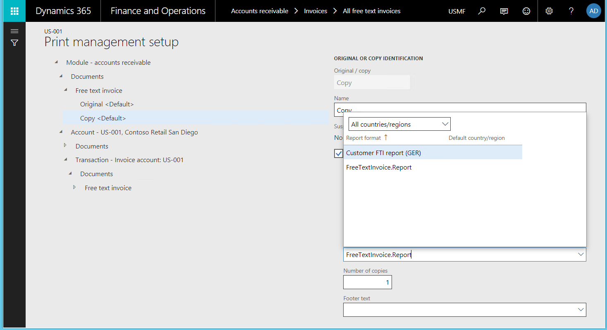
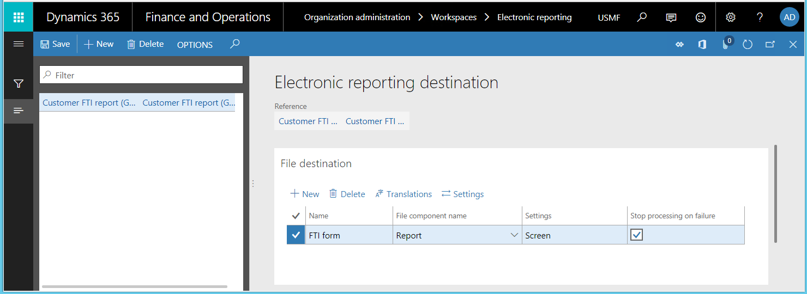
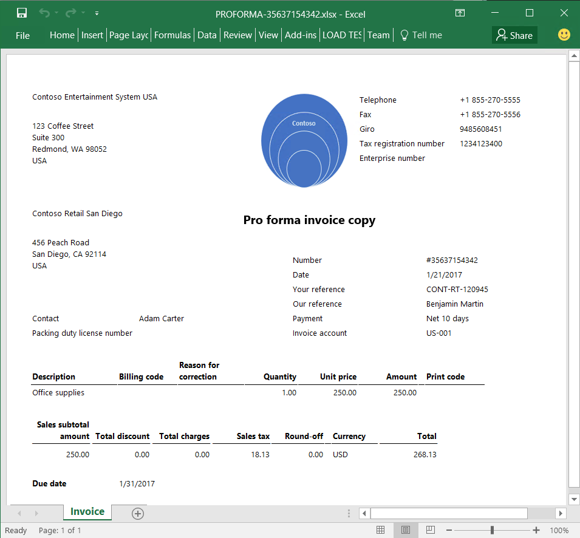

---
# required metadata

title: Generate printable FTI forms 
description: This topic explains how to use the Electronic reporting (ER) framework to generate printable free text invoice (FTI) forms as Microsoft Office documents.
author: NickSelin
manager: AnnBe
ms.date: 06/07/2018
ms.topic: article
ms.prod: 
ms.service: dynamics-ax-platform
ms.technology: 

# optional metadata

# ms.search.form: 
# ROBOTS: 
audience: Application User, Developer, IT Pro
# ms.devlang: 
ms.reviewer: kfend
ms.search.scope: Core, Operations
# ms.tgt_pltfrm: 
ms.custom: 220314
ms.assetid: 2685df16-5ec8-4fd7-9495-c0f653e82567
ms.search.region: Global
# ms.search.industry: 
ms.author: nselin
ms.search.validFrom: 2018-04-01
ms.dyn365.ops.version: Release 8.0

---

# Generate printable FTI forms

[!include[banner](../includes/banner.md)]

You can use the Electronic reporting (ER) framework to generate printable free text invoice (FTI) forms by using SSRS. You can also manage FTI printable forms in Microsoft Office Excel and Word, and modify the layout, data flow, and formatting without making code changes to satisfy specific requirements. 

## Create customized configurations for FTI printable forms
As part of your customized solution for FTI printable forms, you must create a set of ER configurations. Then you can create your application instance in one of those configurations. The configuration must include a data model that describes the customer's invoicing business domain. The data model must be named **CustomersInvoicing**. 

### Configure ER model mapping
The ER model mapping for the **CustomersInvoicing** data model must be in your application. The model mapping can be in the ER data model configuration or in the ER model mapping configuration. However, the name of the root descriptor of this model mapping must be **FreeTextInvoice**.
The mapping must contain the following data sources:

- Data source type, **Table records**

  - Name: **CustInvoiceJour**
  - Refers to the application table **CustInvoiceJour** 
  - Used at run-time to pass the list of invoices selected for printing from the application to the ER model mapping

- Data source type, **Object**

  - Name: **PrintMgmtPrintSettingDetail**
  - Refers to the application class, **PrintMgmtPrintSettingDetail** 
  - Used at run-time to pass the mapping details of the print management settings for executing the ER format from the application to the ER model.

The details of the application integration with the ER framework can be found in the source code of the application:
- **ERPrintMgmtReportFormatSubscriber** class (ER Application Suite integration model).
For more informaiton about the design of ER model mappings, see [Define model mapping and select data sources for electronic reporting (ER)](../tasks/er-define-model-mapping-select-data-sources-2016-11.md).

### Configure ER format
In your application instance, you must have the ER format configuration that will be used to generate FTI forms. 

  > [!NOTE]
  > It is required that this format configuration has been created for the CustomersInvoicing data model and uses the model mapping with the FreeTextInvoice root descriptor.

To learn how to configure ER formats, see [Create a format configuration for electronic reporting (ER)](../tasks/er-format-configuration-2016-11.md). To learn more about how to design ER formats to generate reports in OpenXML format, see [Design a configuration for generating reports in OpenXML format for electronic reporting (ER)](../tasks/er-design-reports-openxml-2016-11.md).

## Configure print management
You can assign ER formats to generate FTI forms using the ER framework the same way you assign for SSRS reports. You can associate the ER format with all Accounts receivable free text invoices by navigating to, **Accounts receivable** > **Setup** > **Forms** > **Form setup** > **General** > **Print management** > **Free text invoice** > **Original**. If you want to associate the ER format with a specific customer or invoice, complete the following steps.
1.	Go to **Accounts receivable** > **Invoices** > **All free text invoices**.
2.	Select the free text invoice you want to associate and open the **Print management setup** form.
3.	Choose the documents’ level to identify the scope of invoices for processing and then select the ER fromat for the document level.

  > [!NOTE]
  > Only ER formats that use the root descriptor **FreeTextInvoice** of the **CustomersInvoicing** data model are visible in the **Report format lookup** field for the format selection.

## Generate free text invoice forms
Free text invoice (FTI) forms are generated in the ER framework the same way that SSRS reports are generated.

You can generate FTI forms choosing invoices either by range or by selection. 

When you use ER formats to print FTI forms this way, the default file destinations are used and there is no option to change the destination. For more information about how the ER destinations can be configured for ER formats, see [Electronic reporting destinations](electronic-reporting-destinations.md).

You can also generate FTI forms when you post a free text invoice by turning **Print invoice** on and **Use print management destinations** off.

  > [!NOTE}
  > When you use ER formats to print FTI forms this way, the default ER file destination is used. You can change the default destination at run-time if the destination has already been configured. To change the destination, you must have the following security privilege:
  -	Name	ERFormatDestinationRuntimeMaintain
  -	Label	Maintain electronic reporting format destination during runtime

The following destinations are currently supported by ER framework for generated documents:

-	Downloaded file: Generated forms are offered by using browser as downloads
-	Screen: Office 365 Microsoft Excel is used to preview FTI forms in Excel format
- SharePoint folder: Generated forms are stored based on setting of the Document management framework
-	Application archive: Files of Azure storage as attachments of records of execution log
-	Email: Generated forms are sent as e-mail attachment

  > [!NOTE]
  > You can’t send the generated FTI form directly to the printer because direct printing using the Dynamics Printer Routing Agent is not supported at this time.

## Download sample ER configurations to generate FTI printable forms
You can download sample ER configurations to use as a template for your FTI solutions. The configurations are stored in the Shared asset library in Microsoft Lifecycle Services. The configurations include:

-	Customer invoicing model configuration that contains the required data model and model mapping
-	Customer FTI report (GER) configuration that contains the sample format.

  > [!NOTE]
  > These configurations have been created as samples to help clarify possible scenarios. The future of these configurations will depend on the results of this evaluation and any feedback received.

### Features implemented in the sample ER format
Microsoft Excel is used as a template in the sample ER format configuration to generate FTI forms.
Currently, this sample ER format supports the following features to generate FTI forms:

- Generated for original invoices both posted and not yet posted. Corrected invoices as well as credit notes are not supported.
- Generated in the invoice language. Note that the values and dates in the generated form are formatted based on the settings of the user’s client locale.
- Generated invoice will show data unavailability notifications when there are no lines in the processing invoice.
- Generated invoice header will based on the paper format that has been chosen in **Accounts receivable parameters** form for the FTI form. Company details will be placed to the header of the generated invoice form only for the blank paper format.
- Generated invoice form shows company and customer tax exempt numbers when the appropriate option has been selected in the **Accounts receivable parameters** form for the FTI form.
- Generated invoice lines as well as invoice totals sections are shown presenting by default invoice’s monetary details in the invoice registration currency.
- Generated invoice totals section can show monetary details in the euro currency and the invoice registration currency when the option **Print amount in currency representing the euro** is enabled in **Accounts receivable** parameters.
- When available, the generated invoice form shows process invoice notes that are based on settings in the **Accounts receivable** parmaters form. Notes are included for the entire invoice as well as for each invoice line)
- Generated invoice form includes notes for the customer FTI form and the processing invoice language when they have been configured in the AR form notes list.
- When configured, the generated invoice includes customer footer text by using Print management tool for the invoice languate and the ER format and FTO document scope.
- When available, the generated invoice form includes cash discount information in the invoice’s totals section.
- When available, the generated invoice form includes payment schedule details in the invoice’s payment schedule section.
- When availale, the generated inovoice form includes charges transactions in the invoice’s markup section.
- Generated invoice form includes sales tax details depending on the **Sales tax specification** in the **Accounts receivable parameters** form. This section can present tax details either in the invoice registration currency only or in the invoice registration currency and company accounting currency simultaneously.
- Generated invoice form will show direct debit notification details including when the method of payment with the mandatory direct debit mandate ID was selected for the invoice, when the processing invoice was registered in euro currency, and when the direct debit mandate ID was defined for the invoice.
- When available, the generated invoice shows prepayment details for posted invoices.
- Generated invoice form can be sent to an invoice customer as an email attachment. The appropriate ER file destination should be configured for using ER format.

### Country-specific features 
The following country-specific features are included in the sample ER format to show how specific requirements are handled in ER configurations.

#### Norway
The Enterprise register term is placed on the header of the generated invoice form when the invoice is processed for the legal entity that is configured by:

- Using the country context for Norway.
- Having the parameter, **Print Foretaksregisteret**, active on sales documents.

#### Spain
The Special regime for cash accounting method term will be placed on the header of the generated invoice form when the invoice is processed for the legal entity that is configured by:

- Using the country context for Spain.
- Having the special regime for the cash accounting method enabled on the invoice processing date.

When available, cash discount details including cash discount amount and invoice line net amount, are presented in the invoice totals section of the generated invoice form when it has been processed for the legal entity that is configured by:

- Using the country context for Spain.
- Having **Cash discount** applied in the invoice option (**General ledger parameters** > **Sales tax section**).

#### Italy
The goods discount mark is included in the invoice lines of the generated invoice when the it is processed for the legal entity that is configured using the country context for Italy.

#### Finland
In addition to the generated invoice form, the Giro money transfer slips can be generated:

- For the legal entity that uses the country context for Finland and has at least one bank account marked as a Giro account and Bank bar code. 
- For an invoice that is marked as required for the Finnish associated payment attachment.

  > [!NOTE]
  > The sample ER format has been configured to optionally generate the Giro money transfer slips in the separated worksheet.

You must first install the font used to generate the barcode on the local machine where the generated invoice form in Microsoft Excel format will be previewed.

### Use the sample ER format to configure email destinations
Use the following elements of the sample ER format to configure email destinations.

- The email address of a customer contact can be accessed with the following ER expression: model.InvoiceBase.Contact.ElectronicMail.
- The email subject text can be accessed with the following ER expression: Emailing.TxtToUse.Subject.
- The email body text can be accessed with the following ER expression: Emailing.TxtToUse.Body.

The default text of email’s subject and body is defined in the sample ER format with the language dependent on the format’s labels. It will be used for emailing when a custom organization email template with the predefined ID **ERFTITMP** has not been added.

  > [!NOTE]
  > The email template ID **ERFTITMP** has been defined in the sample ER format and can be changed if needed in a new ER format that is created from this sample format.

If the organization email template with the predefined ID **ERFTITMP** has been added for the legal entity that you are processing the invoice for, the template for the email subject and body text will be used to generate the email. 

  > [!NOTE]
  > The ER expression of the sample ER format Emailing.TxtToUse.Subject is configured to substitute any occurrences of the characters "%1" by the processing the invoice ID.

Note that the expression of the sample format Emailing.TxtToUse.Body is configured for the following characters’ substitutions:
•	%1 characters by the name of the customer’s contact person
•	%2 characters by the company name
•	%3 characters by the customer name
•	%4 characters by the name of the company’s contact person
•	%5 characters by the job title of the company’s contact person
•	%6 characters by the email of the company’s contact person

